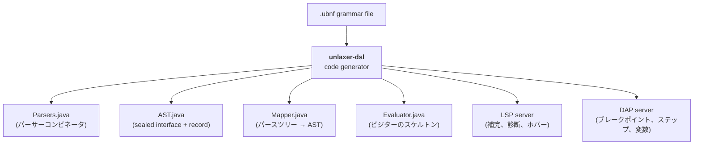
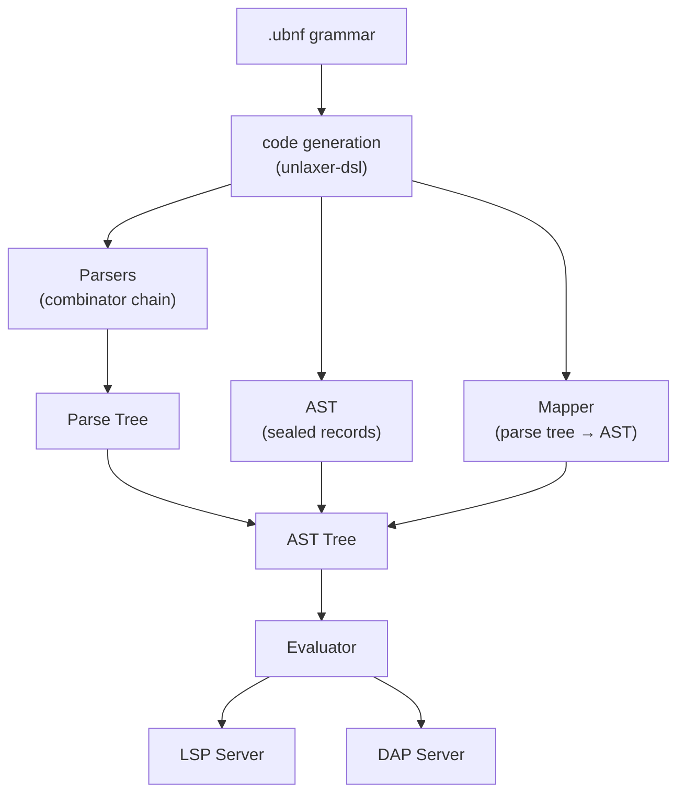

[English](./README.md) | [日本語](./README-ja.md)

---

```
                _
  _   _ _ __   | | __ ___  _____ _ __
 | | | | '_ \  | |/ _` \ \/ / _ \ '__|
 | |_| | | | | | | (_| |>  <  __/ |
  \__,_|_| |_| |_|\__,_/_/\_\___|_|
                              - parser
```

# unlaxer-parser

**文法を書くだけで言語が手に入る — Parser + AST + Evaluator + LSP + DAP をすべて自動生成**

[](https://central.sonatype.com/artifact/org.unlaxer/unlaxer-common)
[](./LICENSE)
[]()
[]()

---

> **最新リリース — 3.0.15**: 生成 Mapper は既存の Token tree を public API で変換でき、利用側から生成内部への reflection が不要になりました。javaStyle block comment と UTF-16 対応 DAP 座標も含みます。全履歴は [CHANGELOG](./CHANGELOG.md) を参照してください。履歴上の注意: **3.0.2 は Maven Central に公開されていません** — 3.0.1 からアップグレードする場合は 3.0.3 以降へ直接進んでください。`unlaxer-common` または `unlaxer-dsl` の `2.x` に依存している場合は、[CHANGELOG](./CHANGELOG.md) と下記の[downstream ドリフト警告](#downstream-ドリフト警告)を参照してください。

---

## 目次

- [課題](#課題)
- [解決策](#解決策)
- [クイックサンプル](#クイックサンプル)
- [生成されるもの](#生成されるもの)
- [5分クイックスタート](#5分クイックスタート)
- [アーキテクチャ](#アーキテクチャ)
- [Bootstrap と自己ホスティング](#bootstrap-と自己ホスティング)
- [実例](#実例)
- [Downstream ドリフト警告](#downstream-ドリフト警告)
- [ドキュメント](#ドキュメント)
- [なぜ unlaxer なのか？](#なぜ-unlaxer-なのか)
- [プロジェクト構成](#プロジェクト構成)
- [foundation-poisonpills について](#foundation-poisonpills-について)
- [ライセンス](#ライセンス)

---

## 課題

DSL を構築するには、通常 **6つ以上のサブシステム** を手作業で書き、保守する必要があります：

| サブシステム | 行数（概算） |
|-----------|----------------|
| レキサー / パーサー | 2,000+ |
| AST ノード型 | 1,500+ |
| パースツリーから AST へのマッパー | 1,000+ |
| エバリュエータ / インタプリタ | 2,000+ |
| LSP サーバー（補完、診断、ホバー） | 2,500+ |
| DAP サーバー（ブレークポイント、ステッピング、変数） | 1,500+ |
| **合計** | **10,000+** |

これらのサブシステムは密結合しています。文法を1箇所変更するだけで、すべてに変更が波及します。

## 解決策

**UBNF 文法**（約300行）を書いて、ジェネレータを実行するだけ。すべてが手に入ります。



あなたが書くのは**評価ロジックだけ** — 通常 50〜200 行の `evalXxx` メソッドです。

---

## クイックサンプル

以下は [tinyexpression](https://github.com/opaopa6969/tinyexpression) の UBNF 文法の一部です：

```ubnf
@mapping(BinaryExpr, params=[left, op, right])
@leftAssoc
NumberExpression ::= NumberTerm @left { AddOp @op NumberTerm @right } ;

@mapping(BinaryExpr, params=[left, op, right])
@leftAssoc
NumberTerm ::= NumberFactor @left { MulOp @op NumberFactor @right } ;

AddOp ::= '+' | '-' ;
MulOp ::= '*' | '/' ;
```

この文法から、unlaxer は以下を生成します：

- 演算子の優先順位と左結合性を正しく処理する**パーサー**
- 型付きの `left`、`op`、`right` フィールドを持つ **`BinaryExpr` AST レコード**
- フラットなパースツリーをネストされた AST に変換する**マッパー**
- エバリュエータスケルトン内の **`evalBinaryExpr`** フック

---

## 生成されるもの

| あなたが書くもの | unlaxer が生成するもの |
|-----------|-------------------|
| 文法規則 (`::=`) | パーサーコンビネータ (`Parsers.java`) |
| `@mapping` アノテーション | AST sealed interface + record (`AST.java`) |
| `@left`、`@right`、`@op` キャプチャ | パースツリーから AST へのマッパー (`Mapper.java`) |
| `@leftAssoc` / `@rightAssoc` | 正しい結合性の処理 |
| `@root` | エントリポイントパーサー |
| （あなたの文法） | `evalXxx` フック付きエバリュエータスケルトン (`Evaluator.java`) |
| （あなたの文法） | LSP サーバー（補完、診断、ホバー） |
| （あなたの文法） | DAP サーバー（ブレークポイント、ステッピング、変数） |

---

## 5分クイックスタート

### 1. Maven 依存関係を追加

```xml
<dependencies>
    <dependency>
        <groupId>org.unlaxer</groupId>
        <artifactId>unlaxer-common</artifactId>
        <version>3.0.15</version>
    </dependency>
    <dependency>
        <groupId>org.unlaxer</groupId>
        <artifactId>unlaxer-dsl</artifactId>
        <version>3.0.15</version>
    </dependency>
</dependencies>
```

### 2. 文法を書く

`src/main/resources/TinyCalc.ubnf` を作成します：

```ubnf
grammar TinyCalc {
  @package: com.example.tinycalc

  token NUMBER = NumberParser
  token EOF    = EndOfSourceParser

  @root
  Formula ::= Expression EOF ;

  @mapping(BinaryExpr, params=[left, op, right])
  @leftAssoc
  Expression ::= Term @left { AddOp @op Term @right } ;

  @mapping(BinaryExpr, params=[left, op, right])
  @leftAssoc
  Term ::= Factor @left { MulOp @op Factor @right } ;

  Factor ::= NUMBER | '(' Expression ')' ;

  AddOp ::= '+' | '-' ;
  MulOp ::= '*' | '/' ;
}
```

### 3. コードジェネレータプラグインを追加

```xml
<plugin>
    <groupId>org.codehaus.mojo</groupId>
    <artifactId>exec-maven-plugin</artifactId>
    <version>3.1.0</version>
    <executions>
        <execution>
            <phase>generate-sources</phase>
            <goals><goal>java</goal></goals>
            <configuration>
                <mainClass>org.unlaxer.dsl.CodegenMain</mainClass>
                <arguments>
                    <argument>--grammar</argument>
                    <argument>${project.basedir}/src/main/resources/TinyCalc.ubnf</argument>
                    <argument>--output</argument>
                    <argument>${project.build.directory}/generated-sources/ubnf</argument>
                    <argument>--generators</argument>
                    <argument>AST,Parser,Mapper,Evaluator</argument>
                </arguments>
            </configuration>
        </execution>
    </executions>
</plugin>
```

### 4. コードを生成

```bash
mvn compile
```

`target/generated-sources/ubnf/com/example/tinycalc/` 配下に4つのファイルが生成されます：

```
TinyCalcParsers.java    -- パーサーコンビネータ
TinyCalcAST.java        -- sealed interface + record (BinaryExpr など)
TinyCalcMapper.java     -- パースツリー -> AST 変換
TinyCalcEvaluator.java  -- evalXxx フック付き抽象エバリュエータ
```

### 5. エバリュエータを書く

```java
public class CalcEvaluator extends TinyCalcEvaluator<Double> {

    @Override
    protected Double evalBinaryExpr(BinaryExpr node) {
        Double left = eval(node.left());
        Double right = eval(node.right());
        return switch (node.op()) {
            case "+" -> left + right;
            case "-" -> left - right;
            case "*" -> left * right;
            case "/" -> left / right;
            default -> throw new IllegalArgumentException("Unknown op: " + node.op());
        };
    }

    @Override
    protected Double evalNumber(NumberLiteral node) {
        return Double.parseDouble(node.value());
    }
}
```

### 6. 実行する

```java
var parser = new TinyCalcParsers();
var tree = parser.parse("1 + 2 * 3");
var ast = new TinyCalcMapper().map(tree);
var result = new CalcEvaluator().eval(ast);
System.out.println(result);  // 7.0
```

詳細なウォークスルーは [docs/getting-started-ja.md](./docs/getting-started-ja.md) を参照してください。

---

## アーキテクチャ



詳細なパイプライン、コンビネータカタログ、ParserIR 設計については [docs/architecture-ja.md](./docs/architecture-ja.md) を参照してください。

---

## Bootstrap と自己ホスティング

UBNF 文法ファイル `unlaxer-dsl/grammar/ubnf.ubnf` 自体が UBNF で記述されており、unlaxer-dsl は自身のコードジェネレータをこれに対して実行できます。この自己適用は**現時点では部分的**です。保証されること・されないことを正確に記します：

- **live 実装は手書きの bootstrap** である `org.unlaxer.dsl.bootstrap`（`UBNFParsers`、`UBNFAST`、`UBNFMapper`）です。本番の codegen（`CodegenMain` / `CodegenRunner`）はこれら手書きクラスを import します。
- ジェネレータは `ubnf.ubnf` から `UBNFParsers` を再生成でき、自己ホスティングテストは生成ソースがコンパイル可能で構造的に妥当であることを確認します。現在チェックインされている生成版 `UBNFParsers`（`bootstrap/generated/` 配下）は、手書きパーサーへ**委譲するだけの薄い shim** です。生成版の `UBNFAST` / `UBNFMapper` は**存在しません**。
- 生成版 `UBNFMapper` がまだ無いため、fixpoint テスト（`SelfHostingTest` / `SelfHostingRoundTripTest`）は両 stage で手書き `UBNFMapper` を再利用します。テスト自身のコメントが認めているとおり、これは**真の fixpoint ではありません** — 保証されるのは生成が**決定的**であること（stage 1 の出力 == stage 2 の出力）であって、生成されたツールチェーンが端から端まで自身を再生成できることではありません。

要するに、「UBNF が UBNF を記述する」ことと「パーサージェネレータの決定的な自己適用」は実現済みですが、完全に自己ホスティングされたパイプライン（生成パーサー**および**生成マッパーが自身を再生成する）はまだ完成していません。

詳細は [docs/architecture-ja.md — Bootstrap](./docs/architecture-ja.md#bootstrap-と自己ホスティング) を参照してください。

---

## 実例

**[tinyexpression](https://github.com/opaopa6969/tinyexpression)** は、unlaxer-parser で構築された完全な数式言語です。

- 約300行の UBNF 文法
- 変数、関数（`sin`、`cos`、`sqrt`、`min`、`max`）、三項演算子、if/else、メソッド宣言
- 完全な LSP サポート（補完、診断、ホバー、定義へのジャンプ）
- 完全な DAP サポート（ブレークポイント、ステッピング、変数インスペクション）
- 本番環境で使用中

---

## Downstream ドリフト警告

> **警告**: 以下の downstream プロジェクトの一部は元々 **unlaxer-parser 2.x** に対してビルドされたものです。`UBNFAST`、`UBNFMapper`、`CodegenMain` エントリポイントの API 変更によってビルドが失敗する可能性があるため、アップグレード前に各プロジェクトの最終検証バージョンを確認してください。

| Downstream プロジェクト | 最終検証バージョン | ステータス |
|----------------------|----------------|----------|
| [tinyexpression](https://github.com/opaopa6969/tinyexpression) | 3.0.4 | 検証済み。`p4-smoke`（86 テスト）+ LSP smoke（25 テスト）パス（[#28](https://github.com/opaopa6969/unlaxer-parser/issues/28), #38） |
| [onigiri-parser](https://github.com/opaopa6969/onigiri-parser) | 3.0.1 | `mvn compile` 成功（[#27](https://github.com/opaopa6969/unlaxer-parser/issues/27)） |
| [fraud-alert](https://github.com/opaopa6969/fraud-alert) | 2.8.0 | 3.x 未検証 |

アップグレード前に、[2.x → 3.x 移行ガイド](./docs/migration-2.x-to-3.x-ja.md)と [CHANGELOG](./CHANGELOG.md) の `2.8.0 → 3.0.0` 破壊的変更セクションを確認してください。

---

## ドキュメント

| ドキュメント | 説明 | 言語 |
|------------|------|------|
| [Getting Started](./docs/getting-started-ja.md) | Maven 設定、最初の文法、完全ウォークスルー | [EN](./docs/getting-started.md) / [JA](./docs/getting-started-ja.md) |
| [UBNF ガイド](./docs/ubnf-guide-ja.md) | UBNF 構文全体、全アノテーション、機能マトリックス | [EN](./docs/ubnf-guide.md) / [JA](./docs/ubnf-guide-ja.md) |
| [アーキテクチャ](./docs/architecture-ja.md) | Bootstrap パイプライン、コンビネータカタログ、ParserIR | [EN](./docs/architecture.md) / [JA](./docs/architecture-ja.md) |
| [パーサーの基礎](./unlaxer-common/docs/tutorial-parser-fundamentals-dialogue.ja.md) | コアとなるパーサーコンビネータの概念 | [EN](./unlaxer-common/docs/tutorial-parser-fundamentals-dialogue.en.md) / [JA](./unlaxer-common/docs/tutorial-parser-fundamentals-dialogue.ja.md) |
| [UBNF から LSP/DAP へのチュートリアル](./unlaxer-dsl/docs/tutorial-ubnf-to-lsp-dap-dialogue.ja.md) | 文法から IDE サポートまでの全パイプライン | [EN](./unlaxer-dsl/docs/tutorial-ubnf-to-lsp-dap-dialogue.en.md) / [JA](./unlaxer-dsl/docs/tutorial-ubnf-to-lsp-dap-dialogue.ja.md) |
| [クイックスタート（5分）](./unlaxer-dsl/docs/quickstart-dialogue.ja.md) | 対話形式の入門ガイド | [EN](./unlaxer-dsl/docs/quickstart-dialogue.en.md) / [JA](./unlaxer-dsl/docs/quickstart-dialogue.ja.md) |
| [LLM 時代と Unlaxer](./unlaxer-dsl/docs/llm-era-and-unlaxer-dialogue.ja.md) | LLM の時代にフレームワークが依然として重要な理由 | [EN](./unlaxer-dsl/docs/llm-era-and-unlaxer-dialogue.en.md) / [JA](./unlaxer-dsl/docs/llm-era-and-unlaxer-dialogue.ja.md) |

---

## なぜ unlaxer なのか？

| | ANTLR | tree-sitter | PEG.js | **unlaxer** |
|---|---|---|---|---|
| 言語 | Java, C#, Python, ... | C + バインディング | JavaScript | **Java** |
| パーサー種別 | ALL(*) | GLR | PEG | **PEG + コンビネータ** |
| AST 生成 | 手動 | 手動 | 手動 | **自動**（`@mapping` から） |
| エバリュエータスケルトン | なし | なし | なし | **あり** |
| LSP 生成 | なし | 部分的（クエリ） | なし | **あり** |
| DAP 生成 | なし | なし | なし | **あり** |
| 文法アノテーション | なし | なし | なし | **あり**（`@mapping`、`@leftAssoc`、`@eval` など） |
| 演算子の結合性 | 文法内 | 文法内 | 手動 | **`@leftAssoc` / `@rightAssoc`** |
| 依存関係ゼロ | なし | なし | なし | **あり** (unlaxer-common) |
| Bootstrap / 自己ホスティング | なし | あり | なし | **あり**（3.0.0 以降） |

unlaxer は、文法から実用的な IDE サポートまでを最小限のボイラープレートで実現したい Java チームのために設計されています。

---

## プロジェクト構成

```
unlaxer-parser/
  +-- unlaxer-common/     コアパーサーコンビネータライブラリ（依存関係ゼロ）
  |     +-- src/          コンビネータ ~50 個、エレメンタリーパーサー ~30 個
  |     +-- docs/         パーサーの基礎チュートリアル
  +-- unlaxer-dsl/        コードジェネレータ: UBNF -> Parsers + AST + Mapper + Evaluator + LSP + DAP
  |     +-- grammar/      ubnf.ubnf（自己ホスト済み文法定義）
  |     +-- src/          Bootstrap パーサー、codegen パイプライン、IR
  |     +-- docs/         UBNF チュートリアル、拡張ロードマップ、ParserIR 設計
  +-- docs/               トップレベルガイド（アーキテクチャ、UBNF ガイド、入門）
```

- **[unlaxer-common](./unlaxer-common/)** — RELAX NG にインスパイアされたパーサーコンビネータ。無制限の先読み、バックトラッキング、包括的なロギング。純粋な Java、依存関係ゼロ。
- **[unlaxer-dsl](./unlaxer-dsl/)** — `.ubnf` 文法ファイルを読み込み、必要な Java コードをすべて生成します。

---

## foundation-poisonpills について

他の `org.unlaxer` 関連資料で `foundation-poisonpills` という名前を目にすることがあります。これはパーサーのモジュールでは**なく**、**unlaxer-parser はこれを一切参照していません**（本リポジトリにそのような依存・テスト・codegen フィクスチャは存在しません）。これは独立したリポジトリにある**別プロジェクト** `org.unlaxer:unlaxer-foundation-poisonpills-parent` で、パースやバックトラッキングとは無関係な、Java 向けの汎用**故障注入（fault injection）ツールキット**です。`Poisoned.trigger(...)` で注入点を設け、実行時に `ThrowPill`（例外を投げる）や `DelayPill`（遅延を注入する）などの「pill」を差し込んで、コードがどれだけ丁寧に失敗するかを検証します。その CHANGELOG には 2026-01-15 付の `1.0.0` リリースが記録されており、親 POM は現在 `1.2.0-SNAPSHOT` です。**unlaxer-parser のビルドや使用にこのモジュールは必要ありません**。

---

## ライセンス

MIT ライセンス。詳細は [LICENSE](./LICENSE) を参照してください。

## コントリビューション

コントリビューションを歓迎します。[GitHub](https://github.com/opaopa6969/unlaxer-parser) で Issue または Pull Request をお寄せください。

## 著者

[opaopa6969](https://github.com/opaopa6969)

---

## MCP サーバ

unlaxer-parser は [volta](https://github.com/opaopa6969/volta-mcp) ファサード（`https://mcp.unlaxer.org/mcp`）で namespace **`unlaxer`** として MCP サーバを提供しています。

### Tools

| Tool | 説明 | 副作用 |
|------|------|--------|
| `unlaxer__validate` | UBNF文法を検証する | read |
| `unlaxer__generate` | UBNF文法からコードを生成する | write (dry-run デフォルト) |
| `unlaxer__export_parser_ir` | Parser IR を JSON でエクスポートする | read |
| `unlaxer__validate_parser_ir` | Parser IR を検証する | read |
| `unlaxer__generate_railroad` | Railway diagram を生成する (SVG/PNG/markdown) | write |
| `unlaxer__convert_to_ebnf` | UBNF を EBNF に変換する | read |
| `unlaxer__init` | DSL プロジェクトを scaffold する | write |

### Resources

- `unlaxer://spec` — 機械可読な能力仕様 (JSON)
- `unlaxer://guide` — 使い方ガイド (markdown)
- `unlaxer://ubnf-guide` — UBNF 構文ガイド (markdown)

### Skills

- `write_ubnf_grammar` — UBNF 文法を書く手順
- `build_dsl_with_unlaxer` — unlaxer で DSL を構築する手順

### ローカル起動

```bash
# 先にビルド
mvn -pl unlaxer-dsl -am compile -DskipTests

# MCP サーバ起動（デフォルトポート 9228）
PORT=9228 node mcp/server.mjs

# ヘルスチェック
curl http://127.0.0.1:9228/healthz
```

### volta 参加状況

- Hostname: `unlaxer.unlaxer.org`
- Port: 9228
- Namespace: `unlaxer`
- Min role: MEMBER

設計の詳細は `docs/mcp/DESIGN.md`、デプロイ状況は `docs/mcp/STATUS.md` を参照してください。
