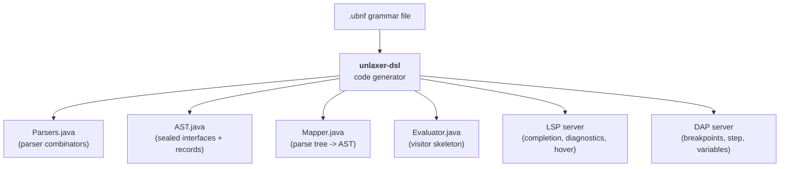
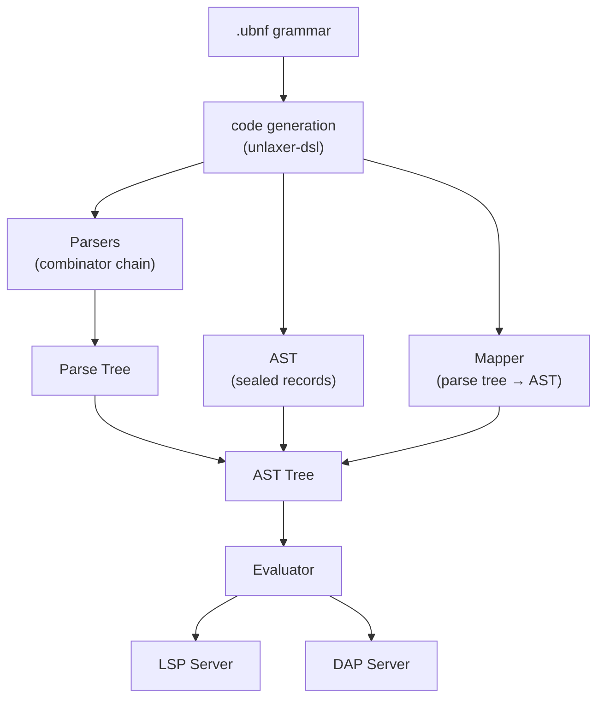

[English](./README.md) | [日本語](./README-ja.md)

---

```
                _
  _   _ _ __   | | __ ___  _____ _ __
 | | | | '_ \  | |/ _` \ \/ / _ \ '__|
 | |_| | | | | | | (_| |>  <  __/ |
  \__,_|_| |_| |_|\__,_/_/\_\___|_|
                              - parser
```

# unlaxer-parser

**Write a grammar, get a language — Parser + AST + Evaluator + LSP + DAP, all generated**

[](https://central.sonatype.com/artifact/org.unlaxer/unlaxer-common)
[](./LICENSE)
[]()
[]()

---

> **Version notice — 3.0.1**: This release contains a patch fix for the Simple wrapper generation bug (issue #22). If you depend on `unlaxer-common` or `unlaxer-dsl` at `2.x`, see [CHANGELOG](./CHANGELOG.md) and the [downstream drift warning](#downstream-drift-warning) below.

---

## Table of Contents

- [The Problem](#the-problem)
- [The Solution](#the-solution)
- [Quick Example](#quick-example)
- [What Gets Generated](#what-gets-generated)
- [5-Minute Quick Start](#5-minute-quick-start)
- [Architecture](#architecture)
- [Bootstrap and Self-Hosting](#bootstrap-and-self-hosting)
- [Real-World Example](#real-world-example)
- [Downstream Drift Warning](#downstream-drift-warning)
- [Documentation](#documentation)
- [Why unlaxer?](#why-unlaxer)
- [Project Structure](#project-structure)
- [foundation-poisonpills Note](#foundation-poisonpills-note)
- [License](#license)

---

## The Problem

Building a DSL typically means writing and maintaining **6+ subsystems** by hand:

| Subsystem | Lines (approx.) |
|-----------|----------------|
| Lexer / Parser | 2,000+ |
| AST node types | 1,500+ |
| Parse-tree-to-AST mapper | 1,000+ |
| Evaluator / interpreter | 2,000+ |
| LSP server (completion, diagnostics, hover) | 2,500+ |
| DAP server (breakpoints, stepping, variables) | 1,500+ |
| **Total** | **10,000+** |

These subsystems are tightly coupled. A single grammar change cascades across all of them.

## The Solution

Write a **UBNF grammar** (~300 lines). Run the generator. Get everything.



You write **only** the evaluation logic — typically 50–200 lines of `evalXxx` methods.

---

## Quick Example

Here is a fragment from the [tinyexpression](https://github.com/opaopa6969/tinyexpression) UBNF grammar:

```ubnf
@mapping(BinaryExpr, params=[left, op, right])
@leftAssoc
NumberExpression ::= NumberTerm @left { AddOp @op NumberTerm @right } ;

@mapping(BinaryExpr, params=[left, op, right])
@leftAssoc
NumberTerm ::= NumberFactor @left { MulOp @op NumberFactor @right } ;

AddOp ::= '+' | '-' ;
MulOp ::= '*' | '/' ;
```

From this, unlaxer generates:

- A **parser** that handles operator precedence and left-associativity correctly
- A **`BinaryExpr` AST record** with typed `left`, `op`, `right` fields
- A **mapper** that transforms the flat parse tree into a nested AST
- An **`evalBinaryExpr`** hook in the evaluator skeleton

---

## What Gets Generated

| You Write | unlaxer Generates |
|-----------|-------------------|
| Grammar rules (`::=`) | Parser combinators (`Parsers.java`) |
| `@mapping` annotations | AST sealed interfaces + records (`AST.java`) |
| `@left`, `@right`, `@op` captures | Parse-tree-to-AST mapper (`Mapper.java`) |
| `@leftAssoc` / `@rightAssoc` | Correct associativity handling |
| `@root` | Entry point parser |
| (your grammar) | Evaluator skeleton with `evalXxx` hooks (`Evaluator.java`) |
| (your grammar) | LSP server (completion, diagnostics, hover) |
| (your grammar) | DAP server (breakpoints, stepping, variables) |

---

## 5-Minute Quick Start

### 1. Add Maven dependencies

```xml
<dependencies>
    <dependency>
        <groupId>org.unlaxer</groupId>
        <artifactId>unlaxer-common</artifactId>
        <version>3.0.1</version>
    </dependency>
    <dependency>
        <groupId>org.unlaxer</groupId>
        <artifactId>unlaxer-dsl</artifactId>
        <version>3.0.1</version>
    </dependency>
</dependencies>
```

### 2. Write a grammar

Create `src/main/resources/TinyCalc.ubnf`:

```ubnf
grammar TinyCalc {
  @package: com.example.tinycalc

  token NUMBER = NumberParser
  token EOF    = EndOfSourceParser

  @root
  Formula ::= Expression EOF ;

  @mapping(BinaryExpr, params=[left, op, right])
  @leftAssoc
  Expression ::= Term @left { AddOp @op Term @right } ;

  @mapping(BinaryExpr, params=[left, op, right])
  @leftAssoc
  Term ::= Factor @left { MulOp @op Factor @right } ;

  Factor ::= NUMBER | '(' Expression ')' ;

  AddOp ::= '+' | '-' ;
  MulOp ::= '*' | '/' ;
}
```

### 3. Add the code generator plugin

```xml
<plugin>
    <groupId>org.codehaus.mojo</groupId>
    <artifactId>exec-maven-plugin</artifactId>
    <version>3.1.0</version>
    <executions>
        <execution>
            <phase>generate-sources</phase>
            <goals><goal>java</goal></goals>
            <configuration>
                <mainClass>org.unlaxer.dsl.CodegenMain</mainClass>
                <arguments>
                    <argument>${project.basedir}/src/main/resources/TinyCalc.ubnf</argument>
                    <argument>${project.build.directory}/generated-sources/ubnf</argument>
                </arguments>
            </configuration>
        </execution>
    </executions>
</plugin>
```

### 4. Generate code

```bash
mvn compile
```

This generates four files under `target/generated-sources/ubnf/com/example/tinycalc/`:

```
TinyCalcParsers.java    -- parser combinators
TinyCalcAST.java        -- sealed interface + records (BinaryExpr, etc.)
TinyCalcMapper.java     -- parse tree -> AST transformation
TinyCalcEvaluator.java  -- abstract evaluator with evalXxx hooks
```

### 5. Write the evaluator

```java
public class CalcEvaluator extends TinyCalcEvaluator<Double> {

    @Override
    protected Double evalBinaryExpr(BinaryExpr node) {
        Double left = eval(node.left());
        Double right = eval(node.right());
        return switch (node.op()) {
            case "+" -> left + right;
            case "-" -> left - right;
            case "*" -> left * right;
            case "/" -> left / right;
            default -> throw new IllegalArgumentException("Unknown op: " + node.op());
        };
    }

    @Override
    protected Double evalNumber(NumberLiteral node) {
        return Double.parseDouble(node.value());
    }
}
```

### 6. Run it

```java
var parser = new TinyCalcParsers();
var tree = parser.parse("1 + 2 * 3");
var ast = new TinyCalcMapper().map(tree);
var result = new CalcEvaluator().eval(ast);
System.out.println(result);  // 7.0
```

See [docs/getting-started.md](./docs/getting-started.md) for the full walkthrough.

---

## Architecture



See [docs/architecture.md](./docs/architecture.md) for the full pipeline, combinator catalog, and ParserIR design.

---

## Bootstrap and Self-Hosting

As of 3.0.x, unlaxer-dsl has crossed the **bootstrap threshold**: the UBNF grammar file `unlaxer-dsl/grammar/ubnf.ubnf` is itself written in UBNF and processed by unlaxer-dsl to regenerate `UBNFParsers.java`, `UBNFAST.java`, and `UBNFMapper.java`.

This means:

- The hand-written bootstrap files are now verification targets, not the source of truth
- Every grammar feature added to UBNF is exercised by the self-hosted parse of `ubnf.ubnf`
- The bootstrap path is: `ubnf.ubnf` → codegen → `bootstrap/generated/` → used by next codegen cycle

See [docs/architecture.md — Bootstrap](./docs/architecture.md#bootstrap-and-self-hosting) for details.

---

## Real-World Example

**[tinyexpression](https://github.com/opaopa6969/tinyexpression)** is a complete formula language built with unlaxer-parser.

- ~300-line UBNF grammar
- Variables, functions (`sin`, `cos`, `sqrt`, `min`, `max`), ternary operator, if/else, method declarations
- Full LSP support (completion, diagnostics, hover, go-to-definition)
- Full DAP support (breakpoints, stepping, variable inspection)
- Used in production

---

## Downstream Drift Warning

> **Warning**: The following downstream projects were built against **unlaxer-parser 2.x** and have not yet been validated against 3.0.1. API changes in `UBNFAST`, `UBNFMapper`, and `CodegenMain` entry point may cause breakage.

| Downstream project | Last validated against | Status |
|--------------------|----------------------|--------|
| [tinyexpression](https://github.com/opaopa6969/tinyexpression) | 2.8.0 | Unverified against 3.0.1 |
| [onigiri-parser](https://github.com/opaopa6969/onigiri-parser) | 2.6.0 | Unverified against 3.0.1 |
| [fraud-alert](https://github.com/opaopa6969/fraud-alert) | 2.8.0 | Unverified against 3.0.1 |

Before upgrading, check the [CHANGELOG](./CHANGELOG.md) for the `2.8.0 → 3.0.0` breaking changes section.

---

## Documentation

| Document | Description | Languages |
|----------|-------------|-----------|
| [Getting Started](./docs/getting-started.md) | Maven setup, first grammar, full walkthrough | [EN](./docs/getting-started.md) / [JA](./docs/getting-started-ja.md) |
| [UBNF Guide](./docs/ubnf-guide.md) | Full UBNF syntax, all annotations, feature matrix | [EN](./docs/ubnf-guide.md) / [JA](./docs/ubnf-guide-ja.md) |
| [Architecture](./docs/architecture.md) | Bootstrap pipeline, combinator catalog, ParserIR | [EN](./docs/architecture.md) / [JA](./docs/architecture-ja.md) |
| [Parser Fundamentals](./unlaxer-common/docs/tutorial-parser-fundamentals-dialogue.en.md) | Core parser combinator concepts | [EN](./unlaxer-common/docs/tutorial-parser-fundamentals-dialogue.en.md) / [JA](./unlaxer-common/docs/tutorial-parser-fundamentals-dialogue.ja.md) |
| [UBNF to LSP/DAP Tutorial](./unlaxer-dsl/docs/tutorial-ubnf-to-lsp-dap-dialogue.en.md) | Full pipeline: grammar to IDE support | [EN](./unlaxer-dsl/docs/tutorial-ubnf-to-lsp-dap-dialogue.en.md) / [JA](./unlaxer-dsl/docs/tutorial-ubnf-to-lsp-dap-dialogue.ja.md) |
| [Quick Start (5 min)](./unlaxer-dsl/docs/quickstart-dialogue.en.md) | Dialogue-format getting started guide | [EN](./unlaxer-dsl/docs/quickstart-dialogue.en.md) / [JA](./unlaxer-dsl/docs/quickstart-dialogue.ja.md) |
| [LLM Era and Unlaxer](./unlaxer-dsl/docs/llm-era-and-unlaxer-dialogue.en.md) | Why frameworks still matter in the age of LLMs | [EN](./unlaxer-dsl/docs/llm-era-and-unlaxer-dialogue.en.md) / [JA](./unlaxer-dsl/docs/llm-era-and-unlaxer-dialogue.ja.md) |

---

## Why unlaxer?

| | ANTLR | tree-sitter | PEG.js | **unlaxer** |
|---|---|---|---|---|
| Language | Java, C#, Python, ... | C + bindings | JavaScript | **Java** |
| Parser type | ALL(*) | GLR | PEG | **PEG + combinators** |
| AST generation | Manual | Manual | Manual | **Automatic** (from `@mapping`) |
| Evaluator skeleton | No | No | No | **Yes** |
| LSP generation | No | Partial (queries) | No | **Yes** |
| DAP generation | No | No | No | **Yes** |
| Grammar annotations | No | No | No | **Yes** (`@mapping`, `@leftAssoc`, `@eval`, ...) |
| Operator associativity | In grammar | In grammar | Manual | **`@leftAssoc` / `@rightAssoc`** |
| Zero dependencies | No | No | No | **Yes** (unlaxer-common) |
| Bootstrap / self-hosting | No | Yes | No | **Yes** (since 3.0.0) |

unlaxer is designed for Java teams who want to go from grammar to working IDE support with minimal boilerplate.

---

## Project Structure

```
unlaxer-parser/
  +-- unlaxer-common/     Core parser combinator library (zero dependencies)
  |     +-- src/          ~50 combinators, ~30 elementary parsers
  |     +-- docs/         Parser fundamentals tutorial
  +-- unlaxer-dsl/        Code generator: UBNF -> Parsers + AST + Mapper + Evaluator + LSP + DAP
  |     +-- grammar/      ubnf.ubnf (self-hosted grammar definition)
  |     +-- src/          Bootstrap parsers, codegen pipeline, IR
  |     +-- docs/         UBNF tutorials, extension roadmap, ParserIR design
  +-- docs/               Top-level guides (architecture, UBNF guide, getting started)
```

- **[unlaxer-common](./unlaxer-common/)** — Parser combinators inspired by RELAX NG. Infinite lookahead, backtracking, comprehensive logging. Pure Java, zero dependencies.
- **[unlaxer-dsl](./unlaxer-dsl/)** — Reads `.ubnf` grammar files and generates all the Java code you need.

---

## foundation-poisonpills Note

Some internal integration tests and codegen fixtures reference a module named `foundation-poisonpills`. This module is not published to Maven Central and is not part of the public API. Its purpose is internal adversarial testing of the parser combinator core (inputs designed to trigger worst-case backtracking). **You do not need it** to use unlaxer-parser. If you see a build error mentioning `foundation-poisonpills`, you are likely running the full internal test suite, which requires the private module to be present on the local classpath.

---

## License

MIT License. See [LICENSE](./LICENSE) for details.

## Contributing

Contributions are welcome. Please open an issue or pull request on [GitHub](https://github.com/opaopa6969/unlaxer-parser).

## Author

[opaopa6969](https://github.com/opaopa6969)
