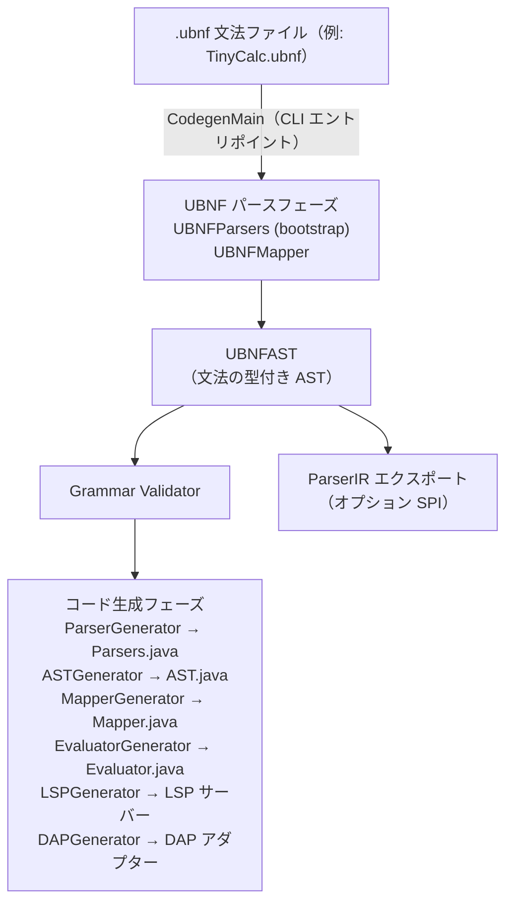
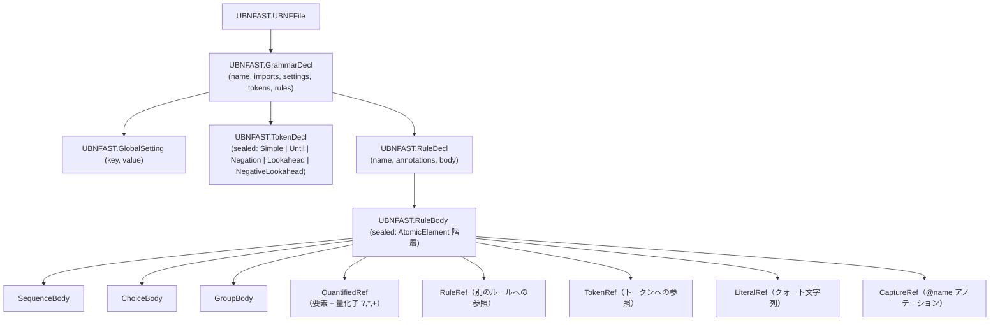

[English](./architecture.md) | [日本語](./architecture-ja.md)

---

# unlaxer-parser アーキテクチャ

**バージョン**: 3.0.1

このドキュメントでは、`.ubnf` 文法ファイルから動作する言語実装までの全パイプライン、`unlaxer-common` と `unlaxer-dsl` の内部構造、bootstrap / 自己ホスティングの仕組み、そして ParserIR 設計について説明します。

---

## 目次

- [パイプライン概要](#パイプライン概要)
- [unlaxer-common: パーサーコンビネータライブラリ](#unlaxer-common-パーサーコンビネータライブラリ)
  - [コア型](#コア型)
  - [コンビネータカタログ（約50個）](#コンビネータカタログ)
  - [エレメンタリーパーサーカタログ（約30個）](#エレメンタリーパーサーカタログ)
- [unlaxer-dsl: コード生成パイプライン](#unlaxer-dsl-コード生成パイプライン)
  - [UBNF パースフェーズ](#ubnf-パースフェーズ)
  - [UBNFAST](#ubnfast)
  - [検証フェーズ](#検証フェーズ)
  - [コード生成フェーズ](#コード生成フェーズ)
- [Bootstrap と自己ホスティング](#bootstrap-と自己ホスティング)
- [ParserIR](#parserir)
- [生成物マップ](#生成物マップ)

---

## パイプライン概要



---

## unlaxer-common: パーサーコンビネータライブラリ

`unlaxer-common` は純粋な Java、ゼロ依存のパーサーコンビネータライブラリです。生成されたパーサーが動作するランタイム基盤を提供します。

### コア型

| 型 | 説明 |
|----|------|
| `Parser` | 基底インターフェース。すべてのパーサーが `parse(ParseContext) → Parsed` を実装します |
| `ParseContext` | ソーステキスト、カーソル位置、トークンスタック、デバッグリスナー、トランザクション状態を管理します |
| `Parsed` | 結果型。ステータス（`succeeded` / `stopped` / `failed`）、消費済みトークン、診断メッセージを保持します |
| `Cursor` | Unicode コードポイントサポート付きの位置トラッキング（行/列とインデックス演算） |
| `Token` | マッチしたスパン：パーサークラス、開始/終了カーソル、マッチしたテキスト |
| `Source` | コードポイントインデックス付きの `String` 上の入力ソース抽象化 |

### コンビネータカタログ

`org.unlaxer.parser.combinator` にはおよそ **50個のコンビネータクラス** があります：

| クラス | 説明 |
|--------|------|
| `Chain` | 逐次合成：A → B → C |
| `LazyChain` | 遅延初期化チェーン（再帰文法向け） |
| `Choice` | 順序付き選択肢：A を試し、失敗したら B を試す |
| `LazyChoice` | 遅延初期化選択肢 |
| `ZeroOrMore` | クリーネスター：UBNF の `{A}`、正規表現記法の `A*` |
| `LazyZeroOrMore` | 遅延初期化ゼロ以上 |
| `OneOrMore` | 1回以上：`A+` |
| `LazyOneOrMore` | 遅延初期化1回以上 |
| `Optional` / `LazyOptional` | ゼロまたは1回：`[A]` または `A?` |
| `NonOrdered` | 順序なし結合：すべての要素が任意の順序で出現する必要がある |
| `Not` | 否定先読み：A が失敗した場合に成功、何も消費しない |
| `Flatten` | ネストされたトークンツリーを単一レベルに平坦化 |
| `MatchOnly` | 消費なしのマッチ（先読みアサーション） |
| `ConstructedCombinatorParser` | 生成されたパーサークラスの基底クラス |
| `ASTNode` | 子追跡付きパースツリーノード |

### エレメンタリーパーサーカタログ

`org.unlaxer.parser.elementary` と `org.unlaxer.parser.posix` にはおよそ **30個のエレメンタリーパーサー** があります：

| クラス | マッチ対象 |
|--------|----------|
| `SingleCharacterParser` | 正確な1文字 |
| `SingleStringParser` | 正確な文字列リテラル |
| `WordParser` | 識別子文字（英字 + 数字 + `_`） |
| `NumberParser` | 整数シーケンス `[0-9]+`、codegen では `int` として推論 |
| `QuotedParser` | エスケープシーケンス付きダブルクォート文字列 |
| `SingleQuotedParser` | シングルクォート文字列（UBNF リテラルで使用） |
| `EndOfSourceParser` | 入力末尾のみでマッチ |
| `StartOfSourceParser` | 入力先頭のみでマッチ |
| `EndOfLineParser` | `\n`、`\r\n`、または `\r` |
| `WildCardCharacterParser` | 任意の1文字 |
| `WildCardStringParser` | 任意の文字シーケンス（greedy） |
| `WildCardStringTerminatorParser` | ターミネーター文字列までの任意シーケンス |
| `WildCardLineParser` | 任意の1行 |
| `EmptyParser` | 常に成功し、何も消費しない |
| `EmptyLineParser` | 空白のみを含む行 |
| `IgnoreCaseWordParser` | 大文字小文字を区別しないワードマッチ |
| `DigitParser` (posix) | POSIX digit `[0-9]` |
| `AlphabetParser` (posix) | POSIX alpha `[a-zA-Z]` |

---

## unlaxer-dsl: コード生成パイプライン

### UBNF パースフェーズ

bootstrap パーサー（`org.unlaxer.dsl.bootstrap` 内の `UBNFParsers`、`UBNFMapper`、`UBNFAST`）が `.ubnf` ファイルを読み込み、`UBNFAST.UBNFFile` 値を生成します。

3.0.0 以降、これらの bootstrap ファイルは自身が `grammar/ubnf.ubnf` に対して `unlaxer-dsl` を実行することで生成されています。生成された出力は `org.unlaxer.dsl.bootstrap.generated` に存在します。

### UBNFAST

`UBNFAST` は解析された文法を表す sealed-interface AST です：



`RuleDecl` のアノテーション型：

| アノテーション | 効果 |
|--------------|------|
| `@root` | エントリポイントルールをマーク |
| `@mapping(Type, params=[...])` | リストされたフィールドを持つ Java レコード `Type` を生成 |
| `@leftAssoc` / `@rightAssoc` | パーサーに左 / 右結合性を生成 |
| `@whitespace: style` | 暗黙の空白スキップを挿入 |
| `@comment: { line: '//' }` | 暗黙のコメントスキップを挿入 |
| `@enum` | ルールの選択肢から Java enum を生成 |
| `@commonField` | フィールドを sealed interface メソッドに引き上げる |
| `@scopeTree` | ParserIR にスコープ enter/leave イベントを出力 |
| `@declares` | キャプチャをスコープ内のシンボル定義としてマーク |
| `@backref` | キャプチャを後方参照制約の対象となるシンボル使用としてマーク |

### 検証フェーズ

`GrammarValidator` は codegen 前に実行され、構造化された警告を出力します：

| コード | 条件 |
|--------|------|
| `W-TOKEN-UNRESOLVED` | トークンが静的に解決できないクラス名を参照している |
| `W-RULE-UNDEFINED` | ルールボディが文法内で定義されていないルール名を参照している |
| `W-MAPPING-PARAM-ORDER` | `@mapping params=` リストの順序がルールボディのキャプチャ順序と一致しない |
| `W-WRAPPER-CONFLICT` | Simple wrapper 名が既存のルール名と衝突している（3.0.1 で修正） |

### コード生成フェーズ

検証済みの `UBNFAST` に対して6つのジェネレーターが順次実行されます：

| ジェネレーター | 出力 | 主要ロジック |
|--------------|------|------------|
| `ParserGenerator` | `XxxParsers.java` | 各ルール → `ConstructedCombinatorParser` サブクラス。`@leftAssoc` ルールはループ構造を取得 |
| `ASTGenerator` | `XxxAST.java` | 各 `@mapping` → レコード。文法のすべてのレコード → sealed interface。`@enum` → Java enum |
| `MapperGenerator` | `XxxMapper.java` | パースツリーを走査し、名前でキャプチャをマッチし、レコードを構築 |
| `EvaluatorGenerator` | `XxxEvaluator.java` | 抽象ビジター：AST ノード型ごとに1つの `evalXxx(XxxNode)` メソッド |
| `LSPGenerator` | `XxxLanguageServer.java` | LSP4J ベースのサーバー：補完、診断、ホバー、定義へのジャンプ |
| `DAPGenerator` | `XxxDebugAdapter.java` | DAP ベースのアダプター：ブレークポイント、ステッピング、変数インスペクション |

---

## Bootstrap と自己ホスティング

Bootstrap シーケンスは以下の通りです：

```
ステップ1: grammar/ubnf.ubnf  (UBNF 構文を記述する UBNF 文法)
           │
           ▼
ステップ2: 手書きの UBNFParsers / UBNFAST / UBNFMapper
          (org.unlaxer.dsl.bootstrap — リファレンスとして保持)
           │
           ▼
ステップ3: CodegenMain が手書きのパーサーを使って ubnf.ubnf を処理
           │
           ▼
ステップ4: 生成された UBNFParsers / UBNFAST / UBNFMapper
          (org.unlaxer.dsl.bootstrap.generated)
           │
           ▼
ステップ5: SelfHostingTest が検証: 生成されたパーサーで ubnf.ubnf をパース
          → 出力が手書きの bootstrap と一致することを確認
```

この重要性：

- **完全性テスト**: すべての UBNF 機能は UBNF で表現可能でなければならない。`ubnf.ubnf` がパースできなければ、何かが欠けている。
- **リグレッションガード**: codegen への変更が UBNF 文法を壊した場合、即座に検出される。
- **ドキュメント**: `ubnf.ubnf` は UBNF 構文の正規の機械可読仕様として機能する。

bootstrap ファイル（`org.unlaxer.dsl.bootstrap.UBNFParsers` など）はコンパイル可能な状態に保たれ、フリーズされたリファレンスとしてテストされます。生成されたファイル（`org.unlaxer.dsl.bootstrap.generated.*`）がライブ実装です。

---

## ParserIR

`ParserIR` は、codegen パイプラインを **UBNF 以外のパーサー** からもアクセス可能にするために設計された中間表現です。

### 動機

codegen パイプライン（mapper → evaluator → LSP → DAP）は、本質的にパーサーが unlaxer によって生成されたことを要求しません。`ParserIrDocument` を生成できるパーサーであれば、同じ downstream ステップに接続できます。

### ドキュメント構造

| フィールド | 型 | 要件 |
|------------|------|------|
| `irVersion` | `"1.0"` | 必須 |
| `source` | パスまたは論理 id | 必須 |
| `nodes` | `[IrNode]` | 必須 |
| `diagnostics` | `[IrDiagnostic]` | 必須（空でも可） |
| `tokens` | `[IrToken]` | オプション |
| `trivia` | `[IrTrivia]` | オプション |
| `scopeEvents` | `[IrScopeEvent]` | オプション |
| `annotations` | `[IrAnnotation]` | オプション |

各 `IrNode` は以下を保持します：`id`、`kind`、`span.start`、`span.end`、オプションの `parentId`、`children`、`text`、`attributes`。

### 不変条件

- ノードスパンは非負で `start <= end` でなければならない
- `nodes` には少なくとも1つのノードが含まれなければならない
- `parentId` が存在する場合、親ノードが存在しなければならない
- スコープ enter/leave イベントは `scopeId` ごとにバランスが取れている必要がある（LIFO 順序）
- 診断スパンはソーススパン範囲内でなければならない

### SPI

外部パーサーを接続するために `ParserIrAdapter` を実装します：

```java
public interface ParserIrAdapter {
    ParserIrAdapterMetadata metadata();
    ParserIrDocument parseToIr(ParseRequest request);
}
```

`ParserIrAdapterMetadata` は、アダプター id、サポートされている IR バージョン、機能フラグ（interleave、backreference、scope events）を宣言します。

リファレンス実装は `src/test/java/org/unlaxer/dsl/ParserIrAdapterContractTest.java`（`ScopeTreeSampleAdapter`）で確認できます。

ParserIR v1 の JSON スキーマは `unlaxer-dsl/docs/schema/parser-ir-v1.draft.json` にあります。

---

## 生成物マップ

`@package: com.example.tinycalc` を持つ `TinyCalc` という名前の文法の場合：

```
target/generated-sources/ubnf/com/example/tinycalc/
  TinyCalcParsers.java        ルールごとに ConstructedCombinatorParser を継承
  TinyCalcAST.java            sealed interface TinyCalcNode + レコード
  TinyCalcMapper.java         TinyCalcMapper.map(Token) → TinyCalcNode
  TinyCalcEvaluator.java      evalXxx(XxxNode) メソッドを持つ抽象クラス
  TinyCalcLanguageServer.java LSP4J LanguageServer 実装
  TinyCalcDebugAdapter.java   DAP IDebugProtocolServer 実装
```

LSP と DAP サーバーはスタンドアロンです — 生成された `XxxLSPLauncher` および `XxxDAPLauncher` クラスを介して別プロセスとして起動できます。
