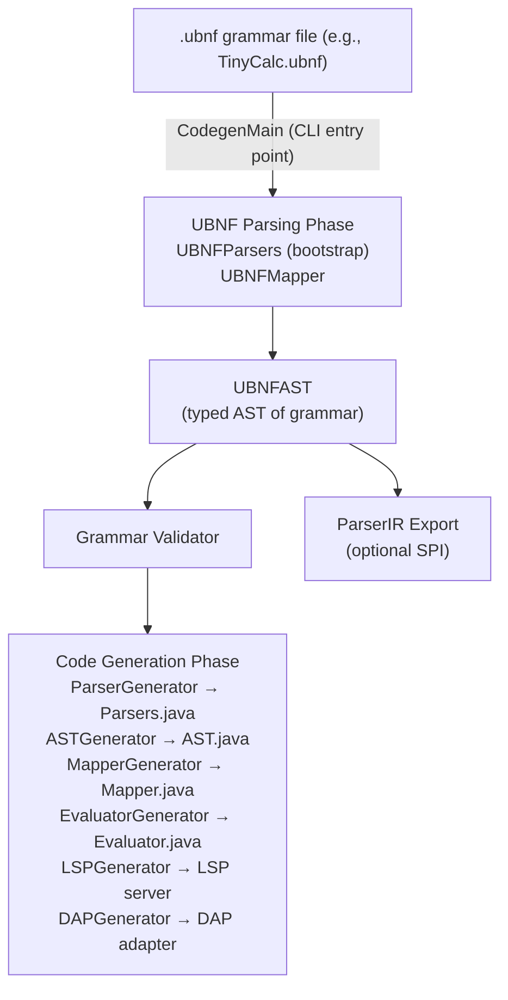
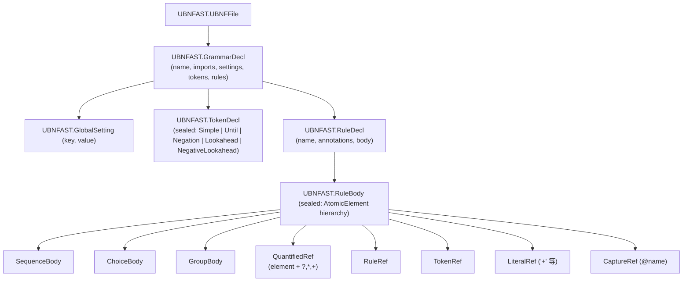

[English](./architecture.md) | [日本語](./architecture-ja.md)

---

# unlaxer-parser Architecture

**Version**: 3.0.10

This document describes the full pipeline from a `.ubnf` grammar file to a running language implementation, the internal structure of `unlaxer-common` and `unlaxer-dsl`, the bootstrap / self-hosting mechanism, and the ParserIR design.

---

## Table of Contents

- [Pipeline Overview](#pipeline-overview)
- [unlaxer-common: Parser Combinator Library](#unlaxer-common-parser-combinator-library)
  - [Core Types](#core-types)
  - [Combinator Catalog (~50)](#combinator-catalog)
  - [Elementary Parser Catalog (~30)](#elementary-parser-catalog)
- [unlaxer-dsl: Code Generation Pipeline](#unlaxer-dsl-code-generation-pipeline)
  - [UBNF Parsing Phase](#ubnf-parsing-phase)
  - [UBNFAST](#ubnfast)
  - [Validation Phase](#validation-phase)
  - [Code Generation Phase](#code-generation-phase)
- [Bootstrap and Self-Hosting](#bootstrap-and-self-hosting)
- [ParserIR](#parser-ir)
- [Generated Artifact Map](#generated-artifact-map)

---

## Pipeline Overview



---

## unlaxer-common: Parser Combinator Library

`unlaxer-common` is a pure Java, zero-dependency parser combinator library. It provides the runtime foundation that generated parsers run on.

### Core Types

| Type | Description |
|------|-------------|
| `Parser` | Base interface. All parsers implement `parse(ParseContext) → Parsed`. |
| `ParseContext` | Manages source text, cursor position, token stack, debug listeners, and transaction state. |
| `Parsed` | Result type. Carries status (`succeeded` / `stopped` / `failed`), consumed tokens, and diagnostic messages. |
| `Cursor` | Position tracking with Unicode code point support, line/column, and index arithmetic. |
| `Token` | A matched span: parser class, start/end cursor, matched text. |
| `Source` | Input source abstraction over `String` with code point indexing. |

### Combinator Catalog

There are approximately **50 combinator classes** in `org.unlaxer.parser.combinator`:

| Class | Description |
|-------|-------------|
| `Chain` | Sequential composition: A then B then C |
| `LazyChain` | Lazy-initialized chain (for recursive grammars) |
| `Choice` | Ordered alternation: try A, if fails try B |
| `LazyChoice` | Lazy-initialized choice |
| `ZeroOrMore` | Kleene star: `{A}` in UBNF, `A*` in regex notation |
| `LazyZeroOrMore` | Lazy-initialized zero-or-more |
| `OneOrMore` | One or more: `A+` |
| `LazyOneOrMore` | Lazy-initialized one-or-more |
| `Optional` / `LazyOptional` | Zero or one: `[A]` or `A?` |
| `NonOrdered` | Unordered conjunction: all elements must appear, any order |
| `Not` | Negative lookahead: succeeds if A fails, consumes nothing |
| `Flatten` | Flatten nested token trees to a single level |
| `MatchOnly` | Match without consuming (lookahead assertion) |
| `ConstructedCombinatorParser` | Base for generated parser classes |
| `ASTNode` | Parse tree node with child tracking |

### Elementary Parser Catalog

There are approximately **30 elementary parsers** in `org.unlaxer.parser.elementary` and `org.unlaxer.parser.posix`:

| Class | Matches |
|-------|---------|
| `SingleCharacterParser` | Exact single character |
| `SingleStringParser` | Exact string literal |
| `WordParser` | Identifier characters (letters + digits + `_`) |
| `NumberParser` | Integer sequence `[0-9]+`, inferred as `int` in codegen |
| `QuotedParser` | Double-quoted string with escape sequences |
| `SingleQuotedParser` | Single-quoted string (used in UBNF literals) |
| `EndOfSourceParser` | Matches only at end of input |
| `StartOfSourceParser` | Matches only at start of input |
| `EndOfLineParser` | `\n`, `\r\n`, or `\r` |
| `WildCardCharacterParser` | Any single character |
| `WildCardStringParser` | Any sequence of characters (greedy) |
| `WildCardStringTerminatorParser` | Any sequence until a terminator string |
| `WildCardLineParser` | Any single line |
| `EmptyParser` | Always succeeds, consumes nothing |
| `EmptyLineParser` | A line containing only whitespace |
| `IgnoreCaseWordParser` | Case-insensitive word match |
| `DigitParser` (posix) | POSIX digit `[0-9]` |
| `AlphabetParser` (posix) | POSIX alpha `[a-zA-Z]` |

---

## unlaxer-dsl: Code Generation Pipeline

### UBNF Parsing Phase

The bootstrap parser (`UBNFParsers`, `UBNFMapper`, `UBNFAST` in `org.unlaxer.dsl.bootstrap`) reads a `.ubnf` file and produces a `UBNFAST.UBNFFile` value.

These hand-written bootstrap classes in `org.unlaxer.dsl.bootstrap` are the **live implementation** used by codegen (`CodegenMain` / `CodegenRunner` import them directly). `unlaxer-dsl` can also regenerate a `UBNFParsers` from `grammar/ubnf.ubnf` into `org.unlaxer.dsl.bootstrap.generated`, but that generated class is currently a thin shim that delegates back to the hand-written parser — see [Bootstrap and Self-Hosting](#bootstrap-and-self-hosting) for the exact status.

### UBNFAST

`UBNFAST` is a sealed-interface AST representing the parsed grammar:



Annotation types on `RuleDecl`:

| Annotation | Effect |
|------------|--------|
| `@root` | Marks the entry point rule |
| `@mapping(Type, params=[...])` | Generates a Java record `Type` with the listed fields |
| `@leftAssoc` / `@rightAssoc` | Generates left / right associativity in the parser |
| `@whitespace: style` | Inserts implicit whitespace skipping |
| `@comment: { line: '//' }` | Inserts implicit comment skipping |
| `@enum` | Generates a Java enum from the rule's alternatives |
| `@commonField` | Lifts a field into the sealed interface method |
| `@scopeTree` | Emits scope enter/leave events in ParserIR |
| `@declares` | Marks a capture as a symbol definition in scope |
| `@backref` | Marks a capture as a symbol use subject to backreference constraint |

### Validation Phase

`GrammarValidator` runs before codegen and emits structured warnings:

| Code | Condition |
|------|-----------|
| `W-GENERAL-NO-ROOT` | The grammar has no `@root` rule (and not all rules are imported) |
| `W-LEFT-RECURSION` | A left-recursive cycle was detected among the rules |
| `W-TOKEN-UNRESOLVED` | A `token` references a parser class name that cannot be statically resolved (a fully-qualified-name hint is offered when a bundled parser matches) |

### Code Generation Phase

Eight generators run sequentially on the validated `UBNFAST` (registered in `CodegenRunner.generatorMap()`):

| Generator | Output | Key logic |
|-----------|--------|-----------|
| `ASTGenerator` | `XxxAST.java` | Each `@mapping` → a `record`. All records for a grammar → a `sealed interface`. `@enum` → a Java `enum`. |
| `ParserGenerator` | `XxxParsers.java` | Each rule → a `ConstructedCombinatorParser` subclass. `@leftAssoc` rules get a loop structure. |
| `MapperGenerator` | `XxxMapper.java` | Traverses parse tree, matches captures by name, constructs records. |
| `EvaluatorGenerator` | `XxxEvaluator.java` | Abstract visitor: one `evalXxx(XxxNode)` method per AST node type. |
| `LSPGenerator` | `XxxLanguageServer.java` | LSP4J-based server: completion, diagnostics, hover, go-to-definition. |
| `LSPLauncherGenerator` | `XxxLSPLauncher.java` | Standalone launcher entry point for the generated LSP server. |
| `DAPGenerator` | `XxxDebugAdapter.java` | DAP-based adapter: breakpoints, stepping, variable inspection. |
| `DAPLauncherGenerator` | `XxxDAPLauncher.java` | Standalone launcher entry point for the generated DAP adapter. |

---

## Bootstrap and Self-Hosting

Self-application is **partial today**. The actual sequence is:

```
Step 1: grammar/ubnf.ubnf  (UBNF grammar describing UBNF syntax)
           │
           ▼
Step 2: Hand-written UBNFParsers / UBNFAST / UBNFMapper
        (in org.unlaxer.dsl.bootstrap — the LIVE implementation)
           │
           ▼
Step 3: CodegenMain / CodegenRunner process .ubnf using the
        hand-written UBNFMapper + UBNFAST
           │
           ▼
Step 4: ParserGenerator can regenerate a UBNFParsers from ubnf.ubnf.
        The checked-in generated class (org.unlaxer.dsl.bootstrap.generated
        .UBNFParsers) is a thin shim that DELEGATES to the hand-written
        parser. There is no generated UBNFAST or UBNFMapper.
           │
           ▼
Step 5: SelfHostingTest / SelfHostingRoundTripTest verify that the
        regenerated parser source compiles and is structurally sound,
        and that generation is deterministic (stage-1 source == stage-2).
        Both stages reuse the hand-written UBNFMapper, so — as the tests'
        own comments state — this is NOT yet a true fixpoint.
```

The significance:

- **Completeness test**: Every UBNF feature must be expressible in UBNF. If `ubnf.ubnf` cannot be parsed, something is missing.
- **Regression guard**: Changes to codegen that break the UBNF grammar are caught immediately.
- **Documentation**: `ubnf.ubnf` serves as the canonical machine-readable specification of UBNF syntax.

What is guaranteed today is **determinism** of the parser generator's self-application, not a fully self-hosted toolchain. The live implementation is the hand-written `org.unlaxer.dsl.bootstrap.*` package; the generated `org.unlaxer.dsl.bootstrap.generated.UBNFParsers` shim delegates to it, and generated `UBNFAST` / `UBNFMapper` do not yet exist. Closing that gap (a generated mapper that lets the pipeline reproduce itself end to end) is remaining work.

---

## Parser IR

`ParserIR` is an intermediate representation designed to make the codegen pipeline accessible to **non-UBNF parsers**.

### Motivation

The codegen pipeline (mapper → evaluator → LSP → DAP) does not inherently require that the parser was generated by unlaxer. Any parser that can produce a `ParserIrDocument` can feed into the same downstream steps.

### Document Structure

| フィールド | 型 | 要件 |
|------------|------|------|
| `irVersion` | `"1.0"` | required |
| `source` | path or logical id | required |
| `nodes` | `[IrNode]` | required |
| `diagnostics` | `[IrDiagnostic]` | required (may be empty) |
| `tokens` | `[IrToken]` | optional |
| `trivia` | `[IrTrivia]` | optional |
| `scopeEvents` | `[IrScopeEvent]` | optional |
| `annotations` | `[IrAnnotation]` | optional |

Each `IrNode` carries: `id`, `kind`, `span.start`, `span.end`, optional `parentId`, `children`, `text`, `attributes`.

### Invariants

- Node spans must be non-negative with `start <= end`.
- `nodes` must contain at least one node.
- If `parentId` exists, the parent node must exist.
- Scope enter/leave events must be balanced per `scopeId` (LIFO order).
- Diagnostic spans must be within the source span range.

### SPI

Implement `ParserIrAdapter` to connect an external parser:

```java
public interface ParserIrAdapter {
    ParserIrAdapterMetadata metadata();
    ParserIrDocument parseToIr(ParseRequest request);
}
```

`ParserIrAdapterMetadata` declares the adapter id, supported IR versions, and feature flags (interleave, backreference, scope events).

A reference implementation is available in `src/test/java/org/unlaxer/dsl/ParserIrAdapterContractTest.java` (`ScopeTreeSampleAdapter`).

The JSON schema for ParserIR v1 is at `unlaxer-dsl/docs/schema/parser-ir-v1.draft.json`.

---

## Generated Artifact Map

For a grammar named `TinyCalc` with `@package: com.example.tinycalc`:

```
target/generated-sources/ubnf/com/example/tinycalc/
  TinyCalcParsers.java        extends ConstructedCombinatorParser per rule
  TinyCalcAST.java            sealed interface TinyCalcNode + records
  TinyCalcMapper.java         TinyCalcMapper.map(Token) → TinyCalcNode
  TinyCalcEvaluator.java      abstract class with evalXxx(XxxNode) methods
  TinyCalcLanguageServer.java LSP4J LanguageServer implementation
  TinyCalcDebugAdapter.java   DAP IDebugProtocolServer implementation
```

The LSP and DAP servers are standalone — they can be launched as separate processes via the generated `XxxLSPLauncher` and `XxxDAPLauncher` classes.
