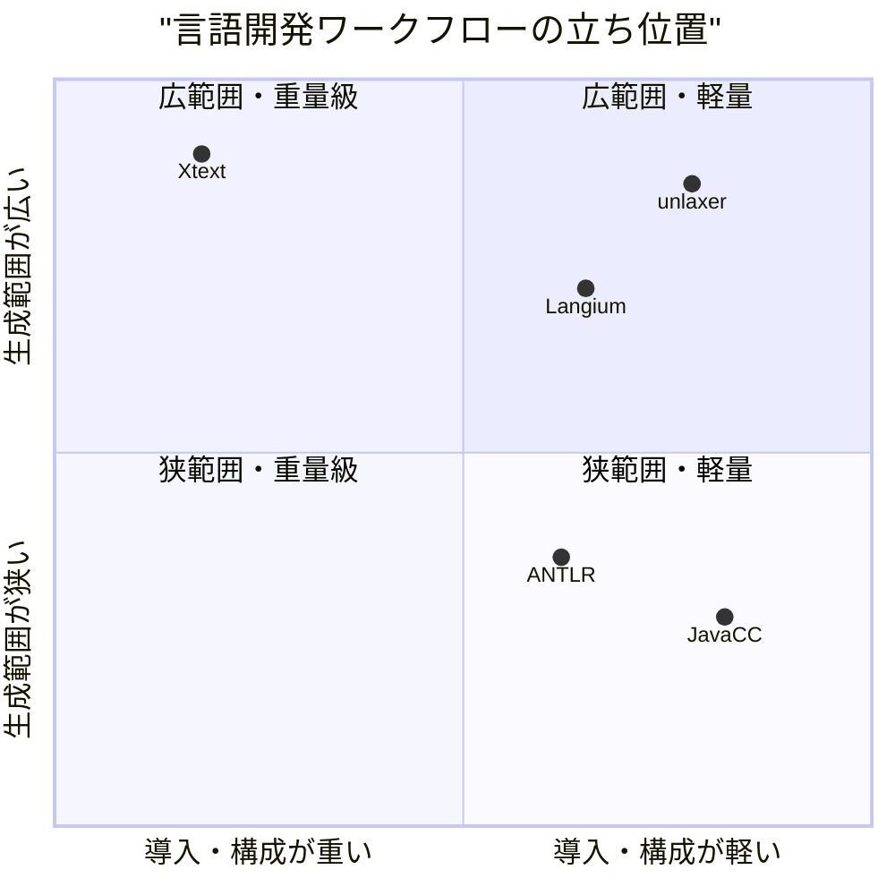
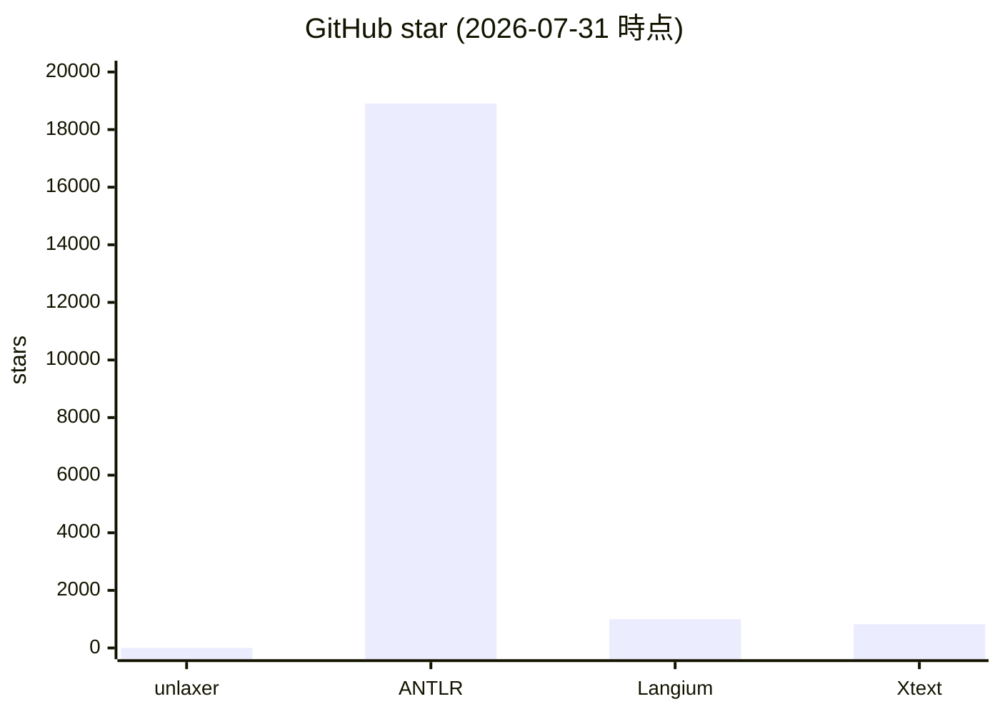
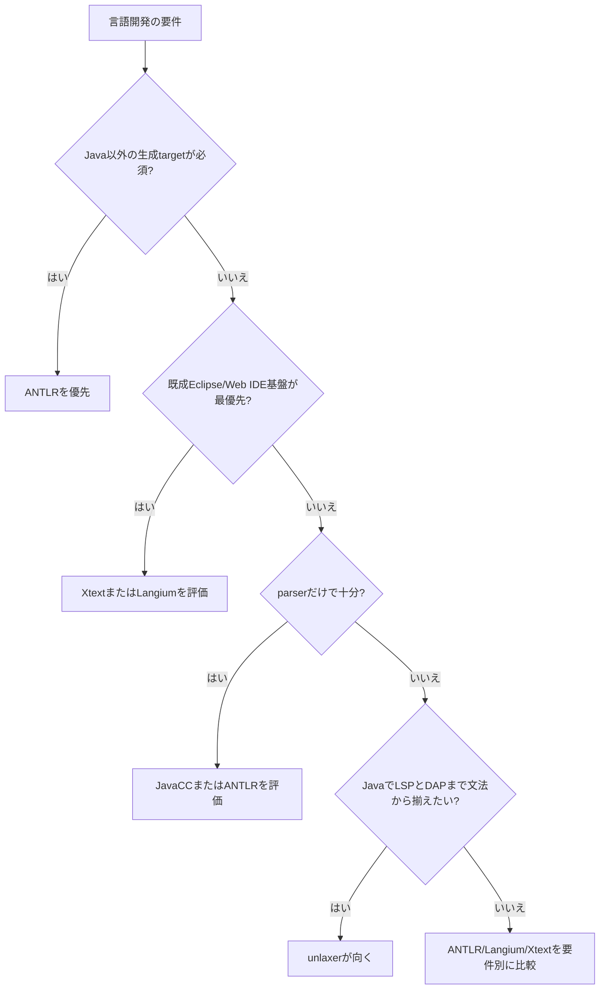

# 0. 要約

立ち位置: Java向けに、UBNF一枚から parser・型付きAST・Evaluator骨格・LSP・DAPまで生成できる、統合度の高い小規模ライブラリである。

最大の弱点: ANTLRの多言語・知名度、Langium/Xtextの既成IDE基盤、JavaCCのJava導入実績に対して、公開採用の厚みと導入時の安心材料がまだ弱い。

次の一手: 「LSP/DAPまで生成される最小のJava DSL」を固定した再現可能なサンプルと互換性テストとして製品化し、機能追加より先に導入リスクを下げる。

# 1. このrepoは何か

一言でいえば、Java 21のMavenプロジェクトで文法ファイルを書き、言語処理系の複数サブシステムを生成するライブラリである。`unlaxer-common` は依存ゼロのJava parser combinator基盤、`unlaxer-dsl` は `.ubnf` を読み込み、Parser・AST・Mapper・Evaluator・LSP・DAPを生成するコードジェネレータである。[README](https://github.com/opaopa6969/unlaxer-parser/blob/master/README.md) と `docs/architecture.md`、実装を突き合わせて確認した。

価値はrepo単体の「パーサを呼ぶAPI」ではなく、文法変更に伴う parser / AST / mapper / 実行ロジック / IDE連携の手作業を一つの生成パイプラインに揃えることにある。したがって比較単位は parser generator単体ではなく、文法から実用的なDSL開発環境までを作るワークフローとした。ANTLRとJavaCCはparser生成寄り、LangiumとXtextは言語ワークベンチ寄りで、完全な同条件ではない。その差自体を比較結果に残す。

想定利用者は、Javaコードベースに小さなDSL・設定言語・式言語を組み込み、VS Code等からの診断・補完・定義ジャンプ・デバッグも欲しいチームである。利用者が書くのは主にUBNFとEvaluatorの実装で、READMEの例ではEvaluator実装は50〜200行程度としている（これはREADMEの記述であり、一般的な実測値ではない）。

調査時点の客観指標は、HEAD `c43d93a`、Java main 429ファイル・39,812行、テストJava 202ファイル、`@Test` 135件、`mvn -q test` 成功、Maven成果物 `unlaxer-common-3.0.11.jar` 496,977 bytes / `unlaxer-dsl-3.0.11.jar` 506,516 bytes である。Maven Centralへの公開導線はREADMEとPOMにあるが、ここではリポジトリ内の公開状態以上の採用数は確認していない。

# 1.5 調査の型

`library` とした。主な成果物はJavaライブラリとコードジェネレータで、利用者はプログラマ、入力は文法、出力はJavaソースとLSP/DAPサーバである。比較軸は、機能表だけでなく、文法の表現、生成される型・IDE層、拡張点、ランタイム依存、テストと配布サイズ、ライセンス、Javaへの適合度とした。

この型では比較対象コードを読む必要があるため、ANTLRのJava `Tool` 周辺、Langiumのgrammar定義とLanguage Server周辺、Xtextの`LanguageServerImpl`、JavaCCの`Main`・README・ビルド構成を公開リポジトリで確認した。競合側の公開API数を同一基準で安全に数えることはできなかったので、4.5節では「数えられた自repoの数字」と、コードから確認できた実装方針を分けて記載する。

# 2. 比較対象と選定理由

| 製品 | 何ができるか | 採用状況 | ライセンス | うちとの決定的な違い | なぜ比較対象に選んだか |
|---|---|---|---|---|---|
| ANTLR | 文法からlexer/parser、parse tree、listener/visitorを生成。10以上のターゲット言語に対応 | ★18.9k / 最終リリース 4.13.2（2024-08-03） | BSD-3-Clause | 多言語・大規模なparser基盤だが、AST/LSP/DAPは利用者が組み立てる | parser generatorの認知・採用における最大の基準で、Java利用の代替候補だから |
| Eclipse Langium | TypeScriptで文法からAST・検証・LSPを備えたDSL/言語基盤を作る | ★1.0k / 4.2.4（2026-05-11） | MIT | LSPとWeb/Node.js適合が強いが、Java生成とDAP生成は主目的ではない | 「文法から言語＋IDE」を軽量に作る現代的な同職種の候補だから |
| Eclipse Xtext | 文法からparser、linker、compiler/interpreter、Eclipse/Web IDE、LSPまで提供 | ★824 / GitHub確認時に2.40系列の開発が表示 | EPL-2.0 | JVMの重量級言語ワークベンチで、生態系とIDE統合が厚いが導入範囲が広い | Java/JVMでIDE付き言語開発を丸ごと比較する相手だから |
| JavaCC | Javaを中心に文法からtop-down parserを生成。JJTreeによるtree buildingとdebuggingも提供 | ★数はGitHub画面で取得できず / 7.0.13（リリースページ表示） | BSD-3-Clause | Java導入が軽くparserに集中するが、LSP/DAP/型付きAST生成は別作業 | Java/Mavenでparserを作る際の直接的な既存選択肢だから |

この地図は「parser生成の標準」と「IDEまで含む言語基盤」が分かれている。ANTLRは採用規模と多言語性で明確な標準だが、そこからAST・LSP・DAPを完成させる作業は残る。LangiumとXtextはIDE層まで持つ一方、Node/TypeScriptまたはEclipse/JVM基盤に乗る。unlaxerの空き地は、Javaの通常のMaven開発に寄せたまま、parser generatorより上の成果物を一回の生成で揃える部分である。ただしこの結論は、利用者が本当にLSP/DAPまで必要とするケースに限って有効である。

# 3. ポジショニング

軸の位置は、各プロジェクトの公式説明とコード構成からの定性的な整理であり、数値測定ではない。star数だけで導入の重さや生成範囲を推定していないため、この図は比較の補助であって採用確率の図ではない。

# 4. 機能比較

| 機能 | 重み | unlaxer | ANTLR | Langium | Xtext | JavaCC |
|---|---|---|---|---|---|---|
| Javaで文法からparserを生成 | ◎必須 | ○ | ○ | × | ○ | ○ |
| ASTを文法から型付き生成 | ◎必須 | ○ | △ | ○ | ○ | △ |
| Mapper / parse treeからASTの標準経路 | ◎必須 | ○ | △ | ○ | ○ | △ |
| Evaluator / interpreterの骨格生成 | ○効く | ○ | × | △ | △ | × |
| LSP（診断・補完・定義等）を標準生成 | ◎必須 | ○ | × | ○ | ○ | × |
| DAP（breakpoint・step・variables）を標準生成 | ◎必須 | ○ | × | × | △ | × |
| 演算子の結合規則を文法注釈で表現 | ○効く | ○ | △ | △ | ○ | △ |
| parserランタイムの依存を抑えた配布 | ○効く | ○（commonは依存ゼロ） | △ | × | × | ○（JREのみの説明） |
| 多言語ターゲット | △あれば | × | ○ | × | △ | △ |
| Web / Node.jsへの組み込み | △あれば | × | △ | ○ | △ | × |
| 既成IDE・エコシステムの厚み | ○効く | × | ○ | ○ | ○ | △ |

unlaxerの痛い×は多言語と既成エコシステムである。Java以外のランタイムや既成IDEを最優先する利用者には、機能の多さを説明しても逆転しない。一方、ANTLR・JavaCCのparser生成機能はunlaxerの差別化ではなく、unlaxerも満たす土台にすぎない。勝負になるのは、同じ文法変更から型付きAST・Evaluator・LSP・DAPまで壊さず揃うことと、Javaチームが追加フレームワークを覚えずにMavenへ入れられることだと読める。

なお「DAP」はXtextにも標準で全面生成されると確認できなかったため、△とした。Xtextの標準説明はparserからcompiler/interpreter、IDE/LSPまでを強く主張するが、今回確認した公開コード・説明だけではunlaxerと同じ生成済みDAPワークフローまでは確認できなかった。分からない点を○にしていない。

# 4.5 コード・実装の比較

| 観点 | unlaxer | ANTLR | Langium | Xtext | JavaCC | 出典・確認方法 |
|---|---:|---|---|---|---|---|
| mainのJavaソース | 429ファイル / 39,812行 | 同一基準で未集計 | TypeScript中心 | Java/ Xtend中心 | Java中心 | 自repoは`find`/`wc -l`、競合は公開ソース構成を閲覧 |
| テストJavaファイル | 202 | 同一基準で未集計 | 同一基準で未集計 | 同一基準で未集計 | 同一基準で未集計 | 同上。言語・モノレポ構成が異なるため未集計を明記 |
| 実行テスト | 1,346 tests / 0 failures / 0 errors / 0 skipped | 未実行 | 未実行 | 未実行 | 未実行 | 2026-07-31に自repoで`mvn -q test`実行。競合コードは環境へ取得していない |
| 公開型の概数 | 135 public class/interface/record/enum | 未集計 | 未集計 | 未集計 | 未集計 | 自repoの正規表現集計。API互換の完全な公開面数ではない |
| コンパイル時の主依存 | common: 0、dsl: common + Vavr + Batik 2 artifact | Java runtime/targetを含む多言語構成 | Chevrotain、Node/TypeScript等 | Eclipse/EMF/Xtext一式 | 生成後はJREのみとの説明 | 各POM/packageと公式README |
| 配布JAR | common 496,977 bytes、dsl 506,516 bytes | 単一JAR比較は不適切 | npmパッケージで比較不能 | Eclipse/P2・Maven構成で比較不能 | jar構成で比較可能だが未取得 | 自repo `target/*.jar`。競合は配布方式が異なるため無理に換算しない |
| 実装の中心 | PEG/combinator + UBNF codegen + ParserIR + LSP4J/DAP | grammarから複数targetのlexer/parserとparse tree | grammar + Chevrotain + DI services + LSP | EMF/JVM services + Eclipse/Web/LSP | top-down Java generator + JJTree | 各公開リポジトリのREADME・ソースを実読 |

数字を同じ土俵に揃えられたのは自repoだけで、競合の未集計欄をゼロや推定値で埋めることはしなかった。これはunlaxerが小さいという証明ではなく、モノレポ・多言語・Eclipseの配布単位が違うため、単純なLOCや依存数の比較は誤差が大きいという意味である。自repoについては依存ゼロのcommonと、機能を広げたdslの依存差がはっきりしている。軽いparserランタイムと広い生成機能を同一repoで両立している点は強みだが、利用者が見える導入手順はまだdsl側の依存を隠せない。

実装を読むと、ANTLRは生成ターゲットの一貫性、LangiumはDIでサービスを差し替えられる構造、Xtextはサービスの層とIDE統合、JavaCCはJavaコード生成とJJTreeの分離を前提にしている。unlaxerは生成物の幅が広い代わりに、UBNF・ParserIR・LSP/DAP生成契約を一つの仕様として維持する責任が大きい。

# 5. 採用状況

JavaCCはGitHubページでstar数を取得できなかったため、図から除外した。比較対象全件の数値が揃っていないので、図を採用状況の総合ランキングとして読んではいけない。starは採用の代理指標にすぎず、Xtextの企業・Eclipse生態系やJavaCCの長期利用を過小評価する可能性がある。

# 5.5 調査者の見立て

本当の勝負所は、LSP/DAPを「ある」と言えることではなく、文法を一箇所変えたときに型・診断・補完・デバッグの契約が同時に更新されることだと思う。ANTLRとの差はparser性能ではなく、後段の一貫性で作るべきである。

数字に出ていない懸念は、公開採用がまだ薄く、生成されたコードの長期互換性を利用者が判断しにくいことだ。README自身が2.xから3.xの下流漂流と、完全な自己ホスティングではない点を説明している。これは正直さではあるが、採用者の不安を解く証拠にはまだなっていない。

私なら、次のリリースでは機能を増やさず、tinycalcから実用DSLまでの「文法変更→再生成→Maven test→LSP/DAP smoke」をCIで固定し、generated APIの互換性を表にする。Java専用を捨てず、Javaチームにとっての完成度を上げる方が、ANTLRの多言語競争へ追随するより勝ち筋が明確である。

この見立てが外れるとしたら、利用者の大半がLSP/DAPを必要とせず、parserと多言語出力だけを求めている場合である。その場合はANTLRの採用規模が支配的になり、unlaxerの後段生成は過剰機能になる。また、LangiumやXtextがJava向けの軽量なDAP付き生成体験を実際に提供し、導入も軽くなれば、現在のニッチ優位は縮む。

# 6. 提案（優先順）

| 順 | 提案 | 分類 | 根拠 | 最小の一手 | 効きそうな指標 |
|---:|---|---|---|---|---|
| 1 | LSP/DAP付きの最小実用DSLを「golden path」として固定する | 伸ばす | 4節の◎。ここがANTLR/JavaCCとの差で、Xtext/Langiumとは導入軽さで競える | tinycalcに加え、定義・補完・診断・breakpoint・variablesを1つのサンプルで動かし、CI smokeを公開 | 初回成功までの時間、生成後のsmoke pass率、READMEからの再現率 |
| 2 | generated APIとUBNFの互換性マトリクスを公開する | 伸ばす | READMEに下流の2.x/3.x driftと未検証版が既にある | `3.0.x`の生成物・注釈・破壊的変更を表にし、最小サンプルを各リリースで再生成 | 互換性テスト数、アップグレード時のissue数、再現ビルド成功率 |
| 3 | DSL側の依存と配布を整理し、Mavenの最小導入を一段にする | 埋める | commonは0依存だが、dslはVavr/Batik等を持つ。導入の軽さはJavaCCとの差別化に効く | codegen本体・図生成・IDE/DAP連携の依存境界を依存グラフで文書化し、最小POM例を追加 | clean checkoutからのビルド時間、依存artifact数、最小POMの成功率 |
| 4 | 多言語ターゲットを本体の次の主戦場にしない | やらない | ANTLRの最大優位であり、追随すると生成後段の一貫性という差別化を薄める | Java専用を明記し、ParserIR adapterのような後段拡張点を優先する | Java導入者の継続利用、機能ごとの保守負債 |
| 5 | parser性能のベンチマーク競争を主目的にしない | やらない | parser単体はANTLR/JavaCC等の成熟領域。packratは既にopt-inであり、用途別の安全な基準が先 | 代表文法3種で「再現性・最悪時・メモリ」を測る回帰ベンチだけを追加 | リグレッション検出、生成契約の維持、性能問い合わせへの回答時間 |

提案の順番は、機能を横に広げるより「一つの文法からどこまで確実に到達できるか」を証明する順である。特に1と2は新規機能をほとんど増やさず、現在の強みを市場で比較可能な形に変える。3は導入摩擦を下げるが、依存を完全にゼロにすることを目的にはしない。4と5をやらないのは消極策ではなく、現在の差別化を守るためである。

# 7. 選択の分岐

自repoを選ばない条件は明確に書ける。Java以外の出力、巨大な既成コミュニティ、Eclipseの統合資産、parserだけの軽さを優先するなら、unlaxerは第一候補ではない。逆に、Java 21・Maven・文法一枚・LSP/DAPまでを同じ生成契約で揃えることが必須なら、機能数ではなく作業境界の小ささでunlaxerを選ぶ理由がある。

# 8. 出典

| URL | 参照日 | 何の根拠に使ったか |
|---|---|---|
| https://github.com/opaopa6969/unlaxer-parser | 2026-07-31 | 自repoのREADME、star 0、MIT、構成、生成範囲、下流互換性、公開採用の説明 |
| https://github.com/opaopa6969/unlaxer-parser/blob/master/pom.xml | 2026-07-31 | Java 21、version 3.0.11、Maven modules、ライセンス |
| https://github.com/opaopa6969/unlaxer-parser/blob/master/docs/architecture.md | 2026-07-31 | ParserIR、codegen、LSP/DAP生成、bootstrapの実装方針 |
| https://github.com/antlr/antlr4 | 2026-07-31 | ANTLRの機能、10以上のtarget、star 18.9k、最新リリース4.13.2（2024-08-03）、コード構成 |
| https://github.com/antlr/antlr4/blob/master/LICENSE.txt | 2026-07-31 | ANTLRのBSD-3-Clauseライセンス本文 |
| https://github.com/eclipse-langium/langium | 2026-07-31 | Langiumの機能、Chevrotain、LSP、MIT、star 1.0k、コード構成 |
| https://projects.eclipse.org/projects/ecd.langium | 2026-07-31 | Langium 4.2.4のリリース日（2026-05-11）、MIT、成熟度 |
| https://github.com/eclipse-langium/langium/blob/main/packages/langium/src/grammar/langium-grammar.langium | 2026-07-31 | Langiumの公開grammar定義コードを読んだ記録 |
| https://www.npmjs.com/package/langium | 2026-07-31 | Langiumのnpm配布、LSP API、version 4.3.1表示、MIT |
| https://github.com/eclipse-xtext/xtext | 2026-07-31 | Xtextの機能、EPL-2.0、star 824、巨大なモジュール構成 |
| https://github.com/eclipse/xtext/blob/main/org.eclipse.xtext.ide/src/org/eclipse/xtext/ide/server/LanguageServerImpl.java | 2026-07-31 | XtextのLanguage Server実装コードを読んだ記録 |
| https://github.com/javacc/javacc | 2026-07-31 | JavaCCのparser生成、JJTree、top-down/LL(1)、JREのみの説明、BSD-3-Clause、コード構成 |
| https://github.com/javacc/javacc/releases | 2026-07-31 | JavaCC 7.0.13の最新リリース表示。star数は取得できなかった |
| https://github.com/javacc/javacc/blob/master/src/main/java/org/javacc/parser/Main.java | 2026-07-31 | JavaCCのエントリポイント実装コードを読んだ記録 |
| https://github.com/eclipse-langium/langium/blob/main/packages/langium/package.json | 2026-07-31 | URLは確認を試みたが取得不能。依存数の根拠には使用していない |
| https://github.com/opaopa6969/unlaxer-parser/commit/c43d93a00e7cc385da45bbad55b98e5f966368c4 | 2026-07-31 | 調査時点の自repo HEAD |

競合側の「最終更新日」は、GitHub画面で取得できたものだけを記載した。取得できなかったJavaCCのstar数とXtextの厳密な最終コミット日は「不明」とし、推測で埋めていない。4.5節の自repo数値は、調査時にローカルで実行した`find`、`wc -l`、`rg`、`mvn -q test`の結果である。
