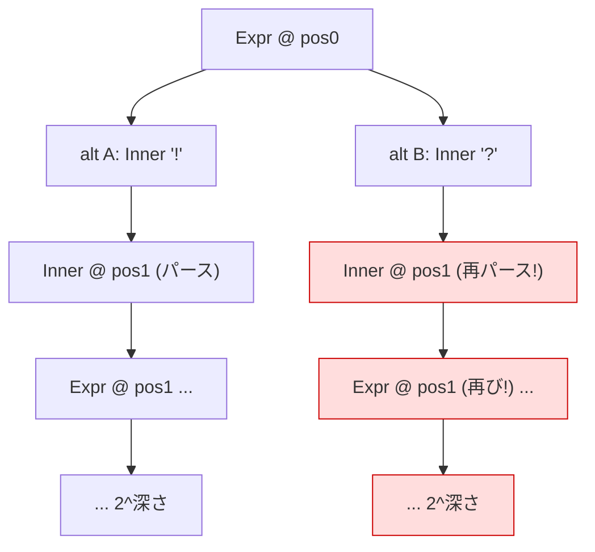

# Packrat メモ化 (#40) — 設計と「効果の濃淡」

opt-in の packrat メモ化を `unlaxer-common` に追加した（issue #40）。本書は **なぜ効くのか／なぜ成功メモ化の効果はこの種の文法では薄いのか** を記録する。

## 1. 問題: 曖昧括弧式の指数バックトラック

PEG は順序付き選択 + バックトラックで動く。曖昧な括弧式文法では、ある `(` の位置で複数の選択肢が **同じ内側部分木をフルパースしてから** 失敗する。tinyexpression P4 の実例（opaopa6969/tinyexpression#19）:

1. `NumberFactor → TernaryExpression` … `(` の後 `BooleanExpression` をフルパース → `?` が無くて失敗
2. `NumberFactor → '(' NumberExpression ')'` … 内側を再びフルパース → 型不一致で失敗
3. `BooleanFactor → '(' BooleanExpression ')'` … ここで成功

同一部分木を毎レベルで複数回パースし、ネストごとに乗算 → **約 3^深さ**。実運用の不正検知式（400〜900字、深いネスト）で **53分以上 CPU 張り付き**。



赤＝重複再計算。各レベルで同じ `(rule, position)` が何度も評価される。

## 2. 解法: `(parser, position)` メモ化

`AbstractParser.parse` / `ChainInterface.parse` / `ChoiceInterface.parse`（生成ルールは `LazyChain`/`LazyChoice` なのでこの3点でルール実行を網羅）で、`(parser同一性, consumed, matched, tokenKind, invertMatch)` をキーに結果をキャッシュする。

- **opt-in / default-off**: `parseContext.enableMemoize()` または `new ParseContext(src, ParseContext.memoize())`。既定では無効＝既存挙動・性能に影響ゼロ。
- メモは 1 つの `ParseContext`（1 パースセッション）に属し、`close()` で破棄。

### 2a. 失敗メモ化 — **効果大**

ルールがある位置で **既に失敗** したなら、再試行しても成功し得ない（PEG は位置で決定的）。よって即 `FAILED` で短絡し、部分木の再導出をスキップする。

- 失敗パースは roll back 済み（onBegin→onRollback で scope 効果は差し引きゼロ）。よって `TransactionListener`（scope/宣言/back-reference）**以外** のルールの「ある位置での失敗」はソースの純関数 → 安全にメモ化可。
- **指数の主因は失敗の再パース**（選択肢 2 つが内側をフルパースして失敗する部分）。これを潰すと 3^深さ → ほぼ線形に崩壊する。

実測（同形の再現文法 `Expr ::= A|B; A ::= Inner '!'; B ::= Inner '?'; Inner ::= '(' Expr ')' | 'x'`、末尾終端子なしの失敗入力）:

| depth | OFF | ON |
|------:|----:|---:|
| 8  | 127 ms | 21 ms |
| 12 | 506 ms | 3 ms |
| 14 | 986 ms | 1 ms |
| 16 | 3 986 ms | 0 ms |
| 18 | 11 481 ms | 0 ms |

OFF は +2 深さごとに約 2 倍（指数）。ON は平坦（線形）。depth 40 の失敗入力（OFF なら 2^40 で実行不能）が ON では数 ms。

### 2b. 成功メモ化 — **この種の文法では効果が薄い**

ルールがある位置で **成功** したなら、その部分木のトークンを再利用すれば再導出を避けられる。実装はしてある（キャッシュしたトークンを `Token.deepCopy()` で複製 → cursor を進める → `commit` で通常通りマージ/collect）。トークン木の同一性はテストで検証済み。

**だが、対象（tinyexpression のような変数を含む式）文法では追加利得が小さい。理由:**

1. **失敗メモ化が既に指数を崩している。** 指数爆発のコストは「失敗部分木の再パース」が支配項。成功する 1 本の経路は本質的に線形回数しか通らないので、成功メモ化が省けるのは「線形分の重複」に留まる。

2. **scope 安全性のため、成功メモ化は `TransactionListener` を部分木に含むルールを除外する。** キャッシュヒットで部分木をスキップすると、その中の scope/宣言/back-reference の副作用（`onBegin`/`onCommit`）が再発火しない（失敗と違い、成功は副作用が残るべきなので差し引きゼロにならない）。
   - tinyexpression 文法では **`VariableRef` が `@backref`**（参照解決リスナ）として生成される。式（`if`/boolean/比較/算術）はほぼ必ず `$変数` を含む → その部分木はリスナを含む → **成功メモ化の対象から外れる**。
   - すなわち、まさに指数爆発する式ルール群が、成功メモ化では（安全側に倒して）対象外になる。

```mermaid
graph LR
  R["式ルール (BooleanExpression / IfExpression ...)"] --> V["VariableRef (@backref = TransactionListener)"]
  R -. "部分木にリスナを含む" .-> X["成功メモ化: 除外 (安全側)"]
  R --> F["失敗メモ化: 適用 (差し引きゼロで安全) → 指数崩壊"]
  classDef ok fill:#dfd,stroke:#0a0; classDef no fill:#fdd,stroke:#c00;
  class F ok; class X no;
```

3. **`Token.parent` が可変**。キャッシュしたトークンをそのまま別の親に差し込むと共有インスタンスが再 parent 付けされ元の木を壊す → 各 replay で `deepCopy()` が必要（コストとリスクの追加）。

**結論:** 失敗メモ化が #40 の実害（指数ハング）を解消する主役。成功メモ化は正しく実装・検証してあるが、変数参照を含む式文法では除外され、追加効果は限定的。**成功メモ化が効くのは、リスナ（scope/宣言/back-ref）を一切含まない純粋な部分木**（例: 変数を含まない定数算術の深いネスト）に限られる。

## 3. 安全性まとめ

| ケース | メモ化 | 安全性の根拠 |
|---|---|---|
| 失敗（非リスナ ルール） | する | roll back 済みで scope 差し引きゼロ。位置決定的 |
| 失敗（`TransactionListener`） | しない | 結果が可変 scope 状態に依存しうる |
| 成功（リスナ無し部分木） | する | 副作用無し。`deepCopy` で木の独立性を保証。トークン木同一性をテストで検証 |
| 成功（リスナ含む部分木） | しない | スキップすると scope/宣言/back-ref 副作用が欠落 |

## 4. 残・補助

- **end-to-end**: 実 tinyexpression #19 の5式での計測は、downstream で memoize を eval 経路に配線 + Central 公開後。
- **補助最適化（独立）**: `StringSource.peek` が毎回 `new StringSource` + codepoint 配列コピー（#19 プロファイル最頻フレーム）。メモ化とは別に削減余地。
- メモリ上限: 現状は 1 セッションの `HashMap`（`#rules × #positions`）。長大入力で問題化すれば LRH/サイズ上限を追加。

関連: issue #40, #38（指数バックトラック perf）, opaopa6969/tinyexpression#19。
