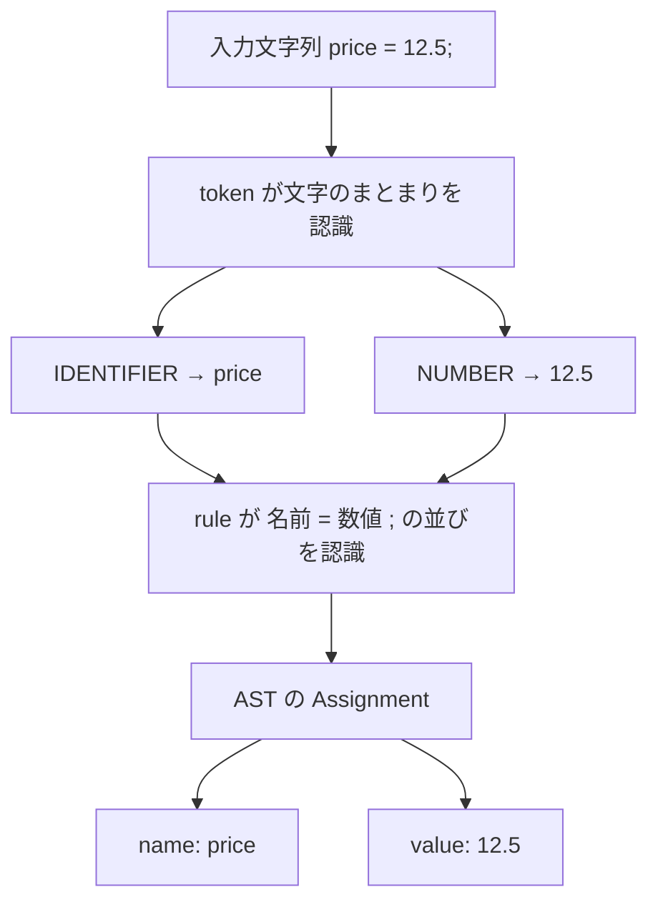
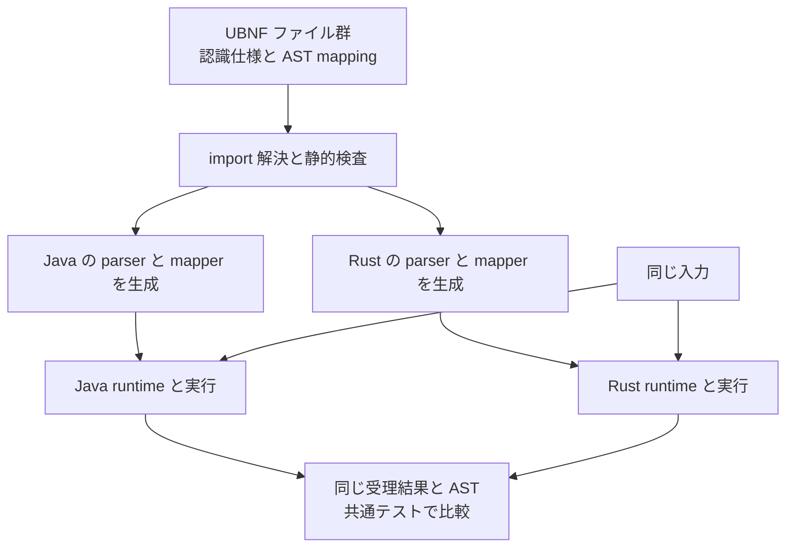
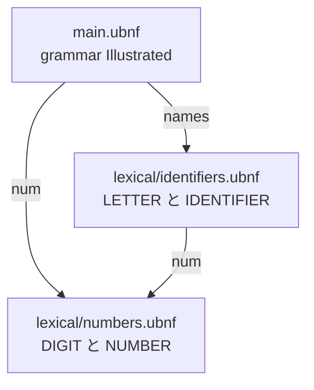
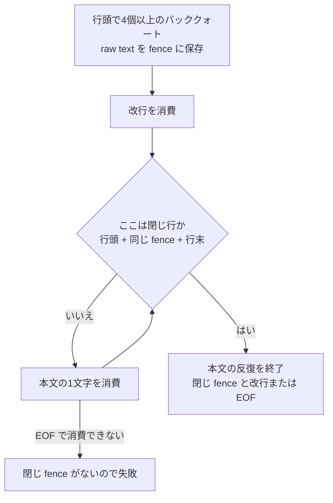
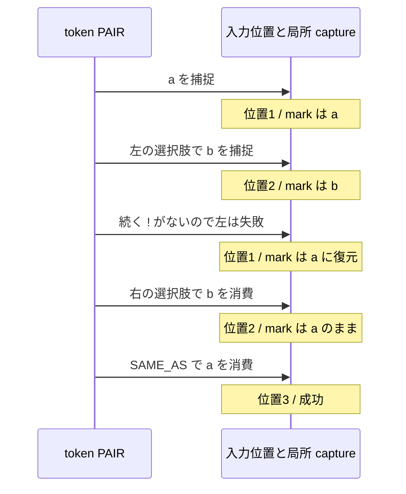

# 図でわかる UBNF v2

UBNF は「何を受け入れる言語なのか」と「読み取ったものをどんな構造にするのか」を書く文法です。
この入門では `price = 12.5;` を読み取る小さな言語を作り、文字列、可変長 fence、外部 grammar へ進みます。
Java の `NumberParser` や Rust の実装を読まなくても、**UBNF 自体から認識条件がわかる**のが新しい書き方です。

対象は `@ubnf: v2` の宣言的 token と、本リポジトリの Java/Rust 共通実装です。
対応する Maven 版は `3.2.0` 以降。`3.1.1` ではこの入門の機能は使えません。
UBNF の書式の版と、ライブラリの配布版は別の番号です。

図は GitHub の Mermaid 表示に対応しています。図を表示できない環境でも、直後の文章とコードで読めます。
完全な例は [examples/ubnf-v2](examples/ubnf-v2/)、厳密な規約は [宣言的 token の仕様](declarative-tokens.md) にあります。

## 文字から AST まで



`token` は数字や名前などの文字のまとまり、`rule` はそれらの並び方を定義します。
AST（抽象構文木）は、認識結果から必要な情報を取り出したデータ構造です。
この図は役割の区別であって、入力全体を先に token 列へ変換する独立した lexer が必須という意味ではありません。
rule が必要なところで token を呼び出します。

`12.5` を認識することと、それを計算用の数値に変換することも別です。
この入門の AST は `value` を文字列 `"12.5"` として持ちます。計算や代入の実行は evaluator 側の仕事です。

## 数字と名前を定義する

まず [lexical/numbers.ubnf](examples/ubnf-v2/lexical/numbers.ubnf) を見てください。
`::=` の右側が、説明文ではなく実行可能な認識仕様です。

<!-- example: examples/ubnf-v2/lexical/numbers.ubnf -->
```ubnf
grammar Numbers {
  @ubnf: v2
  token DIGIT ::= CHAR_RANGE('0', '9');
  token NUMBER ::= [ '+' | '-' ]
    ( DIGIT+ '.' DIGIT* | '.' DIGIT+ | DIGIT+ )
    [ ( 'e' | 'E' ) [ '+' | '-' ] DIGIT+ ];
}
```

`NUMBER` を読む順番は「任意の符号 → 数字部分 → 任意の指数」です。


使った記号は次のように読みます。ここでは token 式の意味を示しています。

| 記法 | 読み方 |
|---|---|
| `'abc'` | 文字列 `abc` そのもの |
| `A B` | A の次に B |
| `A \| B` | A を先に試し、A 自体が失敗したら B |
| `( ... )` | 式をまとめる |
| `[ A ]` または `A?` | A を省略できる |
| `{ A }` または `A*` | A を 0 回以上繰り返す |
| `A+` | A を 1 回以上繰り返す |
| `A{4,}` | A を 4 回以上繰り返す。`{2}`、`{2,4}` も使える |
| `CHAR_RANGE('0', '9')` | `0` から `9` までのどれか 1 文字 |

これで `12.5`、`-.5E-2`、`+12.` を受け入れます。`+` だけでは数字部分がないので失敗します。
既存の `NumberParser` に対応付けるのではなく、この式から認識処理を生成します。

次に [lexical/identifiers.ubnf](examples/ubnf-v2/lexical/identifiers.ubnf) で名前を定義します。

<!-- example: examples/ubnf-v2/lexical/identifiers.ubnf -->
```ubnf
grammar Identifiers {
  @import num from 'numbers.ubnf'
  @ubnf: v2
  token LETTER ::= CHAR_RANGE('a', 'z') | CHAR_RANGE('A', 'Z') | '_';
  token IDENTIFIER ::= LETTER ( LETTER | num.DIGIT )*;
}
```

先頭は英字か `_`、2 文字目以降は数字も使えます。`price` や `_price2` は成功し、
`2price` や `価格` は失敗します。ここでは **ASCII の識別子を選んだ**のであって、
UBNF 全体が日本語を扱えないという意味ではありません。
`num.DIGIT` は外部 grammar の数字部品です。名前空間の仕組みは後で図解します。

## rule で組み立てて AST にする

これが小さな言語の全体、[main.ubnf](examples/ubnf-v2/main.ubnf) です。

<!-- example: examples/ubnf-v2/main.ubnf -->
```ubnf
grammar Illustrated {
  @import num from 'lexical/numbers.ubnf'
  @import names from 'lexical/identifiers.ubnf'
  @ubnf: v2
  @package: guide.demo
  @whitespace: javaStyle

  @root
  @mapping(Assignment, params=[name, value])
  Assignment ::= names.IDENTIFIER @name '=' num.NUMBER @value ';';
}
```

`Assignment` が rule の名前、`@root` が読み始める rule の指定です。
`@name` と `@value` で認識結果に名前を付け、`@mapping` で AST のフィールドへ渡します。
入力 `price = 12.5;` から、概念的には次のデータができます。`=` や `;` を AST のフィールドにする必要はありません。

```json
{"name":"price","value":"12.5"}
```

`@whitespace: javaStyle` は rule の要素間で空白を扱う設定です。
`price=12.5;` も `price = 12.5;` も受け入れますが、**token 内では空白を暗黙に読み飛ばしません**。
`price = 1 .2;` は失敗します。`1` と `.2` の間の空白を消して数値にしてはいけないためです。
ここでいう入力の空白と、UBNF ファイル自体の字下げ・改行は別物です。

生成の流れも確認しておきましょう。



生成された token は、汎用の字句プログラム実行機構を使います。
「全部生成する」は NUMBER などの認識仕様を UBNF に置くという意味で、共通 runtime まで不要になるわけではありません。
新しい例では `NumberParser` や `IdentifierParser` を認識の実装として呼びません。

## grammar を部品として組み合わせる



`@import num from 'lexical/numbers.ubnf'` の **alias `num` が名前空間**です。
`num.NUMBER` のように参照し、独立した `namespace` 宣言は不要です。
パスの基準は import を書いたファイルなので、`identifiers.ubnf` からは `'numbers.ubnf'` だけで届きます。

部品を安心して再利用するため、次の境界があります。

- `NUMBER` の中の `DIGIT` は Numbers 側の定義です。呼出し側に同名 token を置いても置き換わりません。
- 公開されるのはそのファイルで宣言した token です。入れ子の import は自動では再公開されません。
  再公開するなら `token DIGIT ::= num.DIGIT;` のように明示します。
- import 先の package、空白設定、root などは主 grammar に継承されません。

この入門で使う共通 module loader の部品は **1 ファイル 1 grammar の宣言的 token 群**です。
rule を含む部品、循環 import、ネットワーク import は対象外です。
相互に再帰する式の rule は主 grammar に置き、まず字句の部品から分離します。
別のコンパイラ [ubnfc](https://github.com/opaopa6969/ubnfc) には rule import もありますが、
その対応範囲をこの共通 loader と混同しないでください。

## STRING は囲みと escape の合成

[lexical/strings.ubnf](examples/ubnf-v2/lexical/strings.ubnf) は、二重引用符の文字列です。

<!-- example: examples/ubnf-v2/lexical/strings.ubnf -->
```ubnf
grammar Strings {
  @ubnf: v2
  token STRING ::= '"' { '\\' ANY | NEGATION('"\\') } '"';
}
```

最初と最後は `"`。中身は「バックスラッシュと次の 1 文字」か「`"` とバックスラッシュ以外の 1 文字」の繰り返しです。
`NEGATION` はここでは **除外する文字の集合**であり、後で使う式の否定先読みとは違います。
`ANY` は Unicode scalar 1 個を消費するので、`😀` も 1 文字として扱います。

入力 `"a\"b"` の途中の `\"` は escape 側でまとめて消費され、閉じ引用符になりません。
閉じ引用符がない入力や、末尾がバックスラッシュだけの入力は失敗します。
この定義は意図的に単純で、実改行や `\q` も許します。JSON の STRING 定義ではありません。
改行禁止や escape の種類の制限が必要なら、その制約も認識式に書きます。

ここでは `\n` を改行に変換しません。**認識・raw text の捕捉・値の変換は別の仕事**です。
現在の AST mapper には周辺空白や単一引用符を除く互換変換がありますが、
この二重引用符の例では引用符も escape も文字列値に残ります。厳密な元テキストには source span を使います。

## 可変長 fence は開いた文字列を覚える

「開いたときと同じ数のバッククォートで閉じる」は、固定の繰り返しだけでは表せません。
ここで局所的な `CAPTURE` と `SAME_AS` を使います。
[lexical/fences.ubnf](examples/ubnf-v2/lexical/fences.ubnf) は説明を簡単にするため、言語名を付けない fence にしています。
Markdown 全体の仕様ではなく、**4 個以上で開き、同じ長さの行で閉じる**独自の定義です。

<!-- example: examples/ubnf-v2/lexical/fences.ubnf -->
```ubnf
grammar Fences {
  @ubnf: v2
  token NL ::= '\r\n' | '\r' | '\n';
  token BLOCK ::= BOL CAPTURE(fence, '`'{4,}) NL
    { NEGATIVE_LOOKAHEAD(BOL SAME_AS(fence) EOL) ANY }
    BOL SAME_AS(fence) ( NL | EOF );
}
```



`BOL` と `EOL` は行の境界を調べるだけで、改行を消費しません。`NL` が CRLF・CR・LF を明示的に消費します。
この実装の BOL は入力先頭または直前が CR/LF、EOL は EOF または現在位置が CR/LF です。
`EOF` は入力末尾を調べるだけです。

`NEGATIVE_LOOKAHEAD(...)` は、括弧内が **失敗するときだけ成功**する検査です。
検査では入力位置も capture の値も元に戻すため、閉じ行を本文として食べずに止まれます。
反対に「括弧内が成功するときだけ成功」は `LOOKAHEAD(...)` です。

4 個で開いた場合、3 個や 5 個の行は本文です。行の途中の fence や末尾空白付きの行も閉じ行ではありません。
次の入力は成功します。最後の 4 個だけが閉じ fence です。

~~~~text
````
```
`````
````
~~~~

`CAPTURE(fence, ...)` はその場の文字列を無加工で覚え、`SAME_AS(fence)` はまったく同じ文字列をもう一度消費します。
本文内の文字列やコメントを Java などの言語として解析するわけではありません。

## capture と巻き戻しの範囲

似た名前でも、以下は役割も寿命も異なります。

| 仕組み | 何のためか | 範囲 |
|---|---|---|
| `CAPTURE(mark, ...)` / `SAME_AS(mark)` | raw text を覚えて認識に再利用する | その token 呼出しの内部 |
| rule の `@name` / `@mapping` | AST のフィールドを作る | 認識結果から作る AST |
| evaluator の変数環境 | 代入や計算を実行する | アプリケーションの評価処理 |

呼び出された別の token は独立した capture の領域を持ち、呼出し元の値を読み書きできません。
失敗した選択肢や反復の試行、先読みで作った capture は後続に漏れません。
たとえば次節の `PAIR` に `aba` を渡すと、こう進みます。位置は次に読む文字を指す 0 始まりの番号です。



入力位置だけ戻して `mark` を戻さないと、最後に誤って `b` を要求してしまいます。
token 自体が失敗した場合も、消費位置と照合位置は開始時点に戻ります。
逆に `ab!b` では左の選択肢が成功するので、更新された `mark` の `b` で閉じます。

これは任意の ParseContext を操作する API ではありません。
外部 adapter 用の read-only accessor `source`・`remaining`・`position`・`matchedPosition` は別の仕組みです。
今回の NUMBER・STRING・fence に外部 adapter は必要ありません。
両者の区別は [外部 token と context accessor](ubnf-format-2.md) で確認できます。

## 全入力検査と選択で気をつけること

ここまでの token を切り替えて試すための [probes.ubnf](examples/ubnf-v2/probes.ubnf) です。
通常は NUMBER を試し、共通テストでは `Root` の右辺を各 token に切り替えています。

<!-- example: examples/ubnf-v2/probes.ubnf -->
```ubnf
grammar LexicalExamples {
  @import num from 'lexical/numbers.ubnf'
  @import names from 'lexical/identifiers.ubnf'
  @import strings from 'lexical/strings.ubnf'
  @import fences from 'lexical/fences.ubnf'
  @ubnf: v2
  @package: guide.demo

  token PAIR ::= CAPTURE(mark, 'a')
    ( CAPTURE(mark, 'b') '!' | 'b' ) SAME_AS(mark);
  token FIRST ::= ( 'a' | 'ab' ) 'c';
  token GREEDY ::= 'a'+ 'a';
  token COMPLETE_NUMBER ::= num.NUMBER EOF;

  @root @mapping(Value, params=[text])
  Root ::= num.NUMBER @text;
}
```

**途中まで読めることと、入力全体が正しいことは別です。** NUMBER 単体は `1e+` から `1` まで成功し、`e+` を残します。
任意の指数部分を試して失敗し、その部分の開始位置へ戻るためです。
`COMPLETE_NUMBER` のように EOF を合成すると、残りがあるので token 全体が失敗します。
生成 Java mapper の `diagnose` / `parseWithSourceMap`、生成 Rust parser の `parse_tree_detailed` も全入力を検査します。
低水準の parser 呼出しは prefix の成功を返し得るので、使う API を区別してください。

また、この token 式は見た目が BNF に似ていますが、選択は PEG 型の先勝ちです。
反復はできるだけ多く読み、後続の都合では短くしない方式です。

| token | 入力 | 結果と理由 |
|---|---|---|
| `FIRST` | `ac` | 成功。最初の `a` と続く `c` が一致 |
| `FIRST` | `abc` | 失敗。`a` の選択は既に成功済み。後の `c` が失敗しても `ab` に選び直さない |
| `GREEDY` | `aa` | 失敗。`'a'+` が両方を消費し、最後の `'a'` のために 1 個戻さない |
| `PAIR` | `aba` | 成功。左の選択肢そのものが失敗したので、位置と capture を戻して右を試す |

「選択肢自身の失敗による巻き戻し」と「成功済みの選択や反復を後からやり直すこと」を区別すると読みやすくなります。
未定義 token、循環 token 参照、必ず値が入るとは限らない `SAME_AS`、空文字でも成功する式の無制限反復は生成前の検査で拒否されます。

## 手元で検証する

リポジトリのルートで実行します。Java 21、Maven、Rust toolchain（`cargo` と `rustc`）を用意してください。
テストは掲載ファイルそのものを読み、Java と native Rust の generator でコードを生成して実行します。

```bash
mvn -B -pl unlaxer-common,unlaxer-dsl -am test \
  -Dtest=DeclarativeTokenConformanceTest -DrustConformance=true -DfailIfNoTests=false
```

`-DrustConformance=true` を外すと両言語の比較は skip されるので、検証済みとは扱えません。
`-DfailIfNoTests=false` は、依存モジュールにこの名前のテストがない場合に reactor を止めないための指定です。
[共通入力と期待値](examples/ubnf-v2/cases.json) には成功・失敗、消費位置と照合位置、AST の値を記録しています。
テストは source span も比較し、`😀` を含め位置を Unicode code point 単位で確かめます。
本文に載せた 6 個の grammar と実ファイルの一致もテストします。

Rust 側だけで、import を含む文法の検査と生成を試すこともできます。

```bash
cargo run --locked --manifest-path rust/Cargo.toml -p unlaxer-generator -- \
  check --target rust --grammar docs/examples/ubnf-v2/main.ubnf

cargo run --locked --manifest-path rust/Cargo.toml -p unlaxer-generator -- \
  generate --grammar docs/examples/ubnf-v2/main.ubnf \
  --output target/illustrated-ubnf-v2/generated
```

ファイルの import は Java の `UBNFModuleLoader.load(Path)`、Rust の `modules::load(Path)` が解決します。
文字列だけを受け取る parse API はファイルを勝手に読みません。

## TinyExpression とさらに詳しい資料

TinyExpression では、この考え方で
[主 grammar](https://github.com/opaopa6969/tinyexpression/blob/master/tools/tinyexpression-p4-lsp-vscode/grammar/tinyexpression-p4.ubnf) と
[字句部品](https://github.com/opaopa6969/tinyexpression/tree/master/tools/tinyexpression-p4-lsp-vscode/grammar/lexical)
を分けています。文字、数値、識別子、文字列、fence が別 grammar です。
相互に再帰する式の rule は主 grammar に残しています。
この入門の fence は簡略版なので、TinyExpression の言語名・クラス名付きヘッダや短い fence の互換動作とは区別してください。

すべての既存 Parser の宣言化が済んだわけではありません。履歴参照、任意の callback、
一部の消費制御などは追加設計が必要です。Unicode property や引数付き token も今後の拡張です。
「現在できること」と「今後できるようにしたいこと」の境界は仕様の対応表にあります。

- [宣言的 token の仕様](declarative-tokens.md) — 正確な認識規約、制限、既存 Parser との対応。
- [外部 token と context accessor](ubnf-format-2.md) — 宣言式で扱えない host 実装を接続する契約。
- [UBNF 言語ガイド](ubnf-guide-ja.md) — rule やアノテーションの広いリファレンス。旧形式の例も含みます。
- [TinyExpression の移行説明](https://github.com/opaopa6969/tinyexpression/blob/master/docs/declarative-lexical-modules.md) — 実際の部品分割と互換性の扱い。
- [TinyExpression playground](https://opaopa6969.github.io/tinyexpression/) — TinyExpression の式をブラウザで試す場所。この入門の代入文を実行する場ではありません。
