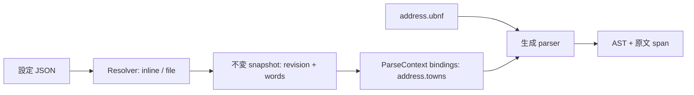

# 辞書 resolver を切り替える UBNF チュートリアル

同じ [address.ubnf](address.ubnf) に、直書きまたはファイルから取得した辞書を渡します。
Java と Rust は同じ UBNF から生成した parser を実行します。
**ここにある Resolver と設定 JSON は、このサンプルの実装です。**
標準機能は既存の `ADAPTER` と immutable `ParseContext.bindings`。
`@binding` / `DICTIONARY(...)` という新しい UBNF 構文は導入していません。

## 1. まず動かす

必要なもの: JDK 21、Maven、Rust 1.85 以上、Python 3。初回ビルドは依存取得にネットワークを使います。
リポジトリのルートで実行します。

```sh
python3 examples/resolver-tutorial/run.py build
python3 examples/resolver-tutorial/run.py java examples/resolver-tutorial/config/inline.json '𠮷野-12'
python3 examples/resolver-tutorial/run.py rust examples/resolver-tutorial/config/inline.json '𠮷野-12'
python3 examples/resolver-tutorial/run.py check
```

両 CLI の出力は JSON。キーの順序を除いて次の内容になります。

```json
{"stage":"parse","revision":"towns-1","accepted":true,"consumed":5,"matched":5,"ast":{"town":"𠮷野","house":"12"},"captures":[{"text":"𠮷野","span":[0,2]},{"text":"12","span":[3,5]}]}
```

**問い:** `𠮷` は Java で UTF-16 の2要素なのに、町名の終点が2なのはなぜでしょう？

<details><summary>答え</summary>

公開 span はコードポイント単位で、半開区間 `[start,end)` です。`𠮷` と `野` で2つ。
Java の UTF-16 オフセットや Rust の UTF-8 バイト位置をそのまま公開しません。
この例では正規化していない原文の位置です。
</details>

## 2. 小さな辞書と文法を分ける

固定辞書なら UBNF の `token TOWN ::= '東京駅' | '東京' | '大阪' | '𠮷野';` だけでも書けます。
更新のたびに parser を生成し直す代わりに、今回の例では `TOWN = ADAPTER(...)` を使います。
adapter は `address.towns` という論理名の bindings を読みます。
この論理名は [TownParser.java](java/TownParser.java) と [main.rs](rust/src/main.rs) の定数で対応付けています。



[config/inline.json](config/inline.json) の `bindings` が論理名を `townCatalog` へ対応付け、
`resolvers.townCatalog` が provider と properties を指定します。
`inline/v1` の properties は [words.schema.json](schema/words.schema.json) の snapshot そのものです。
`words` は順序付きの非空文字列配列。空配列は有効、空文字の要素はエラーです。
重複や並び順を resolver は変更しません。

**問い:** `['東京', '東京駅']` に並べ替えると、`東京駅-1` を受理できるでしょうか？

<details><summary>答え</summary>

できません。この adapter は「登録順で最初に prefix 一致した語」を選びます。
`東京` の後に `-` が来ないため失敗します。最長一致を必要とする辞書では長い語を先に置くか、
adapter の契約と実装を最長一致に変更します。resolver が勝手に並べ替えることはありません。
</details>

## 3. UBNF を変えず、ファイルへ移す

```sh
python3 examples/resolver-tutorial/run.py java examples/resolver-tutorial/config/file.json '𠮷野-12'
python3 examples/resolver-tutorial/run.py rust examples/resolver-tutorial/config/file.json '𠮷野-12'
```

[config/file.json](config/file.json) は `file/v1` と `{"path":"../data/towns.json"}` を指定します。
結果は手順1と同じです。相対パスは**設定ファイルのあるディレクトリ**を基準に解決します。
実行時のカレントディレクトリには依存しません。

**やってみる:** `config/` と `data/` を同じ作業用ディレクトリへコピーし、コピーした辞書に
`京都` を追加して revision を `towns-2` に変更してください。
コピー先の `config/file.json` で `京都-1` を実行すると成功し、元の設定では失敗します。
UBNF の再生成は不要です。

**問い:** 読み込んだ後にファイルを書き換えると、解析中の辞書も変わりますか？

<details><summary>答え</summary>

変わりません。Resolver は解析前に snapshot を作り、Java は immutable list、Rust は所有する
vector を context に渡します。次回の resolve から更新が反映されます。
revision はデータ提供側が指定するラベルで、自動計算するハッシュではありません。
</details>

## 4. 設定の失敗と、構文の失敗を見分ける

```sh
python3 examples/resolver-tutorial/run.py java examples/resolver-tutorial/config/file.json '京都-1'
python3 examples/resolver-tutorial/run.py rust examples/resolver-tutorial/config/file.json '東京-1x'
```

どちらも終了コード1、`stage: parse`、`accepted: false`、`ast: null`、空の captures になります。
EOF を文法に書いているので末尾の `x` を見逃しません。失敗時の consumed / matched は0へ戻ります。

| 終了コード | 内容 |
|---|---|
| 0 | 全入力を受理 |
| 1 | snapshot を取得できたが構文に不一致 |
| 2 | 設定・取得の失敗、または CLI 引数不足 |

取得失敗は `{"stage":"resolve","code":"E-IO"}` のように返します。
`E-CONFIG`: 設定の構造/JSON、`E-BINDING`: 論理名なし、`E-RESOLVER`: 対応する定義なし、
`E-PROVIDER`: provider 未登録、`E-DATA`: snapshot 不正、`E-IO`: ファイルを読めない、です。
設定とデータは UTF-8 JSON、各1 MiBまで。孤立 surrogate は拒否します。

**問い:** `provider` を `rdb/v1` に変更するだけで DB に接続できますか？

<details><summary>答え</summary>

この例では `E-PROVIDER` です。下の Resolver 実装を作り、registry に登録する必要があります。
単に UBNF に名前を書くことでネットワーク接続が発生する仕組みではありません。
</details>

## 5. RDB / KVS / API へ拡張する接点

[Java](java/Resolvers.java) の `Resolver.resolve(properties, configDirectory)`、
[Rust](rust/src/resolvers.rs) の `Resolver::resolve` は、取得後に `Snapshot` を返します。
Java の `load(path, registry)`、Rust の `load_with(path, registry)` で provider を差し替えられます。
UBNF や字句 adapter に DB クライアントは入れません。

次は**未実装 provider の設計例**です。このまま実行する設定ではありません。

| provider 案 | properties の例 | 実装側が行うこと |
|---|---|---|
| `rdb/v1` | `{"connectionRef":"addressDb","queryId":"townsByRegion","region":"13"}` | ホストの接続を取得し、登録済みクエリの結果を順序付き words に投影 |
| `kvs/v1` | `{"connectionRef":"catalogStore","key":"towns:13"}` | 対象キーの値を schema 検証して snapshot 化 |
| `api/v1` | `{"clientRef":"catalogApi","resource":"towns/13"}` | ホストが構成した認証済みクライアントで取得し schema 検証 |
| `file/v1` | `{"path":"../data/towns.json"}` | 実装済み。ローカル JSON を読み込む |

AWS RDS なら利用する DB エンジンに対応した RDB resolver を使う想定です。
認証情報・接続プール・許可した取得先はホストの設定へ置き、上の参照名から引きます。
API の timeout / retry / cancellation、DB transaction、cache / refresh、巨大辞書の分割取得は
各 provider の責務として仕様を決めます。この例には実接続、非同期 API、キャッシュはありません。

## 設定スキーマと実装範囲

- root は `version`（JSON 数字の整数表記 `1`）、`bindings`、`resolvers` の3項目のみ。
- `bindings["address.towns"]` は `resolver`（非空文字列）、`schema`（`ubnf.words/v1`）のみ。
- 対応する resolver 定義は `provider` と `properties` の2項目のみ。
- `inline/v1` properties は words schema、`file/v1` は非空文字列 `path` のみ。
- 今回の CLI は `address.towns` のみ要求します。他の論理名・未使用定義を実行/検証しません。
  一般的な manifest 全体の検証器を提供するものではありません。
- JSON Schema はデータ形式の文書です。実行時は両言語の明示的な検証コードを使用します。
  Rust の JSON 読み取りには [serde_json](https://docs.rs/serde_json/) を利用し、依存はこの例の
  独立した Cargo workspace と lockfile に閉じています。unlaxer runtime 本体の依存は増やしません。

## 検証の読み方

`run.py check` は [cases.json](cases.json) の独立した期待値に、両 CLI の終了コード、AST、
コードポイント位置、captures、取得エラーを照合します。別の cwd と空白・非 BMP を含むパスでも
実行し、Inline / File の等価性、語順、空辞書、不正設定・データを確認します。
さらに両言語で取得後のファイル変更と snapshot の不変性を検証します。
結果は `target/conformance.tsv`。CI でも生成・コンパイルから実行します。

続き: [bindings の仕様](../../docs/parse-composition.md)、[宣言的 token と import](../../docs/declarative-tokens.md)。
