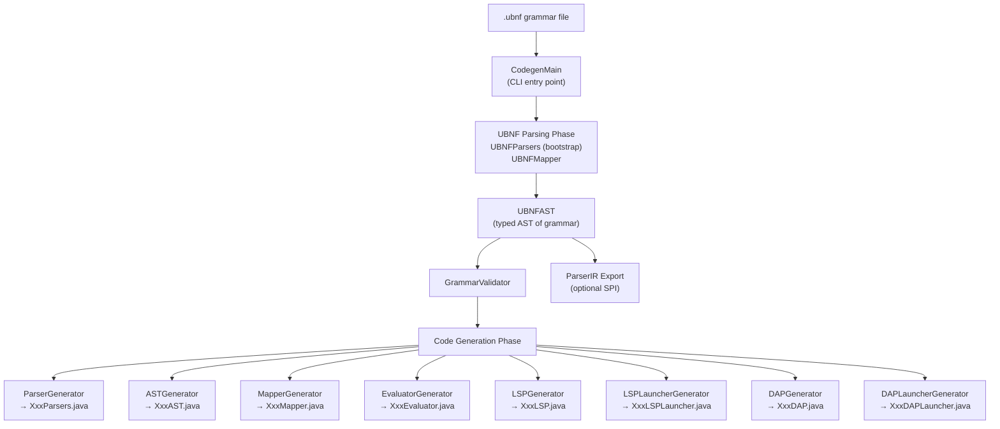
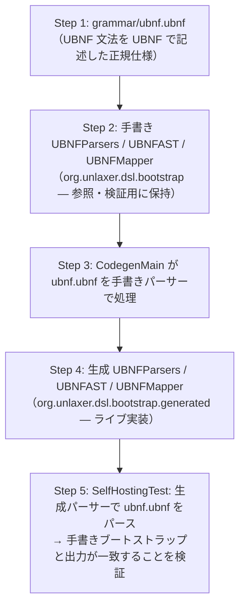
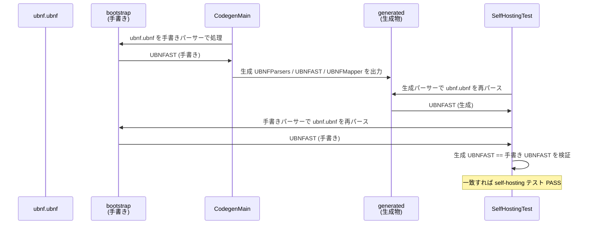
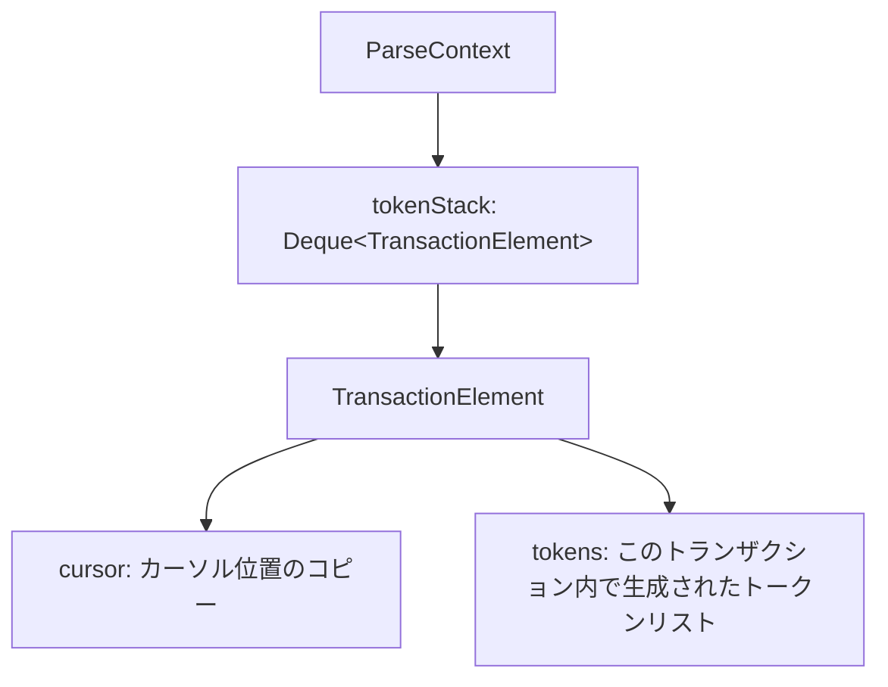
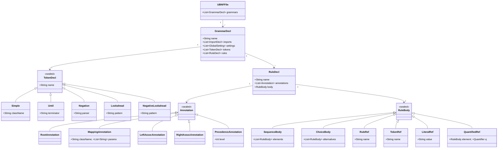
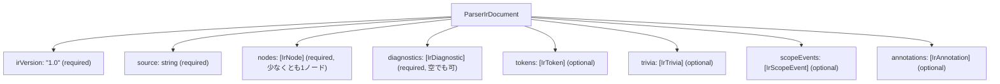
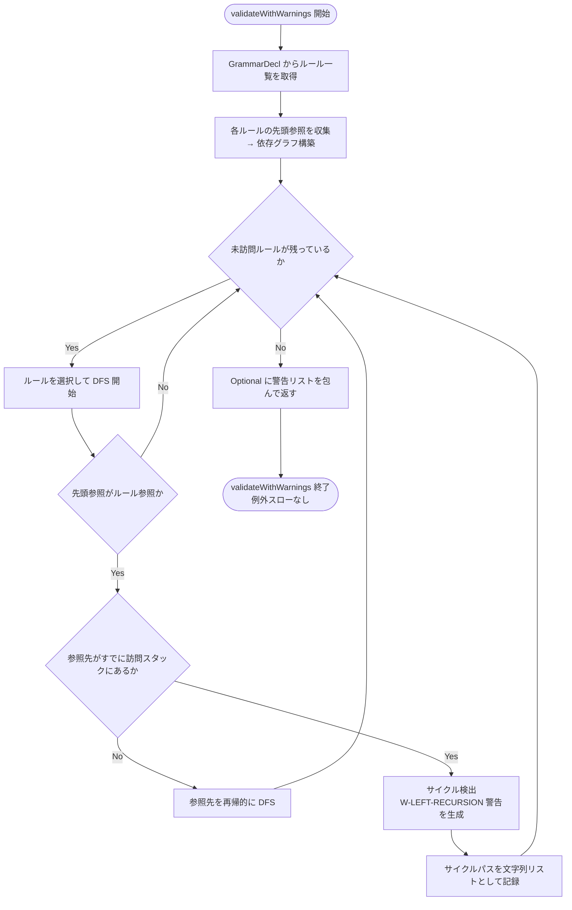
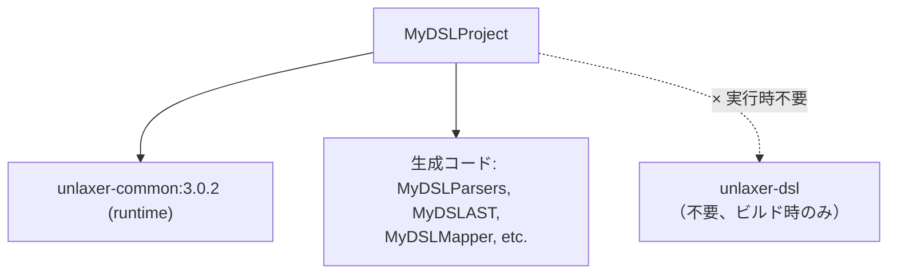
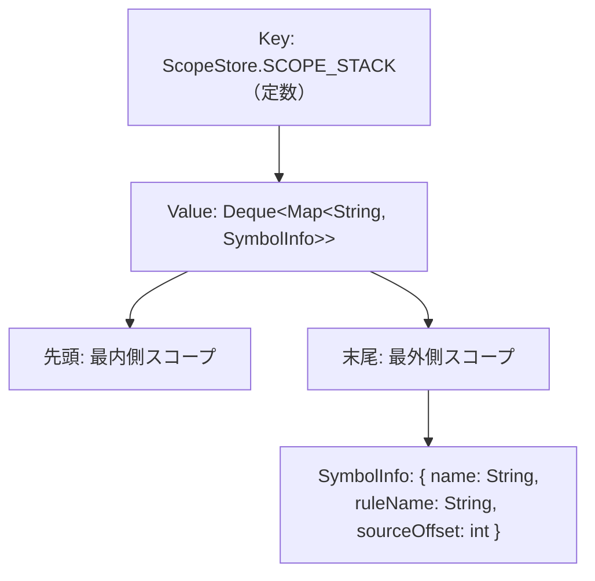

# unlaxer-parser SPEC

**Version**: 3.0.2
**Date**: 2026-04-19

---

## 目次

1. [概要](#1-概要)
2. [機能仕様](#2-機能仕様)
3. [データ永続化層](#3-データ永続化層)
4. [ステートマシン](#4-ステートマシン)
5. [ビジネスロジック](#5-ビジネスロジック)
6. [API / 外部境界](#6-api--外部境界)
7. [UI](#7-ui)
8. [設定](#8-設定)
9. [依存](#9-依存)
10. [非機能](#10-非機能)
11. [テスト戦略](#11-テスト戦略)
12. [デプロイ / 運用](#12-デプロイ--運用)

---

## 1. 概要

### 1.1 プロジェクト目的

unlaxer-parser は **UBNF（Unlaxer BNF）文法定義から Java ソースコードを自動生成する DSL フレームワーク** である。`.ubnf` ファイルに文法を宣言的に記述し、以下の8種類の Java ソースコードを自動生成する。

| 生成物 | 説明 |
|--------|------|
| `XxxParsers.java` | パーサーコンビネータ群 |
| `XxxAST.java` | sealed interface + records による型安全な AST |
| `XxxMapper.java` | Token 木から AST へのマッピング |
| `XxxEvaluator.java` | AST 評価スケルトン |
| `XxxLSP.java` | Language Server Protocol サーバー実装 |
| `XxxLSPLauncher.java` | LSP サーバー起動クラス |
| `XxxDAP.java` | Debug Adapter Protocol サーバー実装 |
| `XxxDAPLauncher.java` | DAP サーバー起動クラス |

**設計哲学**: DSL を作るとき、典型的には Lexer/Parser、AST 型定義、Parse Tree → AST マッパー、評価器、LSP サーバー、DAP サーバーの合計 10,000 行超を手書きする必要がある。unlaxer はこれを「文法を書けば自動生成する」という一文で解決する。評価ロジックのみ（典型的に 50〜200 行）の実装でゼロから動く言語実装が得られる。

### 1.2 バージョン履歴（概要）

| バージョン | 日付 | 主要変更 |
|-----------|------|---------|
| 1.0.0 | 2025-09-01 | 初版公開。基本コンビネータ、UBNF 文法、6ジェネレータ |
| 2.0.0 | 2026-01-20 | Parser IR 導入、GrammarValidator 追加、Java 17 → 21 |
| 2.6.0 | 2026-03-15 | セルフホスティングマイルストーン、Railroad 図エクスポート |
| 2.8.0 | 2026-04-10 | `@scopeTree` / `@declares` / `@backref`、UBNF 拡張 Tier 1-4 |
| 3.0.0 | 2026-04-18 | Bootstrap 完全移行、`@enum` / `@commonField` / `@import`、インクリメンタルパース |
| 3.0.1 | 2026-04-19 | Simple wrapper バグ修正（issue #22） |
| 3.0.2 | 2026-04-20 | 左再帰検出（issue #25/#26）、`@Generated` アノテーション（issue #24） |

### 1.3 モジュール構成

```
unlaxer-parser/
  unlaxer-common/     パーサーコンビネータランタイム（ゼロ依存）
    src/              コア実装
    specs/            コンポーネント仕様書（日本語）
    docs/             チュートリアル
  unlaxer-dsl/        UBNF → Java コードジェネレータ
    grammar/          ubnf.ubnf（UBNF 自体の文法定義）
    src/              コードジェネレータ実装
    specs/            コンポーネント仕様書（日本語）
    docs/             UBNF チュートリアル、スキーマ
  docs/               トップレベルドキュメント（英語/日本語）
  spec/               統合仕様書（本ファイル）
```

#### unlaxer-common

Pure Java、ゼロ依存のパーサーコンビネータライブラリ。RELAX NG のスキーマ合成パターンに着想を得て、小さなパーサーを組み合わせて複雑な文法を構築する。

設計目標:
1. **合成可能性**: すべてのパーサーは `Parser` インタフェースを実装し、コンビネータにより自由に合成できる
2. **無制限先読み（Infinite Lookahead）**: バックトラッキングベースの解析により、文脈に依存しない任意の先読みを可能にする
3. **トランザクショナルパース**: begin/commit/rollback によるトランザクションモデルで、パース状態の安全な管理を保証する
4. **リッチなデバッグ**: リスナーベースのデバッグシステムにより、パース過程の詳細な追跡を提供する
5. **AST 射影**: トークン木からの選択的フィルタリングにより、クリーンな AST を生成する

RELAX NG からの着想:

| RELAX NG | unlaxer |
|----------|---------|
| `<group>` | `Chain` — 順序付きシーケンス |
| `<choice>` | `Choice` — 選択 |
| `<zeroOrMore>` | `ZeroOrMore` — 0回以上 |
| `<oneOrMore>` | `OneOrMore` — 1回以上 |
| `<optional>` | `Optional` — 省略可能 |
| `<interleave>` | `NonOrdered` — 順序不問 |

#### unlaxer-dsl

UBNF 文法ファイルを読み込み、unlaxer-common ベースの Java コードを生成するコードジェネレータ。3.0.0 以降セルフホスティング完了済み: `grammar/ubnf.ubnf` 自体が UBNF で記述され、unlaxer-dsl により処理される。

### 1.4 パイプライン概要



### 1.5 セルフホスティング

unlaxer-dsl は 3.0.0 でセルフホスティングを達成した。UBNF 文法自体が UBNF で記述されており、unlaxer-dsl 自身でパーサーを生成できる。



意義:
- **完全性テスト**: すべての UBNF 機能が UBNF で表現可能であることを保証
- **回帰ガード**: codegen の変更が UBNF 文法を破壊する場合に即時検出
- **ドキュメント**: `ubnf.ubnf` が UBNF 構文の機械可読な正規仕様となる

手書きブートストラップファイル（`org.unlaxer.dsl.bootstrap.UBNFParsers` 等）は凍結された参照実装として保持され続ける。生成ファイル（`org.unlaxer.dsl.bootstrap.generated.*`）がライブ実装である。



### 1.6 競合比較

| 特性 | ANTLR | tree-sitter | PEG.js | **unlaxer** |
|------|-------|-------------|--------|-------------|
| 言語 | Java, C#, Python... | C + bindings | JavaScript | **Java** |
| パーサー型 | ALL(*) | GLR | PEG | **PEG + combinators** |
| AST 生成 | 手動 | 手動 | 手動 | **自動**（`@mapping` から） |
| 評価器スケルトン | なし | なし | なし | **あり** |
| LSP 生成 | なし | 部分的（クエリ） | なし | **あり** |
| DAP 生成 | なし | なし | なし | **あり** |
| 文法アノテーション | なし | なし | なし | **あり**（`@mapping`, `@leftAssoc` 等） |
| ゼロ依存 | なし | なし | なし | **あり**（unlaxer-common） |
| セルフホスティング | なし | あり | なし | **あり**（3.0.0 以降） |

---

## 2. 機能仕様

### 2.1 UBNF 文法パース

`UBNFParsers`（`org.unlaxer.dsl.bootstrap`）が `.ubnf` ファイルを解析し、`UBNFAST.UBNFFile` 値を生成する。

#### UBNF ファイル構造（形式仕様）

```
UBNFFile     ::= { '//' LINE_COMMENT } GrammarDecl+
GrammarDecl  ::= 'grammar' IDENTIFIER '{' { GlobalSetting } { TokenDecl } { RuleDecl } '}'
GlobalSetting::= '@' IDENTIFIER ':' SettingValue
SettingValue ::= DottedIdentifier | '{' { IDENTIFIER ':' STRING } '}'

TokenDecl    ::= 'token' IDENTIFIER '=' TokenValue
TokenValue   ::= CLASS_NAME
               | UNTIL('terminator')
               | NEGATION('chars')
               | LOOKAHEAD('pattern')
               | NEGATIVE_LOOKAHEAD('pattern')
               | CHAR_RANGE('min','max')
               | CI('word')
               | REGEX('pattern')
               | ANY
               | EOF
               | EMPTY

RuleDecl     ::= { Annotation } IDENTIFIER '::=' RuleBody ';'
Annotation   ::= '@root'
               | '@mapping' '(' IDENTIFIER [',' 'params' '=' '[' IDENTIFIER {',' IDENTIFIER} ']'] ')'
               | '@whitespace' ['(' IDENTIFIER ')']
               | '@leftAssoc' | '@rightAssoc'
               | '@precedence' '(' 'level' '=' INTEGER ')'
               | '@interleave' '(' 'profile' '=' IDENTIFIER ')'
               | '@backref' '(' 'name' '=' IDENTIFIER ')'
               | '@scopeTree' '(' 'mode' '=' IDENTIFIER ')'
               | '@doc' '(' STRING ')'
               | '@skip'
               | '@typeof' '(' IDENTIFIER ')'
               | '@' IDENTIFIER

RuleBody     ::= ChoiceBody
ChoiceBody   ::= SequenceBody { '|' SequenceBody }
SequenceBody ::= AnnotatedElement+

AnnotatedElement ::= ['@typeof' '(' IDENTIFIER ')'] AtomicElement
                     [Quantifier | '%' AtomicElement] ['@' IDENTIFIER]
Quantifier   ::= '+' | '?' | '*' | '{' INTEGER '}' | '{' INTEGER ',' [INTEGER] '}'

AtomicElement ::= GroupElement
                | OptionalElement
                | RepeatElement
                | TerminalElement
                | RuleRefElement
                | ErrorElement

GroupElement    ::= '(' RuleBody ')'
OptionalElement ::= '[' RuleBody ']'
RepeatElement   ::= '{' RuleBody '}'
TerminalElement ::= "'" chars "'"
RuleRefElement  ::= IDENTIFIER
ErrorElement    ::= 'ERROR' '(' STRING ')'
```

#### 予約語

UBNF で特別な意味を持つ単語:
- `grammar` — grammar ブロックの開始
- `token` — トークン宣言
- `UNTIL`, `NEGATION`, `LOOKAHEAD`, `NEGATIVE_LOOKAHEAD` — トークンキーワード
- `CHAR_RANGE`, `CI`, `REGEX`, `ANY`, `EOF`, `EMPTY` — トークンキーワード
- `ERROR` — エラーヒント要素
- `params` — `@mapping` アノテーション内

#### リテラルのエスケープシーケンス

| 書き方 | 意味 |
|--------|------|
| `'\n'` | 改行 |
| `'\t'` | タブ |
| `'\r'` | 復帰 |
| `'\\'` | バックスラッシュ |
| `'\''` | シングルクォート |

### 2.2 コンビネータシステム

unlaxer-common が提供するパーサーコンビネータ（約50種類）と端末パーサー（約30種類）により、生成パーサーの実行時基盤を構成する。

#### 共通パターン（すべてのコンビネータが従うべきパターン）

1. `parseContext.startParse(this, ...)` でパース開始を通知
2. `parseContext.begin(this)` でトランザクションを開始
3. 子パーサーを呼び出す
4. 成功時: `parseContext.commit(this, tokenKind)` でコミット
5. 失敗時: `parseContext.rollback(this)` でロールバック
6. `parseContext.endParse(this, result, ...)` でパース終了を通知

#### Chain / LazyChain

**RELAX NG 相当**: `<group>`

子パーサーを **順序通り** にすべて適用する。

アルゴリズム:
```
begin()
for each child in children:
    result = child.parse()
    if result == stopped:
        break              // 残りの子をスキップしてコミット
    if result == failed:
        rollback()
        return FAILED
commit()
return succeeded
```

入出力契約:

| 条件 | 結果 |
|------|------|
| すべての子が succeeded | `succeeded` |
| いずれかの子が stopped | 残りをスキップし `succeeded`（コミットされる） |
| いずれかの子が failed | `failed`（ロールバック） |

バックトラッキング: いずれかの子が `failed` を返した場合、Chain の `begin()` 呼び出し時点にカーソルを復元し、それ以前に生成されたすべてのトークンをロールバックする（MUST）。

#### Choice / LazyChoice

**RELAX NG 相当**: `<choice>`

子パーサーを順番に試行し、最初に成功したものを採用する。

アルゴリズム:
```
for each child in children:
    begin()
    result = child.parse()
    if result == succeeded:
        commit(ChoiceCommitAction(child))
        return succeeded
    rollback()
return FAILED
```

各子パーサーは独立したトランザクションで実行される（MUST）。成功時、`ChoiceCommitAction` により選択されたパーサーが `chosenParserByChoice` マップに記録される。

#### ZeroOrMore / OneOrMore / Optional / Repeat

すべて `Occurs` インタフェースを通じた共通の繰り返しアルゴリズムを使用する。

| コンビネータ | min | max | 0回マッチ時 |
|------------|-----|-----|------------|
| `ZeroOrMore` | 0 | MAX_INT | `succeeded` |
| `OneOrMore` | 1 | MAX_INT | `failed` |
| `Optional` | 0 | 1 | `succeeded` |
| `Repeat(n,m)` | n | m | n=0なら `succeeded`、n>0なら `failed` |

**無限ループ防止**: 子パーサーが成功してもカーソル位置が変わらない場合（空マッチ）、ループを中断する（MUST）。

**ターミネータ**: `ChildOccursWithTerminator` はオプションのターミネータパーサーを持つ。ターミネータが成功すると繰り返しを終了する。

#### NonOrdered

**RELAX NG 相当**: `<interleave>`

すべての子パーサーを **任意の順序** で適用する。各子パーサーは正確に1回成功しなければならない。

1ラウンドで1つも進まなかった場合、ロールバックして失敗を返す。コミット時に決定された順序を `orderedParsersByNonOrdered` に記録する。

#### Not

子パーサーを先読み（matchOnly）で実行し、結果を反転する。入力は消費しない。

| 子パーサー結果 | Not の結果 | カーソル位置 |
|--------------|-----------|-------------|
| succeeded | `failed` | 変化しない |
| failed | `succeeded` | 変化しない |

子パーサーは常に `TokenKind.matchOnly` で実行される（MUST）。

#### Flatten

Chain を継承し、コンストラクタで `child.getChildren()` を取得してフラット化する。実行時の動作は Chain と同一。

#### MatchOnly

子パーサーを実行するが、入力を消費しない（先読み）。`getTokenKind()` は常に `TokenKind.matchOnly` を返す（MUST）。

#### Lazy バリアント

各コンビネータに対応する Lazy バリアントが存在する:

| Constructed | Lazy |
|------------|------|
| `Chain` | `LazyChain` |
| `Choice` | `LazyChoice` |
| `ZeroOrMore` | `LazyZeroOrMore` |
| `OneOrMore` | `LazyOneOrMore` |
| `Optional` | `LazyOptional` |
| `Repeat` | `LazyRepeat` |
| `ZeroOrOne` | `LazyZeroOrOne` |
| `Zero` | `LazyZero` |

Lazy バリアントは `getLazyParsers()` メソッドをオーバーライドして子パーサーを返す。**循環参照**（再帰的な文法定義）を許容する。パース動作は Constructed バリアントと同一（MUST）。

#### ASTNode / ASTNodeRecursive

AST フィルタリング用ラッパーコンビネータ。

| クラス | タグ設定範囲 | 用途 |
|--------|------------|------|
| `ASTNode` | 子パーサーのみ | 特定パーサーのみ AST に含める |
| `ASTNodeRecursive` | 子パーサーとすべての子孫 | サブツリー全体を AST に含める |
| `ASTNodeRecursiveGrandChildren` | 孫以降（自身を除く） | — |
| `NotASTNode` | 子パーサーのみ（除外） | AST から除外 |
| `NotASTNodeRecursive` | 子パーサーと子孫（除外） | — |

### 2.3 端末パーサー

入力テキストの文字を直接消費するパーサー（Terminal Symbol）。

#### POSIX 文字クラスパーサー

パッケージ: `org.unlaxer.parser.posix`

| パーサー | 受理文字 | POSIX 相当 |
|---------|---------|-----------|
| `AlphabetParser` | `A-Za-z` | `[:alpha:]` |
| `DigitParser` | `0-9` | `[:digit:]` |
| `AlphabetNumericParser` | `A-Za-z0-9` | `[:alnum:]` |
| `AlphabetUnderScoreParser` | `A-Za-z_` | — |
| `AlphabetNumericUnderScoreParser` | `A-Za-z0-9_` | — |
| `UpperParser` | `A-Z` | `[:upper:]` |
| `LowerParser` | `a-z` | `[:lower:]` |
| `SpaceParser` | 空白文字 | `[:space:]` |
| `BlankParser` | ブランク文字 | `[:blank:]` |
| `PunctuationParser` | 句読点 | `[:punct:]` |
| `XDigitParser` | `0-9A-Fa-f` | `[:xdigit:]` |
| `AsciiParser` | ASCII 文字 | `[:ascii:]` |

POSIX パーサーは ASCII 範囲のみを対象とする。非 ASCII 文字はすべて拒否される。

区切り文字パーサー（POSIX パッケージ）: `CommaParser`, `ColonParser`, `SemiColonParser`, `DotParser`, `HashParser`

#### 複合端末パーサー

| パーサー | 継承 | 受理形式 |
|---------|------|---------|
| `WordParser` | `TerminalSymbol` | 指定文字列（大文字小文字区別オプション） |
| `NumberParser` | `LazyChain` | `[sign] digits ["." digits] [exponent]`（整数・小数・指数表記） |
| `QuotedParser` | `LazyChain` | `leftQuote → contents → rightQuote` |
| `DoubleQuotedParser` | — | ダブルクォートで囲まれた文字列 |
| `SingleQuotedParser` | — | シングルクォートで囲まれた文字列 |
| `SingleStringParser` | — | 単一の文字列リテラルにマッチ |
| `IgnoreCaseWordParser` | — | 大文字小文字を区別しない単語マッチ |
| `EndOfSourceParser` | — | 入力末尾でのみ成功 |
| `StartOfSourceParser` | — | 入力先頭でのみ成功 |
| `EndOfLineParser` | — | `\n`, `\r\n`, または `\r` |
| `EmptyParser` | — | 常に成功、入力を消費しない |
| `EmptyLineParser` | — | 空行にマッチ |
| `WildCardCharacterParser` | — | 任意の1文字 |
| `WildCardStringParser` | — | 任意の文字列（貪欲） |
| `WildCardStringTerminatorParser` | — | 指定ターミネータまでの任意の文字列 |
| `WildCardLineParser` | — | 任意の1行 |

`NumberParser` が受理する数値形式:
- `12` — 整数
- `12.3` — 小数
- `12.` — 小数点で終わる
- `.3` — 小数点で始まる
- `+12`, `-3.14` — 符号付き
- `1e10`, `1.5e-3` — 指数表記

### 2.4 コードジェネレータ

8種類のジェネレータが `CodeGenerator` インタフェースを実装する:

```java
public interface CodeGenerator {
    GeneratedSource generate(GrammarDecl grammar);
}
```

**命名規則**（MUST）: `{GrammarName}{GeneratorSuffix}.java`

#### ParserGenerator

**出力**: `{GrammarName}Parsers.java`

各ルールに対応するパーサークラスを生成する。`LazyChain`, `LazyChoice`, `ZeroOrMore` 等 unlaxer-common のコンビネータを使用。

主な生成内容:
- `@whitespace` 設定に基づくスペースデリミタ自動挿入（`WhiteSpaceDelimitedLazyChain`）
- `@interleave(profile=commentsAndSpaces)` 設定に基づく `DelimitedChain` 選択
- `@precedence` / `@leftAssoc` / `@rightAssoc` に基づく演算子メタデータ API
- `@scopeTree` に基づくスコープツリーメタデータ API
- `@rightAssoc` ルールの右再帰 Choice 構造
- `@getBackrefName(ruleName)` — `@backref` 指定ルールの後方参照ターゲット名
- `@getInterleaveProfile(ruleName)` — `@interleave` 指定ルールのプロファイル

`@precedence` 使用時の演算子メタデータ API:
```java
int PRECEDENCE_{RULE_NAME}
int getPrecedence(String ruleName)
String getAssociativity(String ruleName)
List<OperatorSpec> getOperatorSpecs()
Optional<OperatorSpec> getOperatorSpec(String ruleName)
boolean isOperatorRule(String ruleName)
int getNextHigherPrecedence(String ruleName)
Parser getOperatorParser(String ruleName)
String getLowestPrecedenceOperator()
Parser getLowestPrecedenceParser()
List<Integer> getPrecedenceLevels()
List<String> getOperatorsAtPrecedence(int level)
List<Parser> getOperatorParsersAtPrecedence(int level)
```

`@scopeTree` 使用時のスコープツリーメタデータ API:
```java
String getScopeTreeMode(String ruleName)
ScopeMode getScopeTreeModeEnum(String ruleName)
List<String> getScopeTreeRules()
Map<String, ScopeMode> getScopeTreeModeByRule()
ScopeTreeSpec getScopeTreeSpec(String ruleName)
List<ScopeTreeSpec> getScopeTreeSpecs()
```

#### ASTGenerator

**出力**: `{GrammarName}AST.java`

- sealed interface として AST のルートインタフェース
- `@mapping` 付きルールごとに record クラスを内部型として生成
- record のフィールドは `@mapping` の `params` に対応
- 繰り返しキャプチャ（`{ ... @name }` で同名が複数回） → `List<T>` 型
- 省略可能キャプチャ → `Optional<T>` 型
- `@enum` 付きルール → Java `enum`
- `@commonField` → sealed interface のメソッドに昇格
- 3.0.2 以降: `@javax.annotation.processing.Generated("<GeneratorClass>")` を付与

#### MapperGenerator

**出力**: `{GrammarName}Mapper.java`

- Token 木から AST（record）へのマッピングメソッド群
- 各 `@mapping` ルールに対応する `mapXxx(Token)` メソッド
- `@rightAssoc` ルール用の `foldRightAssoc{ClassName}` ヘルパースケルトン
- `@typeof` キャプチャのランタイム型アサーション

#### EvaluatorGenerator

**出力**: `{GrammarName}Evaluator.java`

- AST を評価するスケルトンクラス
- 各 AST ノード型に対応する `evaluate(XxxNode)` メソッドスケルトン

ユーザーが実装するのはこのスケルトンの各メソッドのみ（典型的に 50〜200 行）。

#### LSPGenerator

**出力**: `{GrammarName}LSP.java`

- Language Server Protocol サーバー実装（LSP4J ベース）
- 文法固有の診断（Diagnostics）、ホバー（Hover）、補完（Completion）
- `@declares` / `@backref` / `@scopeTree` を持つ文法に対して `parseDocument()` 内で `ScopeStore.registerDispatcher(ctx)` を自動生成（2.8.0 以降）

#### LSPLauncherGenerator

**出力**: `{GrammarName}LSPLauncher.java`

- LSP サーバーの起動クラス（`main` メソッド）
- スタンドアロンプロセスとして起動可能

#### DAPGenerator

**出力**: `{GrammarName}DAP.java`

- Debug Adapter Protocol サーバー実装
- パーストークンストリームに基づくブレークポイント・ステッピング
- ステップポイントはパースツリーのリーフから深さ優先で収集（MUST）

#### DAPLauncherGenerator

**出力**: `{GrammarName}DAPLauncher.java`

- DAP サーバーの起動クラス（`main` メソッド）
- スタンドアロンプロセスとして起動可能

### 2.5 LSP 機能詳細

生成される LSP サーバーが提供する機能:

| 機能 | 状態 | 説明 |
|------|------|------|
| Diagnostics | 実装済み | 文法バリデーションエラー・警告のリアルタイム表示 |
| Hover | 実装済み | ルール名・キーワードのホバー情報 |
| Completion | 実装済み | DSL キーワード・アノテーション・文法ターミナル |
| Incremental Parse | 実装済み（3.0.0〜） | `didChange` イベントに接続、キーストローク毎の再パースコスト削減 |
| Semantic Tokens | 部分実装 | 空のトークンリストを返す（無効なエンコーディング回避のため） |
| Go to Definition | 未サポート | — |
| Find References | 未サポート | — |

補完対象アノテーションキーワード:
`@root`, `@mapping`, `@whitespace`, `@interleave`, `@backref`, `@scopeTree`, `@leftAssoc`, `@rightAssoc`, `@precedence`

### 2.6 DAP 機能詳細

| 機能 | 内容 |
|------|------|
| ブレークポイント | パーストークンストリームに基づく設定・ソース位置マッピング |
| ステッピング | パースツリーのリーフから深さ優先で収集されたステップポイント（MUST） |
| ステップイン | サポート |
| ステップオーバー | サポート |
| ステップアウト | サポート |
| 変数検査 | サポート |

### 2.7 補助ツール

| ツール | クラス | 説明 |
|-------|--------|------|
| Railroad Diagram | `RailroadMain` | UBNF 文法を SVG で視覚化。論理的 RTL 描画・動的デバッグ表示対応 |
| BNF Converter | `UBNFToBNFMain` | UBNF を標準 BNF 形式に変換（ドキュメント生成ツール向け） |
| Parser IR Schema | `ParserIrSchemaMain` | Parser IR v1 の JSON スキーマを出力 |

### 2.8 Grammar Import

3.0.0 で追加された `@import` ディレクティブにより、別の `.ubnf` ファイルからルールをインポートできる:

```ubnf
grammar ExtendedCalc {
  @import base from 'common/expressions.ubnf'

  @root
  Program ::= base.Expression EOF ;
}
```

インポートされたルールはエイリアス名前空間の下で利用可能。

---

## 3. データ永続化層

**N/A**

unlaxer-parser はパーサーコンビネータライブラリおよびコードジェネレータであり、データ永続化層を持たない。

パース処理のデータライフサイクル:

| データ | ライフサイクル | 消滅タイミング |
|--------|--------------|--------------|
| `ParseContext` | パース全体 | `close()` 呼び出し時 |
| `Token` 木 | パース完了後 | GC による回収 |
| `UBNFAST` | コード生成処理中 | 生成完了後に GC |
| 生成 Java ソース | ファイルシステムに書き出し | 永続（コード生成の成果物） |
| デバッグログ | `build/parserTest/` に書き出し | 開発時の手動削除まで |

生成された Java ソースコードはファイルシステムに書き出されるが、これはコード生成の出力であり、データベースやキャッシュストレージではない。

---

## 4. ステートマシン

**N/A（入力駆動モデル）**

unlaxer-parser のパーサーは入力駆動型（input-driven）であり、明示的なステートマシンを持たない。パース処理は以下の純粋関数的モデルに従う:

```
parse(ParseContext) → Parsed
```

### 4.1 ParseContext トランザクションモデル

状態の管理は `ParseContext` がトランザクションスタック（`Deque<TransactionElement>`）を通じて行う。



トランザクション操作:

| 操作 | 動作 |
|------|------|
| `begin(parser)` | 現在の TransactionElement のコピーをスタックにプッシュ |
| `commit(parser, tokenKind)` | スタックからポップし、カーソルと生成トークンを親要素に反映 |
| `rollback(parser)` | スタックからポップし、変更を捨てる（カーソルは前の状態に戻る） |

**不変条件**:
- パース開始時、スタックサイズは1（ルート要素のみ）（MUST）
- パース終了時（`close()`）、スタックサイズは1でなければならない（MUST）
- すべての `begin()` は対応する `commit()` または `rollback()` とペアになる（MUST）
- `close()` 時にスタックサイズが1でない場合、`IllegalStateException` がスローされる（MUST）

### 4.2 バックトラッキング保証

コンビネータが `rollback()` を呼び出すと:
- カーソル位置は `begin()` 呼び出し時点に復元される
- ロールバックされたトランザクション内で生成されたトークンは破棄される
- 上位トランザクションの状態は影響を受けない

### 4.3 ParseContext の状態フィールド

診断用フィールド（パース失敗時の詳細情報）:

| フィールド | 説明 |
|-----------|------|
| `farthestConsumedOffset` | パース中に到達した最も遠い消費位置 |
| `farthestMatchedOffset` | パース中に到達した最も遠いマッチ位置 |
| `maxReachedOffset` | パース中に到達した最大オフセット |
| `farthestFailureOffset` | 最も遠い失敗位置（初期値: -1） |
| `maxReachedStackElements` | 最大到達位置でのパーサースタック要素 |
| `farthestFailureStackElements` | 最も遠い失敗位置でのパーサースタック要素 |
| `expectedParsersAtFarthestFailure` | 最も遠い失敗位置で期待されていたパーサー名 |
| `expectedHintCandidatesAtFarthestFailure` | 最も遠い失敗位置でのヒント候補 |

セッション内キャッシュフィールド:

| フィールド | 説明 |
|-----------|------|
| `chosenParserByChoice` | Choice コンビネータの選択結果キャッシュ |
| `orderedParsersByNonOrdered` | NonOrdered コンビネータの順序決定キャッシュ |

---

## 5. ビジネスロジック

### 5.1 UBNFAST 階層（sealed インタフェース）

`UBNFAST` は UBNF 文法の parsed 表現を型安全な sealed インタフェース階層で表現する:

**3.0.0 破壊的変更**: `UBNFAST.TokenDecl` が sealed 化された。2.x では `TokenDecl` が単一クラスだったが、3.0.0 以降は sealed hierarchy になっている。`instanceof` チェックのコードは更新が必要。



### 5.2 アノテーションセマンティクス詳細

#### @root

文法のエントリーポイントを宣言する。1つの grammar ブロック内で最大1つ（SHOULD）。パーサージェネレータはルートルールを起点としたパース構造を生成する。

#### @mapping(ClassName, params=[...])

**構文**:
```
@mapping(ClassName)
@mapping(ClassName, params=[param1, param2, ...])
```

**契約**:
1. `params` 内のすべてのパラメータ名は同じルール本体内のキャプチャ名（`@name`）に一致する（MUST）
2. ルール本体内のすべてのキャプチャ名は `params` に列挙される（MUST）
3. 重複するパラメータ名は不正（MUST NOT）

**型推論**（ASTGenerator / MapperTypeResolver）:
- `NumberParser` キャプチャ → `int`
- ルール参照キャプチャ → そのルールの mapped record 型
- 繰り返しキャプチャ（`{ ... @name }` で同名が複数回） → `List<T>`
- 省略可能キャプチャ → `Optional<T>`
- その他トークンキャプチャ → `String`（マッチテキスト）

**生成物**:
- `record ClassName(FieldType f1, ...)` — AST の内部型として sealed interface に追加
- `evalXxx(XxxNode)` メソッドスケルトン — Evaluator に追加
- `mapXxx(Token)` メソッド — Mapper に追加

**バリデーションエラー**:

| コード | 条件 |
|--------|------|
| `E-MAPPING-MISSING-CAPTURE` | `params` に記載されたキャプチャ名がルール本体に存在しない |
| `E-MAPPING-EXTRA-CAPTURE` | ルール本体のキャプチャ名が `params` に含まれていない |
| `E-MAPPING-DUPLICATE-PARAM` | `params` に重複するパラメータ名がある |

#### @leftAssoc / @rightAssoc

演算子の結合性を宣言する。

**@leftAssoc の契約**:
1. `@precedence` を伴う（MUST）
2. `@rightAssoc` と同一ルールに使用できない（MUST NOT）
3. 同一優先度レベルで `@rightAssoc` と混在させてはならない（MUST NOT）

**@rightAssoc の追加契約**:
1. 正規形 `Base { Op Self }` のルール構造に従う（MUST）
2. 非正規形はバリデーターが拒否する

`@rightAssoc` の MapperGenerator は `foldRightAssoc{ClassName}` ヘルパースケルトンを生成する。

**バリデーションエラー**:

| コード | 条件 |
|--------|------|
| `E-ASSOC-BOTH` | `@leftAssoc` と `@rightAssoc` が同一ルールに使用 |
| `E-ASSOC-WITHOUT-PRECEDENCE` | `@leftAssoc` / `@rightAssoc` が `@precedence` なしで使用 |
| `E-RIGHTASSOC-NON-CANONICAL` | `@rightAssoc` ルールが非正規形 |

#### @precedence(level=N)

演算子優先度レベルを宣言する。`level` の数値が大きいほど優先度が高い（先に計算される）。

**契約**:
1. `level` は0以上の整数（MUST）
2. 1つのルールに最大1回（MUST）
3. `@leftAssoc` または `@rightAssoc` を伴う（MUST）
4. `@leftAssoc` / `@rightAssoc` ルールは `@precedence` を宣言する（MUST）
5. 演算子ルールが他の演算子ルールを参照する場合、参照先はより高い `level` を持つ（MUST）
6. 同一 `level` で左結合と右結合を混在させない（MUST NOT）

**バリデーションエラー**:

| コード | 条件 |
|--------|------|
| `E-PRECEDENCE-WITHOUT-ASSOC` | `@precedence` が結合性なしで使用 |
| `E-PRECEDENCE-DUPLICATE` | `@precedence` が複数回宣言 |
| `E-PRECEDENCE-MIXED-LEVEL` | 同一レベルで左右結合が混在 |
| `E-PRECEDENCE-ORDER` | 演算子ルールの参照先が優先度順でない |

#### @whitespace / @interleave

グローバルな `@whitespace: javaStyle` 設定と、ルールレベルのオーバーライド:

| 設定 | スコープ | 効果 |
|------|---------|------|
| `@whitespace: javaStyle`（グローバル） | 文法全体 | シーケンス要素間に空白スキップを挿入 |
| `@whitespace(none)`（ルールレベル） | 該当ルール | 自動デリミタを無効化 |
| `@whitespace(javaStyle)`（ルールレベル） | 該当ルール | 自動デリミタを有効化 |
| `@interleave(profile=javaStyle)` | 該当ルール | メタデータ。`getInterleaveProfile(ruleName)` API 生成 |
| `@interleave(profile=commentsAndSpaces)` | 該当ルール | `DelimitedChain`（空白・コメント自動挿入）を使用。`CPPComment` がデリミタに追加 |

**バリデーションエラー**:

| コード | 条件 |
|--------|------|
| `E-ANNOTATION-INVALID-PROFILE` | `@interleave` の `profile` が `javaStyle` または `commentsAndSpaces` 以外 |

#### @enum

`alternatives` がすべて文字列リテラルのルールから Java `enum` を生成する。

```ubnf
@enum
AddOp ::= '+' | '-' ;
```

生成される Java コード:
```java
public enum AddOp { PLUS, MINUS }
```

#### @commonField

複数の `@mapping` バリアントで共通するフィールドを sealed interface のメソッドに昇格させる。同じ `@commonField(name)` を持つすべての record が `name()` メソッドを実装することが保証される。

#### @scopeTree(mode=lexical|dynamic) / @declares / @backref

スコープ管理アノテーション群。シンボル定義・使用・後方参照の宣言的記述を可能にする。

`@scopeTree(mode=lexical)` がルールに付与されると、パーサーは `TransactionListener` を実装し、ルールのパース開始でスコープをネスト、終了でポップする:

```java
public class BlockParser extends LazyChain implements TransactionListener {
    @Override
    public void onBegin(ParseContext ctx, Parser parser) {
        ScopeStore.enter(ctx);
    }
    @Override
    public void onCommit(ParseContext ctx, Parser parser, TokenList tokens) {
        ScopeStore.leave(ctx);
    }
    @Override
    public void onRollback(ParseContext ctx, Parser parser, TokenList tokens) {
        ScopeStore.leave(ctx);
    }
}
```

`@declares(symbol=varName)` 付きルールは `onCommit` 時にシンボルを登録する:

```java
@Override
public void onCommit(ParseContext ctx, Parser parser, TokenList tokens) {
    String name = extractCaptureName(tokens, "varName");
    if (name != null) {
        ScopeStore.declare(ctx, name);
    }
}
```

`@backref(name=varName)` 付きルール（スコープ参照モード）はパース後に検証を追加する:

```java
@Override
protected Parsed afterCommit(ParseContext ctx, Parsed parsed) {
    String name = extractCaptureName(parsed, "varName");
    if (name != null && !ScopeStore.isDeclared(ctx, name)) {
        ctx.addDiagnostic(ParseDiagnostic.warning(
            parsed.getRootToken(), "未定義のシンボル: " + name));
    }
    return parsed;
}
```

**スコープ参照モードと後方参照モード**:

| モード | 条件 | 動作 |
|--------|------|------|
| スコープ参照モード | 文法内に `@scopeTree` が存在する | キャプチャした識別子がスコープ内で宣言済みかを検証 |
| 後方参照モード | `@scopeTree` がない | 同一ルール内で先行する同名キャプチャと一致することを検証（XML タグ名等） |

**ScopeStore ランタイム API**（`org.unlaxer.dsl.runtime.ScopeStore`）:

```java
void enter(ParseContext ctx)          // スコープレベルを1段深くする
void leave(ParseContext ctx)          // スコープレベルを1段浅くする
void declare(ParseContext ctx, String name)  // 現在スコープにシンボルを登録
boolean isDeclared(ParseContext ctx, String name)  // スコープチェーンを検索
int currentScopeDepth(ParseContext ctx)  // 現在のネスト深さ
```

**バリデーションエラー**:

| コード | 条件 |
|--------|------|
| `E-ANNOTATION-INVALID-MODE` | `@scopeTree` の `mode` が `lexical` または `dynamic` 以外 |

**現在の制限**:
- `@backref` のセマンティック検証フェーズ（シンボルテーブル参照による名前一致検証）は実装段階
- LSP go-to-definition / find-references への接続は未実装（バックログ）

#### @typeof(captureName)

**セマンティクス**: 要素の Java 型を別のキャプチャと同一であることを強制する。

**パーサー動作**: TypeofElement はパーサーコードを生成しない（透過）。パーサーは通常通りマッチする。

**マッパー動作**: `@typeof(name)` は `name` と同じ mapper 関数で解決し、型アサーションを生成する:

```java
if (name != null && ownCapture != null && !name.getClass().equals(ownCapture.getClass())) {
    throw new IllegalArgumentException("@typeof constraint violated: ...");
}
```

**使用例**:
```ubnf
@mapping(IfExpr, params=[condition, thenExpr, elseExpr])
IfExpression ::=
  'if' '(' BooleanExpression @condition ')'
  '{' Expression @thenExpr '}'
  'else'
  '{' @typeof(thenExpr) @elseExpr '}' ;
```

`thenExpr` と `elseExpr` の型が実行時に一致することを保証する。

**バリデーションエラー**:

| コード | 条件 |
|--------|------|
| `E-TYPEOF-UNKNOWN-CAPTURE` | `captureName` が未定義のキャプチャを参照 |
| `E-TYPEOF-MISSING-CAPTURE` | `@typeof` 要素に自身のキャプチャ名がない |

#### @skip

`@skip` を付けたルールのトークンは構文解析には含まれるが、親ルールの `filteredChildren`（AST）から除外される。

**仕組み**: `getNotAstNodeSpecifier()` が `RecursiveMode.containsRoot` を返すよう生成される。`filteredChildren` からルート（`@skip` ルール自体）ごとフィルタされる。

**`@skip` と `%` の組み合わせ**: `elem % @skip_sep` パターンで区切り記号を AST から消去できる:

```ubnf
@skip
Comma ::= ',' ;

ArgList ::= Arg % Comma ;  // AST には Arg のみ残る
```

#### @doc('description')

ルールの説明を付ける。生成された Java コードに Javadoc コメントとして出力される。

#### @Generated（生成済みマーカー）

3.0.2 以降、すべての生成ファイルに `@javax.annotation.processing.Generated("<GeneratorClass>")` アノテーションが付与される。これにより IDE、Checkstyle、SonarQube が生成コードをスキップできるようになる。API 変更なし。

### 5.3 GrammarValidator

`org.unlaxer.dsl.codegen.GrammarValidator` が文法レベルのセマンティック制約をコード生成前に検証する。

**API**:

```java
// バリデーション結果を返す（スローしない）
List<ValidationIssue> validate(GrammarDecl grammar)

// バリデーションエラーがある場合にスロー
void validateOrThrow(GrammarDecl grammar)

// 3.0.2 追加: 左再帰サイクルを検出して警告を返す（スローしない・MUST NOT）
Optional<List<String>> validateWithWarnings(GrammarDecl grammar)
```

**ValidationIssue**（record）:

| フィールド | 型 | 説明 |
|-----------|-----|------|
| `code` | `String` | エラーコード（例: `E-MAPPING-MISSING-CAPTURE`） |
| `message` | `String` | 人間可読エラーメッセージ |
| `hint` | `String` | 修正ヒント |
| `rule` | `String` | 対象ルール名（nullable） |

導出プロパティ:
- `severity()`: `W-` で始まる → `"WARNING"`、それ以外 → `"ERROR"`
- `category()`: コードプレフィックスに基づくカテゴリ（MAPPING / ASSOCIATIVITY / WHITESPACE / PRECEDENCE / ANNOTATION / GENERAL）
- `format()`: `message [code: ...] [hint: ...]` 形式

**完全エラーコード一覧**:

| カテゴリ | コード | 重大度 | 条件 |
|---------|--------|--------|------|
| MAPPING | `E-MAPPING-MISSING-CAPTURE` | ERROR | `params` に記載されたキャプチャ名がルール本体に存在しない |
| MAPPING | `E-MAPPING-EXTRA-CAPTURE` | ERROR | ルール本体のキャプチャ名が `params` に含まれていない |
| MAPPING | `E-MAPPING-DUPLICATE-PARAM` | ERROR | `params` に重複するパラメータ名がある |
| ASSOCIATIVITY | `E-ASSOC-BOTH` | ERROR | `@leftAssoc` と `@rightAssoc` が同一ルールに使用 |
| ASSOCIATIVITY | `E-ASSOC-WITHOUT-PRECEDENCE` | ERROR | 結合性アノテーションが `@precedence` なしで使用 |
| ASSOCIATIVITY | `E-RIGHTASSOC-NON-CANONICAL` | ERROR | `@rightAssoc` ルールが非正規形 |
| PRECEDENCE | `E-PRECEDENCE-WITHOUT-ASSOC` | ERROR | `@precedence` が結合性なしで使用 |
| PRECEDENCE | `E-PRECEDENCE-DUPLICATE` | ERROR | `@precedence` が複数回宣言 |
| PRECEDENCE | `E-PRECEDENCE-MIXED-LEVEL` | ERROR | 同一レベルで左右結合が混在 |
| PRECEDENCE | `E-PRECEDENCE-ORDER` | ERROR | 演算子ルールの参照先が優先度順でない |
| ANNOTATION | `E-ANNOTATION-DUPLICATE` | ERROR | 同一アノテーションが複数回宣言 |
| ANNOTATION | `E-ANNOTATION-INVALID-PROFILE` | ERROR | `@interleave` の `profile` が不正 |
| ANNOTATION | `E-ANNOTATION-INVALID-MODE` | ERROR | `@scopeTree` の `mode` が不正 |
| TYPEOF | `E-TYPEOF-UNKNOWN-CAPTURE` | ERROR | `@typeof` の参照先キャプチャが未定義 |
| TYPEOF | `E-TYPEOF-MISSING-CAPTURE` | ERROR | `@typeof` 要素に自身のキャプチャ名がない |
| GENERAL | `W-TOKEN-UNRESOLVED` | WARNING | トークン参照クラス名が静的に解決できない |
| GENERAL | `W-RULE-UNDEFINED` | WARNING | ルール本体が未定義のルール名を参照 |
| GENERAL | `W-MAPPING-PARAM-ORDER` | WARNING | `params=` の順序がキャプチャ順と一致しない |
| GENERAL | `W-WRAPPER-CONFLICT` | WARNING | Simple wrapper 名が既存ルール名と衝突（3.0.1 で修正） |

バリデーションは grammar ブロック単位で実行され、複数ブロックのエラーは集約されて報告される。`issues[]` の順序は決定的（`grammar`, `rule`, `code`, `message` でソート）（MUST）。

レポートには集約サマリーが含まれる: `severityCounts`, `categoryCounts`

### 5.4 AST フィルタリング

Token 木から AST への射影メカニズム。

**NodeKind** enum（`org.unlaxer.reducer.TagBasedReducer.NodeKind`）:

| 値 | Tag | 意味 |
|----|-----|------|
| `node` | `Tag.of(NodeKind.node)` | AST に含まれるノード |
| `notNode` | `Tag.of(NodeKind.notNode)` | AST から除外されるノード |

**デフォルト動作**: パーサーに `NodeKind` タグが設定されていない場合、そのパーサーは AST に含まれる扱いとなる。

**AST_NODES Predicate**:
```java
Predicate<Token> AST_NODES = token ->
    false == token.parser.hasTag(NodeKind.notNode.getTag());
```

Token は2つの子リストを保持:
- `originalChildren`: パーサーが生成したすべての子
- `filteredChildren`（`astNodes`）: `AST_NODES` Predicate を通過した子のみ

```java
token.getChildren(ChildrenKind.original)  // 全子
token.getChildren(ChildrenKind.astNodes)  // AST ノードのみ
token.getChildFromAstNodes(index)
```

**TagBasedReducer**: Token 木を走査し、`notNode` タグを持つパーサーのトークンを除去する縮約器。

### 5.5 Parser IR（中間表現）

`ParserIrDocument` は UBNF 以外のパーサーも同じ下流パイプライン（LSP/DAP）に接続可能にする中間表現。Parser IR v1 は Draft ステータス。

**設計目標**:
1. パーサーの動作を CFG では表現しにくい高度な機能で拡張する
2. LSP/DAP や後段パイプラインとの互換性を維持する
3. UBNF 以外のパーサーも同じ下流パイプラインに接続可能にする

**ドキュメント構造**:



**IrNode フィールド**:

| フィールド | 型 | 必須 | 説明 |
|-----------|-----|------|------|
| `id` | `string` | はい | ドキュメント内一意識別子 |
| `kind` | `string` | はい | ノード種別 |
| `span.start` | `int` | はい | 開始オフセット（inclusive） |
| `span.end` | `int` | はい | 終了オフセット（exclusive）。`start < end`（MUST） |
| `parentId` | `string` | いいえ | 親ノードの ID |
| `children` | `string[]` | いいえ | 子ノードの ID リスト |

**親子関係の整合性**:
- `parentId` で参照されるノードは存在する（MUST）
- `children` で参照されるノードは存在する（MUST）
- 自己参照は不可（MUST NOT）
- 親子関係は双方向で整合する（MUST）

**スコープイベントのルール**:
- `leaveScope` の順序はネスト構造（LIFO）に従う（MUST）
- スコープイベントはバランスが取れていなければならない（MUST NOT unbalanced）
- 同一ストリーム内で重複する `enterScope` は不可（MUST NOT）

**SPI**:

```java
public interface ParserIrAdapter {
    ParserIrAdapterMetadata metadata();
    ParserIrDocument parseToIr(ParseRequest request);
}
```

`ParserIrAdapterMetadata` はアダプタ ID、サポートする IR バージョン、機能フラグ（interleave、backreference、scope events）を宣言する。

---

## 6. API / 外部境界

### 6.1 unlaxer-common: パブリック API

#### コア型

| 型 | パッケージ | 説明 |
|----|----------|------|
| `Parser` | `org.unlaxer.parser` | ベースインタフェース。`parse(ParseContext) → Parsed` |
| `ParseContext` | `org.unlaxer.context` | パースライフサイクル全体を管理 |
| `Parsed` | `org.unlaxer` | 結果型。`succeeded` / `stopped` / `failed` |
| `Cursor` | `org.unlaxer` | Unicode コードポイント単位の位置追跡 |
| `Token` | `org.unlaxer` | マッチスパン。木構造を形成 |
| `Source` | `org.unlaxer` | 入力ソース抽象 |
| `TokenKind` | `org.unlaxer` | `consumed` / `matchOnly` / `virtualTokenConsumed` / `virtualTokenMatchOnly` |

#### Parsed ステータスモデル

| ステータス | `isSucceeded()` | `isFailed()` | 説明 |
|-----------|-----------------|--------------|------|
| `succeeded` | `true` | `false` | パース成功 |
| `stopped` | `true` | `false` | 成功だが後続処理を中断（LSP 補完収集用） |
| `failed` | `false` | `true` | パース失敗 |

定数インスタンス: `Parsed.FAILED`, `Parsed.STOPPED`, `Parsed.SUCCEEDED`

`stopped` は `SuggestsCollectorParser` が生成する。`Chain` は `stopped` を受け取ると残りの子パーサーをスキップしてコミットする（成功として扱う）。`Occurs` は `stopped` でループを中断し、matchCount に基づいて成否を判定する。

`stopped` の潜在的応用（将来候補）:

| パターン | 説明 |
|---------|------|
| エラーリカバリ/部分パース | 入力途中でも「ここまでは正しい」として Chain の残りをスキップし、部分的な構造情報を提供 |
| ガード/センチネル | 特定コンテキスト条件検出時に後続をスキップ |
| ストリーミング/インクリメンタルパース | 全入力未到着時の逐次パース |

#### TokenKind

| 値 | 説明 |
|----|------|
| `consumed` | 入力を消費するトークン。カーソル位置が進む |
| `matchOnly` | マッチのみで入力を消費しない。先読みに使用 |
| `virtualTokenConsumed` | ソース上に存在しない仮想トークン（消費扱い） |
| `virtualTokenMatchOnly` | ソース上に存在しない仮想トークン（マッチのみ） |

判定メソッド: `isConsumed()`, `isMatchOnly()`, `isReal()`, `isVirtual()`

#### Source ソースカインド

| 値 | 説明 |
|----|------|
| `root` | パースの起点となるトップレベルの入力テキスト |
| `detached` | 独立したソース（ルートとの位置関係を持たない） |
| `attached` | 親ソースに接続されたソース |
| `subSource` | 親ソースの部分範囲を表すサブソース |

`ParseContext` のコンストラクタは `SourceKind.root` のソースのみを受け付ける（MUST）。

#### AdditionalCommitAction

コミット時に追加アクションを実行するインタフェース:

| インタフェース | タイミング | シグネチャ |
|--------------|-----------|-----------|
| `AdditionalPreCommitAction` | コミット前 | `effect(Parser, ParseContext)` |
| `AdditionalPostCommitAction` | コミット後 | `effect(Parser, ParseContext, Committed)` |

`ChoiceCommitAction` — Choice のコミット時に使用される特殊 Action。選択されたパーサーを `chosenParserByChoice` マップに記録する。

#### デバッグシステム

**OutputLevel** enum: `none` / `simple` / `detail` / `mostDetail` / `withTag`

**ParserListener** インタフェース（`onStart`, `onEnd`）: パーサー実行開始・終了を監視

**TransactionListener** インタフェース（`onOpen`, `onBegin`, `onCommit`, `onRollback`, `onClose`）: トランザクションライフサイクルを監視

**BreakPointHolder** インタフェース: IDE デバッグ用ブレークポイントメソッドを提供

### 6.2 GrammarValidator パブリック API

```java
// org.unlaxer.dsl.codegen.GrammarValidator
List<ValidationIssue> validate(GrammarDecl grammar)
void validateOrThrow(GrammarDecl grammar)
Optional<List<String>> validateWithWarnings(GrammarDecl grammar)  // 3.0.2 追加
```

### 6.3 CodegenMain CLI

エントリーポイント: `org.unlaxer.dsl.CodegenMain`

```bash
java -cp ... org.unlaxer.dsl.CodegenMain [options]
```

**必須オプション**:

| オプション | 説明 |
|-----------|------|
| `--grammar <path>` | UBNF 文法ファイルパス |
| `--output <path>` | 出力ディレクトリパス |
| `--generators <list>` | カンマ区切りのジェネレータ名（空エントリは CLI エラー） |

すべての grammar ブロックを処理する（最初の1ブロックだけでなく）。

**主要オプション**:

| オプション | 説明 |
|-----------|------|
| `--help`, `-h` | 使用方法を表示して終了コード `0` |
| `--version`, `-v` | バージョンを表示して終了コード `0` |
| `--validate-only` | バリデーションのみ（コード生成しない） |
| `--strict` | 警告を失敗として扱う（終了コード `5`） |
| `--dry-run` | 生成ファイルパスをプレビュー（書き込みなし） |
| `--clean-output` | 生成前にターゲットファイルを削除 |
| `--overwrite <mode>` | `never` / `if-different` / `always` |
| `--fail-on <policy>` | `none` / `warning` / `skipped` / `conflict` / `cleaned` / `warnings-count>=N` |
| `--validate-parser-ir <path>` | Parser IR JSON を直接バリデーション（`.ubnf` パースなし） |
| `--export-parser-ir <path>` | `.ubnf` から Parser IR JSON をエクスポート |
| `--report-format <format>` | `text` / `json` / `ndjson` |
| `--report-file <path>` | レポートをファイルに書き出す |
| `--report-version <N>` | JSON スキーマバージョン（現在は `1` のみ） |
| `--report-schema-check` | JSON ペイロードのスキーマ検証を有効化 |
| `--warnings-as-json` | `text` 形式でも警告を JSON で stderr に出力 |
| `--output-manifest <path>` | アクションマニフェスト JSON を書き出す |
| `--manifest-format <format>` | `json` / `ndjson` |

**終了コード**:

| コード | 意味 |
|--------|------|
| `0` | 成功 |
| `2` | CLI 使用方法エラー |
| `3` | バリデーションエラー |
| `4` | 生成/ランタイムエラー |
| `5` | strict バリデーションエラー（警告を失敗として扱った場合） |

**処理フロー**:

1. CLI 引数をパース
2. 各 grammar ブロックに対してバリデーション実行
3. バリデーションエラーを集約
4. `--validate-only` の場合、レポートを出力して終了
5. ジェネレータを実行してソースコードを生成
6. `--fail-on` ポリシーを適用
7. レポート/マニフェストを出力
8. 適切な終了コードで終了

**JSON レポートスキーマ（v1）**:

トップレベルフィールド: `reportVersion`, `schemaVersion`, `schemaUrl`, `toolVersion`, `argsHash`, `generatedAt`（UTC ISO-8601）, `mode`（`validate` / `generate`）, `ok`, `warningsCount`, `issues[]`

生成モード追加フィールド: `generatedCount`, `generatedFiles`, `writtenCount`, `skippedCount`, `conflictCount`, `dryRunCount`, `failReasonCode`（fail-on トリガー時）

`issues[]` エントリの構造: `rule`, `code`, `severity`, `category`, `message`, `hint`, `grammar`

**argsHash**: 正規化されたセマンティック CLI 設定の SHA-256（`version=1` でバージョニング）。

含まれる設定: `grammar`, `output`, `generators`, `validate-only`, `dry-run`, `clean-output`, `strict`, `validate-parser-ir`, `export-parser-ir`, `report-format`, `manifest-format`, `report-version`, `report-schema-check`, `warnings-as-json`, `overwrite`, `fail-on`, warnings threshold

含まれない設定: `--report-file`, `--output-manifest`, `--help`, `--version`（宛先パスと非実行フラグ）

**NDJSON イベント種別**:

| イベント種別 | 主要フィールド |
|------------|--------------|
| `file` | ファイル生成イベント |
| `validate` | バリデーション結果イベント |
| `parser-ir-export` | `source`, `output`, `grammarCount`, `nodeCount`, `annotationCount` |
| `cli-error` | `code`（`E-[A-Z0-9-]+`）, `message`, `detail`, `availableGenerators` |

ndjson モードでは `stdout` は JSON-lines のみ（MUST）。`stderr` も JSON-lines のみ（バリデーション失敗時）。

`cli-error.code` 主要値: `E-CLI-USAGE`, `E-CLI-UNKNOWN-GENERATOR`, `E-CLI-UNSAFE-CLEAN-OUTPUT`, `E-PARSER-IR-EXPORT`, `E-IO`, `E-RUNTIME`, `E-REPORT-SCHEMA-*`

**スキーマ定義ファイル**:

| パス | 内容 |
|------|------|
| `docs/schema/report-v1.json` | JSON レポートスキーマ |
| `docs/schema/report-v1.ndjson.json` | NDJSON イベントスキーマ |
| `docs/schema/manifest-v1.json` | マニフェスト JSON スキーマ |
| `docs/schema/manifest-v1.ndjson.json` | マニフェスト NDJSON スキーマ |
| `docs/schema/parser-ir-v1.draft.json` | Parser IR スキーマ（Draft） |

JSON レポート例:

```json
// バリデーション成功
{"reportVersion":1,"schemaVersion":"1.0","schemaUrl":"https://unlaxer.dev/schema/report-v1.json",
 "toolVersion":"<toolVersion>","argsHash":"<argsHash>","generatedAt":"<generatedAt>",
 "mode":"validate","ok":true,"grammarCount":1,"warningsCount":0,"issues":[]}

// 生成成功
{"reportVersion":1,"schemaVersion":"1.0","schemaUrl":"https://unlaxer.dev/schema/report-v1.json",
 "toolVersion":"<toolVersion>","argsHash":"<argsHash>","generatedAt":"<generatedAt>",
 "mode":"generate","ok":true,"failReasonCode":null,"grammarCount":1,"generatedCount":1,
 "warningsCount":0,"writtenCount":1,"skippedCount":0,"conflictCount":0,"dryRunCount":0,
 "generatedFiles":["/path/to/out/org/example/valid/ValidAST.java"]}
```

### 6.4 Maven Central 座標

```xml
<dependency>
    <groupId>org.unlaxer</groupId>
    <artifactId>unlaxer-common</artifactId>
    <version>3.0.2</version>
</dependency>
<dependency>
    <groupId>org.unlaxer</groupId>
    <artifactId>unlaxer-dsl</artifactId>
    <version>3.0.2</version>
</dependency>
```

---

## 7. UI

**N/A**

unlaxer-parser はライブラリ・CLI ツール・コードジェネレータであり、独自の GUI を持たない。

エンドユーザーインタフェースは以下の形で提供される:

| 形式 | 詳細 |
|------|------|
| CLI | `CodegenMain`（`org.unlaxer.dsl.CodegenMain`）コマンドラインツール |
| Maven Plugin | `exec-maven-plugin` 経由でビルドパイプラインに統合 |
| 生成 LSP サーバー | 文法固有の IDE サポート（VS Code 等が消費） |
| 生成 DAP サーバー | 文法固有のデバッグサポート |

生成 LSP サーバーおよび DAP サーバーはスタンドアロンプロセスとして起動可能（`XxxLSPLauncher.main()` / `XxxDAPLauncher.main()`）。

---

## 8. 設定

### 8.1 UBNF グローバル設定

grammar ブロック内の `@key: value` 形式:

| 設定キー | 型 | 説明 |
|---------|-----|------|
| `@package` | `DottedIdentifier` | 生成コードの Java パッケージ名 |
| `@whitespace` | `javaStyle` / `none` | 空白処理スタイル（`javaStyle` はスペース・タブ・改行・`//` コメントを自動スキップ） |
| `@comment` | `{ line: '//' }` | コメント処理スタイル（`@whitespace: javaStyle` に含まれる） |

`@package` が未指定の場合のデフォルト動作は実装依存。

### 8.2 コードジェネレータ設定

`--generators` フラグでジェネレータを選択（カンマ区切り、空エントリは CLI エラー）:

| 名前 | ジェネレータクラス | 生成物 |
|------|-----------------|--------|
| `parser` | `ParserGenerator` | `XxxParsers.java` |
| `ast` | `ASTGenerator` | `XxxAST.java` |
| `mapper` | `MapperGenerator` | `XxxMapper.java` |
| `evaluator` | `EvaluatorGenerator` | `XxxEvaluator.java` |
| `lsp` | `LSPGenerator` | `XxxLSP.java` |
| `lsplauncher` | `LSPLauncherGenerator` | `XxxLSPLauncher.java` |
| `dap` | `DAPGenerator` | `XxxDAP.java` |
| `daplauncher` | `DAPLauncherGenerator` | `XxxDAPLauncher.java` |

生成ファイルのパッケージ: `@package` グローバル設定から決定。

生成ファイルのパス: `{output}/{package/path}/{GrammarName}{Suffix}.java`

例（grammar `TinyCalc`、`@package: com.example.tinycalc`）:
```
target/generated-sources/ubnf/com/example/tinycalc/
  TinyCalcParsers.java
  TinyCalcAST.java
  TinyCalcMapper.java
  TinyCalcEvaluator.java
  TinyCalcLSP.java
  TinyCalcLSPLauncher.java
  TinyCalcDAP.java
  TinyCalcDAPLauncher.java
```

### 8.3 Maven 統合設定

3.0.0 以降の推奨設定:

```xml
<plugin>
    <groupId>org.codehaus.mojo</groupId>
    <artifactId>exec-maven-plugin</artifactId>
    <version>3.1.0</version>
    <executions>
        <execution>
            <phase>generate-sources</phase>
            <goals><goal>java</goal></goals>
            <configuration>
                <mainClass>org.unlaxer.dsl.CodegenMain</mainClass>
                <arguments>
                    <argument>${project.basedir}/src/main/resources/Grammar.ubnf</argument>
                    <argument>${project.build.directory}/generated-sources/ubnf</argument>
                </arguments>
            </configuration>
        </execution>
    </executions>
</plugin>
```

**3.0.0 破壊的変更**: `mainClass` を `org.unlaxer.dsl.UbnfCodeGenerator`（削除済み）から `org.unlaxer.dsl.CodegenMain` に変更すること（MUST）。

### 8.4 ParseContext 設定

```java
// 基本的な使い方
Source source = StringSource.createRootSource(inputText);
ParseContext ctx = new ParseContext(source);

try (ctx) {
    Parsed result = myParser.parse(ctx);
    // ...
}
```

| 設定 | デフォルト | 説明 |
|------|-----------|------|
| `doMemoize` | `false` | メモ化フラグ（完全実装は未完了） |
| `createMetaToken` | `true` | メタトークン生成フラグ |

テスト時のデバッグレベル設定:

```java
ParserTestBase.setLevel(OutputLevel.detail);     // 詳細ログ
ParserTestBase.setLevel(OutputLevel.mostDetail); // 最詳細ログ
ParserTestBase.setLevel(OutputLevel.withTag);    // タグ情報付きログ
```

ログ出力先: `build/parserTest/`（パースログ・トランザクションログ・トークンログ・結合ログの4種類）

### 8.5 トークン解決設定

`token NAME = ClassName` 宣言のクラス名解決:

1. 完全修飾クラス名（`.` を含む）の場合はそのまま使用
2. 単純クラス名の場合、以下のパッケージを順に検索:
   - `org.unlaxer.parser.elementary`
   - `org.unlaxer.parser.posix`
   - `org.unlaxer.parser.ascii`
   - `org.unlaxer.parser.combinator`
3. 解決できない場合: コード生成は成功するが、生成 Java のコンパイル時に `cannot find symbol` エラーになる

解決できない場合は `W-TOKEN-UNRESOLVED` 警告が発行される（`--strict` と組み合わせると `E-` として扱われる）。

---

## 9. 依存

### 9.1 実行環境要件

| 要件 | 値 |
|------|-----|
| Java | **21 以上**（コンパイルターゲット: 11） |
| エンコーディング | UTF-8 |
| ビルドツール | Maven |

### 9.2 unlaxer-common ランタイム依存

**ゼロ依存**。unlaxer-common はサードパーティライブラリへの依存を持たない。これにより消費プロジェクトの dependency conflict リスクがゼロになる。

### 9.3 unlaxer-dsl コード生成時依存

| 依存 | スコープ | 用途 |
|------|---------|------|
| `unlaxer-common` | compile | 生成パーサーのランタイム基盤 |
| LSP4J | compile | `LSPGenerator` が生成するサーバーの実装基盤 |

### 9.4 ビルド・テスト依存

| 依存 | バージョン | 用途 |
|------|----------|------|
| Maven | 3.x | ビルドツール |
| JUnit | 4.13.2 | テストフレームワーク |
| vavr | — | 内部 `Try`, `Either`, `Tuple` 等（非公開 API） |

**vavr の利用方針**（コードスタイルガイドライン）:
- 推奨: `Try`, `Either`, `Tuple2/3`, `Function1/2`, `CheckedFunction0/1/2`
- 非推奨: vavr `Option`（Java `Optional` を使用）、vavr コレクション（標準コレクションを使用）

### 9.5 foundation-poisonpills（内部テスト専用）

`foundation-poisonpills` モジュールはパーサーコンビネータコアの最悪ケースバックトラッキングを誘発するための内部テスト専用モジュール。Maven Central には公開されていない。公開 API の利用には不要。ビルドエラーで言及された場合、プライベートモジュールがローカルクラスパスに存在しないことが原因。

---

## 10. 非機能

### 10.1 左再帰検出

3.0.2 で追加された `GrammarValidator.validateWithWarnings(GrammarDecl)` が文法の直接・間接左再帰サイクルを検出する。

**動作保証**:
- **警告のみ — 例外は発生しない**（MUST NOT）
- 既存文法は修正なく引き続きパース可能
- 検出された左再帰はサイクルを記述した文字列リストとして返される

**背景**: PEG パーサーモデルにおいて左再帰は理論的にランタイム無限ループを引き起こす可能性がある。`GrammarValidator` がコード生成前に検出することで、実行時問題を早期に発見できる。

**検出アルゴリズム**: 直接左再帰（`A ::= A ...`）と間接左再帰（`A ::= B ...`, `B ::= A ...`）の両方を検出。ルール依存グラフを構築してサイクルを列挙する。



### 10.2 パースキャッシュ（メモ化）

`ParseContext` に `doMemoize` フラグが存在するが、**完全実装は未完了**（現時点では実質的に無効）。

実装済みのセッション内キャッシュ:
- `chosenParserByChoice`: Choice の選択結果（パース完了までキャッシュ）
- `orderedParsersByNonOrdered`: NonOrdered の順序決定（パース完了までキャッシュ）

将来的にこれらのキャッシュを `ScopeTree` に移行する予定（ソース内 FIXME コメント）。

将来の Packrat Parsing 実装候補: `TODO store successfully token's <position,tokens> map`（ソース内コメント）。

### 10.3 インクリメンタルパース（LSP 統合）

3.0.0 追加。LSP `didChange` イベントへのインクリメンタルパース接続により、キーストローク毎の再パースコストを削減する。

### 10.4 バックトラッキング性能

内部 `foundation-poisonpills` モジュールが最悪ケースバックトラッキング入力（パーサーコンビネータの指数爆発パターン）でのベンチマークを提供する。

`ParseFailureDiagnostics`（`org.unlaxer.context.ParseFailureDiagnostics`）により、パース失敗時の詳細な位置情報と期待パーサー情報が取得可能:

| フィールド | 型 | 説明 |
|-----------|-----|------|
| `parserClassName` | `String` | パーサーのクラス名 |
| `depth` | `int` | ネストの深さ |
| `startOffset` | `int` | パース開始位置 |
| `maxConsumedOffset` | `int` | 最大消費位置 |
| `maxMatchedOffset` | `int` | 最大マッチ位置 |

`ExpectedHintCandidate` により失敗位置で期待されていた入力のヒント候補が得られる。`WordParser("if")` 等のリテラルパーサーは自動的に `"'if' expected"` というヒントを生成する。

### 10.5 Unicode サポートと制限

- `Cursor` はソース内位置を Unicode コードポイント単位で追跡（Java `char` 単位ではない）
- `CodePoint` 型によりサロゲートペアを含む文字を正しく1文字として扱う
- **POSIX 文字クラスパーサーは ASCII 範囲のみ対象**（Unicode カテゴリベースの判定なし）
- `SingleCharacterParser.isMatch(char)` は BMP（Basic Multilingual Plane）文字のみ対応。サロゲートペアを構成する `char` は個別に処理されるため注意が必要

### 10.6 ChainInterface / TransactionListener 設計上の既知問題

`ChainInterface.parse()` は `listenerByName` に登録されたリスナーのみに `onBegin` / `onCommit` / `onRollback` を転送する。生成パーサーが `TransactionListener` を実装していても、`listenerByName` に自動登録されないため、これらのコールバックが呼ばれない。

**影響**: `ScopeStore.declare()` 等が実行されず、LSP の go-to-definition や補完に必要なシンボル情報が蓄積されない。

**現在の回避策（2.8.0 以降）**: `ScopeStore.registerDispatcher(ParseContext ctx)` を `parseDocument()` 実行前に呼ぶことで、グローバルリスナーとしてディスパッチャーを登録し、生成パーサーへイベントを転送する。`LSPGenerator` は `@declares` / `@backref` / `@scopeTree` を持つ文法に対して `parseDocument()` 内でこの登録コードを自動生成する。

**根本修正案**（`ChainInterface.parse()` への self-call 追加）:
```java
// begin 直後
if (this instanceof TransactionListener tl) {
    tl.onBegin(parseContext, this);
}
// commit 直後
if (this instanceof TransactionListener tl) {
    tl.onCommit(parseContext, this, committedTokens);
}
// rollback 直後
if (this instanceof TransactionListener tl) {
    tl.onRollback(parseContext, this, rollbackedTokens);
}
```

注意: パーサーが `listenerByName` にも登録されている場合、この変更により二重呼び出しが発生する可能性がある。既存利用パターンを調査した上で適用すること（SHOULD）。

### 10.7 コーディング規約

Java コードスタイル（CLAUDE.md より）:

| 規約 | 内容 |
|------|------|
| 命名 | 略語禁止: `count`, `index`, `temporaryValue`（`cnt`, `idx`, `tmp` は不可） |
| スタイル | ブレース `{}` は必須。1文1行。早期 return 許容 |
| 型宣言 | `var` 禁止。常に明示的型を宣言 |
| null 安全 | null 安全を明示。`Optional` を適切に使用（フィールド型には不使用） |
| ループ | 単純・副作用ありの反復 → for ループ。変換パイプライン → Stream |
| 複数値返却 | 公開メソッドは `record`。プライベートメソッドは vavr Tuple を許可 |
| boolean | `false == condition`（`!condition` より明示的） |

---

## 11. テスト戦略

### 11.1 セルフホスティングテスト

`SelfHostingRoundTripTest` が以下を実行する:

1. `grammar/ubnf.ubnf` を手書き Bootstrap パーサーで処理
2. `ParserGenerator` で新しい `UBNFParsers.java` を生成
3. `javax.tools.JavaCompiler` でコンパイル
4. `URLClassLoader` でロード
5. 生成されたパーサーで `ubnf.ubnf` を再パース → 全入力消費成功を確認

意義:
- **完全性テスト**: すべての UBNF 機能が UBNF で表現可能であることを保証
- **回帰ガード**: codegen の変更が UBNF 文法を破壊する場合に即時検出
- **ドキュメント**: `ubnf.ubnf` が UBNF 構文の機械可読な正規仕様となる

現状（3.0.2）:
- パーサー生成のセルフホスティング: 完了（テストで証明済み）
- AST 型定義・マッパーのセルフホスティング: 実装中（Bootstrap に依存）

### 11.2 ゴールデンスナップショットテスト

生成コードの golden fixtures を `src/test/resources/golden/` に保持する。

**フィクスチャ管理クラス**:

| クラス | 用途 |
|--------|------|
| `SnapshotFixtureWriter` | コードジェネレータ用フィクスチャの再生成。`--output-dir <path>` オプション対応 |
| `CliFixtureWriter` | CLI レポート・マニフェストフィクスチャの再生成 |
| `SnapshotFixtureData` | フィクスチャ文法とファイルリストの一元管理 |
| `CliFixtureData` | CLI フィクスチャの一元管理 |

**スナップショット更新スクリプト**:
```bash
scripts/refresh-golden-snapshots.sh [--output-dir <path>]
scripts/check-golden-snapshots.sh
scripts/spec/refresh-json-examples.sh  # CLI の JSON レポート例を更新
```

**フィクスチャカバレッジ**: AST / Parser / Mapper / Evaluator / LSP / LSPLauncher / DAP / DAPLauncher（右結合 Parser / Mapper バリアントを含む）

**整合性テスト**:

| テストクラス | 検証内容 |
|------------|---------|
| `SnapshotFixtureGoldenConsistencyTest` | writer 出力とコミット済みフィクスチャの一致 |
| `CliFixtureGoldenConsistencyTest` | CLI フィクスチャ writer 出力とコミット済みフィクスチャの一致 |
| `ReportJsonSchemaCompatibilityTest` | レポート v1 の JSON スキーマキー順序を固定 |

### 11.3 テストヘルパー（unlaxer-common）

ベースクラス `ParserTestBase` が提供するヘルパーメソッド:

| メソッド | 検証内容 |
|---------|---------|
| `testAllMatch(parser, source)` | パーサーが入力全体を消費することを検証 |
| `testPartialMatch(parser, source, matched)` | パーサーが入力のプレフィックスにマッチすることを検証 |
| `testUnMatch(parser, source)` | パーサーが入力で失敗することを検証 |
| `testSucceededOnly(parser, source)` | パースが成功することを検証（消費長は無視） |

テスト出力: `build/parserTest/` に4種類のログ（パースログ・トランザクションログ・トークンログ・結合ログ）

### 11.4 Parser IR コンフォーマンステスト

`ParserIrAdapterContractTest`（参照実装: `ScopeTreeSampleAdapter`）が Parser IR アダプタの契約準拠を検証する。

テストフィクスチャ（`src/test/resources/schema/parser-ir/`）:

| ファイル | 内容 |
|---------|------|
| `valid-minimal.json` | 最小有効ペイロード |
| `valid-rich.json` | オプションフィールドを含む有効ペイロード |
| `invalid-*.json` | 各種バリデーションエラーの負のフィクスチャ |

### 11.5 バリデーションテスト

`GrammarValidator` の各エラーコードに対応するテストケースが存在することを確認する。バリデーション失敗時の `ValidationIssue` 構造（`code`, `message`, `hint`, `rule`）がスキーマに準拠していることを検証する。

### 11.6 CLI テスト

`CliFixtureGoldenConsistencyTest` により、各 CLI フラグの組み合わせに対する出力が golden fixture と一致することを継続的に検証する。

`--report-format json` / `ndjson` の出力をスキーマバリデータにかけてスキーマ準拠を確認する（`--report-schema-check` 相当）。

### 11.7 コーディングスタイル検査

`@Generated` アノテーションにより、生成コードが Checkstyle / SonarQube のスキャン対象から除外される（3.0.2 以降）。ハンドコードの実装コードのみがリント対象となる。

---

## 12. デプロイ / 運用

### 12.1 Maven Central 公開

成果物は Maven Central に公開される:
- `org.unlaxer:unlaxer-common:3.0.2`
- `org.unlaxer:unlaxer-dsl:3.0.2`

**デプロイ手順**:
```bash
mvn clean deploy  # GPG 署名セットアップが必要
# ローカル開発時（GPG スキップ）
mvn -Dgpg.skip=true package
```

関連ドキュメント: `unlaxer-common/ReleaseToOSSRH.md`

CI: `.github/workflows/maven.yml`（3.0.2 時点で既存）

`pom.xml` の `groupId` と `developers` は子 POM ファイルにも明示的に記載（Maven Central の coordinate 解決エラー修正 — 3.0.0 で追加）。

### 12.2 バージョニング戦略

セマンティックバージョニング（SemVer）を採用:

| 種別 | 条件 | 例 |
|------|------|-----|
| MAJOR | 破壊的 API 変更 | `UbnfCodeGenerator` 削除、`UBNFAST.TokenDecl` sealed 化 |
| MINOR | 後方互換の機能追加 | `@enum`, `@commonField`, `@import` 追加 |
| PATCH | バグ修正（API 変更なし） | Simple wrapper 衝突修正、左再帰検出追加 |

変更履歴: `CHANGELOG.md`（Keep a Changelog 形式）

### 12.3 ダウンストリーム互換性管理

3.0.0 の主要な破壊的変更:

| 変更 | 2.x での状態 | 3.x での状態 | 移行手順 |
|------|------------|------------|--------|
| CLI エントリーポイント | `UbnfCodeGenerator` | `CodegenMain` | `mainClass` を更新 |
| `UBNFAST.TokenDecl` 型 | 単一クラス | sealed interface | `instanceof` チェックを更新 |
| `@mapping params` 順序 | 非厳密 | 厳密・バリデーション対象 | `params=` リストの順序確認 |

**未検証のダウンストリームプロジェクト**（3.0.x に対して未検証）:

| プロジェクト | 最終検証バージョン | 注意点 |
|------------|-----------------|-------|
| tinyexpression | 2.8.0 | CodegenMain、UBNFAST、@mapping params 順序の影響を確認 |
| onigiri-parser | 2.6.0 | 同上 |
| fraud-alert | 2.8.0 | 同上 |

### 12.4 Plan S（Simple Token Wrappers）

3.0.0 以降、`@mapping` を持たないトークンルールに対して軽量な value-record ラッパーが自動生成される。

例: `token NUMBER = NumberParser` → `NumberToken(int value)` が自動生成される。

AST ノードが完全に型付けされ、`String` へのキャストや型チェックが不要になる。

3.0.1 で修正: ラッパー名が既存ルール名と衝突する場合はラッパー生成をスキップするよう修正（issue #22）。

### 12.5 生成物のデプロイ独立性

生成された LSP / DAP サーバーはスタンドアロンで動作する。unlaxer-dsl への実行時依存は不要（生成コードのランタイム依存は unlaxer-common のみ）。



### 12.6 ロードマップ（Roadmap）

UBNF 拡張のロードマップ（`docs/UBNF-EXTENSION-ROADMAP.md` 参照）:

| Tier | 機能 | 状態 |
|------|------|------|
| Tier 1 | `UNTIL`, `+` 量指定子、`NEGATION`, `LOOKAHEAD`, `NEGATIVE_LOOKAHEAD` | 実装済み（v2.8.0） |
| Tier 2 | Interleave | Roadmap |
| Tier 3 | Backreference matching（ランタイム） | Roadmap |
| — | LSP go-to-definition / find-references | バックログ（`@backref` 完成後） |
| — | ルールレベル `@whitespace` 個別オーバーライド（詳細セマンティクス） | 将来の tightening 候補 |
| — | メモ化（Packrat Parsing） | 将来の性能改善候補 |

---

## Appendix A: UBNF 構文クイックリファレンス

### A.1 ルール本体の構文要素一覧

| 記法 | 意味 | 例 |
|------|------|-----|
| `A B` | A の後に B（シーケンス） | `'let' IDENTIFIER '=' Expr` |
| `A \| B` | A または B（選択） | `NUMBER \| STRING \| 'true'` |
| `( A )` | グループ | `('+' \| '-') Term` |
| `[ A ]` | 0回または1回（省略可能） | `[ ':' TypeName ]` |
| `{ A }` | 0回以上（繰り返し） | `{ Statement }` |
| `A?` | 0回または1回（`[A]` の別記法） | `','?` |
| `A*` | 0回以上（`{A}` の別記法） | `Statement*` |
| `A+` | 1回以上 | `DIGIT+` |
| `A{n}` | ちょうど n 回 | `HEX{6}` |
| `A{n,m}` | n〜m 回 | `CHAR{8,32}` |
| `A{n,}` | n 回以上 | `Expr{1,}` |
| `A % B` | A が B 区切りで1個以上 | `Expr % ','` |
| `'text'` | 文字列リテラル | `'if'`, `'+'` |
| `ERROR('msg')` | エラーヒント要素 | `ERROR('expected: let')` |
| `@name` | キャプチャ（要素に名前を付ける） | `Expression @value` |

### A.2 トークン値一覧

| TokenValue | 説明 | 使用例 |
|-----------|------|--------|
| `ClassName` | unlaxer-common パーサークラス名 | `NumberParser`, `IdentifierParser` |
| `UNTIL('term')` | 終端文字列まで読む | `UNTIL('\n')` |
| `NEGATION(p)` | 指定パーサーにマッチしない文字 | `NEGATION('"')` |
| `LOOKAHEAD('p')` | 先読み（消費しない） | `LOOKAHEAD(':')` |
| `NEGATIVE_LOOKAHEAD('p')` | 否定先読み（消費しない） | `NEGATIVE_LOOKAHEAD('//')` |
| `CHAR_RANGE('a','z')` | 文字範囲 | `CHAR_RANGE('0','9')` |
| `CI('word')` | 大文字小文字を区別しない | `CI('select')` |
| `REGEX('pattern')` | Java 正規表現 | `REGEX('[a-z]+')` |
| `ANY` | 任意の1文字 | `ANY` |
| `EOF` | ファイル終端 | `EOF` |
| `EMPTY` | 常に成功（空） | `EMPTY` |

### A.3 アノテーション一覧

| アノテーション | 構文 | 用途 |
|-------------|------|------|
| `@root` | `@root` | エントリーポイント宣言 |
| `@mapping` | `@mapping(Class, params=[f1,f2])` | AST record 生成 |
| `@leftAssoc` | `@leftAssoc` | 左結合演算子 |
| `@rightAssoc` | `@rightAssoc` | 右結合演算子 |
| `@precedence` | `@precedence(level=N)` | 演算子優先度（大きいほど高優先） |
| `@whitespace` | `@whitespace: javaStyle` | 空白処理（グローバル設定） |
| `@whitespace` | `@whitespace` / `@whitespace(none)` | 空白処理（ルールレベル） |
| `@interleave` | `@interleave(profile=javaStyle)` | インターリーブポリシー |
| `@enum` | `@enum` | Java enum 生成 |
| `@commonField` | `@commonField(fieldName)` | 共通フィールドを interface に昇格 |
| `@scopeTree` | `@scopeTree(mode=lexical)` | スコープ境界宣言 |
| `@declares` | `@declares(symbol=captureName)` | シンボル登録 |
| `@backref` | `@backref(name=captureName)` | 後方参照/スコープ参照検証 |
| `@typeof` | `@typeof(captureName)` | 型制約（要素レベル） |
| `@doc` | `@doc('description')` | Javadoc コメント生成 |
| `@skip` | `@skip` | AST から除外（区切り記号等） |
| `@import` | `@import alias from 'path'` | 別 grammar からルールをインポート |

### A.4 グローバル設定一覧

```ubnf
grammar MyGrammar {
  @package: com.example.pkg          // 生成コードのパッケージ名
  @whitespace: javaStyle             // 空白・コメント自動スキップ
  @comment: { line: '//' }           // コメント処理設定
  @import base from 'base.ubnf'      // 別 grammar のインポート
}
```

---

## Appendix B: 実装例（TinyCalc）

### B.1 文法ファイル

```ubnf
grammar TinyCalc {
  @package: com.example.tinycalc
  @whitespace: javaStyle
  @comment: { line: '//' }

  token NUMBER     = org.unlaxer.parser.elementary.NumberParser
  token IDENTIFIER = org.unlaxer.parser.clang.IdentifierParser
  token EOF        = org.unlaxer.parser.elementary.EndOfSourceParser

  @root
  @mapping(Program, params=[expr])
  Program ::= Expression @expr EOF ;

  @mapping(BinaryExpr, params=[left, op, right])
  @leftAssoc
  @precedence(level=10)
  Expression ::= Term @left { AddOp @op Term @right } ;

  @mapping(BinaryExpr, params=[left, op, right])
  @leftAssoc
  @precedence(level=20)
  Term ::= Factor @left { MulOp @op Factor @right } ;

  Factor ::=
      NUMBER
    | IDENTIFIER
    | '(' Expression ')'
    | '-' Factor ;

  @enum
  AddOp ::= '+' | '-' ;

  @enum
  MulOp ::= '*' | '/' ;
}
```

### B.2 生成される Java クラス（概要）

**TinyCalcAST.java**:
```java
public sealed interface TinyCalcNode permits TinyCalcAST.Program, TinyCalcAST.BinaryExpr {
    record Program(TinyCalcNode expr) implements TinyCalcNode {}
    record BinaryExpr(TinyCalcNode left, AddOp op, TinyCalcNode right) implements TinyCalcNode {}
    enum AddOp { PLUS, MINUS }
    enum MulOp { STAR, SLASH }
}
```

**TinyCalcEvaluator.java（スケルトン）**:
```java
public abstract class TinyCalcEvaluator<T> {
    public T eval(TinyCalcNode node) {
        return switch (node) {
            case TinyCalcAST.Program n -> evalProgram(n);
            case TinyCalcAST.BinaryExpr n -> evalBinaryExpr(n);
        };
    }
    protected abstract T evalProgram(TinyCalcAST.Program node);
    protected abstract T evalBinaryExpr(TinyCalcAST.BinaryExpr node);
}
```

### B.3 ユーザーが実装するコード（評価器）

```java
public class CalcEvaluator extends TinyCalcEvaluator<Double> {

    @Override
    protected Double evalProgram(TinyCalcAST.Program node) {
        return eval(node.expr());
    }

    @Override
    protected Double evalBinaryExpr(TinyCalcAST.BinaryExpr node) {
        Double left = eval(node.left());
        Double right = eval(node.right());
        return switch (node.op()) {
            case PLUS  -> left + right;
            case MINUS -> left - right;
            case STAR  -> left * right;
            case SLASH -> left / right;
        };
    }
}
```

### B.4 実行コード

```java
var parsers = new TinyCalcParsers();
var tree    = parsers.parse("1 + 2 * 3");
var ast     = new TinyCalcMapper().map(tree);
var result  = new CalcEvaluator().eval(ast);
System.out.println(result);  // 7.0
```

---

## Appendix C: パーサーコンビネータ完全カタログ

### C.1 combinator パッケージ（org.unlaxer.parser.combinator）

| クラス | Lazy バリアント | セマンティクス |
|--------|--------------|--------------|
| `Chain` | `LazyChain` | 順序付きシーケンス |
| `Choice` | `LazyChoice` | 選択（最初の成功を採用） |
| `ZeroOrMore` | `LazyZeroOrMore` | 0回以上の繰り返し |
| `OneOrMore` | `LazyOneOrMore` | 1回以上の繰り返し |
| `Optional` | `LazyOptional` | 0回または1回 |
| `ZeroOrOne` | `LazyZeroOrOne` | Optional の別名 |
| `Zero` | `LazyZero` | 0回のみ（常に成功・消費なし） |
| `Repeat` | `LazyRepeat` | 指定範囲の繰り返し（min, max） |
| `NonOrdered` | — | 任意順序の全要素マッチ |
| `Not` | — | 否定先読み（入力を消費しない） |
| `Flatten` | — | 子パーサーの子リストをフラット化 |
| `MatchOnly` | — | 先読み（成功でも入力を消費しない） |
| `ASTNode` | — | 子パーサーに `NodeKind.node` タグを付与 |
| `ASTNodeRecursive` | — | 子孫すべてに `NodeKind.node` タグを付与 |
| `ASTNodeRecursiveGrandChildren` | — | 孫以降に `NodeKind.node` タグを付与 |
| `NotASTNode` | — | 子パーサーに `NodeKind.notNode` タグを付与 |
| `NotASTNodeRecursive` | — | 子孫すべてに `NodeKind.notNode` タグを付与 |
| `NotASTNodeRecursiveGrandChildren` | — | 孫以降に `NodeKind.notNode` タグを付与 |
| `ConstructedCombinatorParser` | — | 生成パーサークラスの基底クラス |

### C.2 elementary パッケージ（org.unlaxer.parser.elementary）

| クラス | セマンティクス | 備考 |
|--------|------------|------|
| `SingleCharacterParser` | 1コードポイント（サブクラスで判定条件を定義） | `isMatch(char)` をオーバーライド |
| `SingleStringParser` | 固定文字列 | コンストラクタで文字列を指定 |
| `WordParser` | 指定文字列（大文字小文字区別オプション） | `ignoreCase` コンストラクタあり |
| `IgnoreCaseWordParser` | 大文字小文字を区別しない単語 | `WordParser(word, true)` の糖衣 |
| `NumberParser` | 数値リテラル（整数・小数・指数表記） | `LazyChain` を継承 |
| `QuotedParser` | 引用符で囲まれたテキスト | `Parts` enum で各部分にアクセス |
| `DoubleQuotedParser` | ダブルクォート文字列 | `QuotedParser` のプリセット |
| `SingleQuotedParser` | シングルクォート文字列 | `QuotedParser` のプリセット |
| `EscapeInQuotedParser` | 引用符内のエスケープシーケンス処理 | — |
| `SignParser` | `+` または `-` | — |
| `ExponentParser` | 指数部 `e` or `E` + 省略可能符号 + 数字列 | — |
| `EmptyParser` | 常に成功、入力を消費しない | — |
| `EndOfSourceParser` | 入力末尾でのみ成功 | — |
| `StartOfSourceParser` | 入力先頭でのみ成功 | — |
| `EndOfLineParser` | `\n`, `\r\n`, `\r` | — |
| `StartOfLineParser` | 行頭でのみ成功 | — |
| `EmptyLineParser` | 空行（空白のみの行） | — |
| `LineTerminatorParser` | 改行文字 | — |
| `SpaceDelimitor` | 空白区切り | — |
| `WildCardCharacterParser` | 任意の1文字 | — |
| `WildCardStringParser` | 任意の文字列（貪欲、ターミネータまで） | — |
| `WildCardStringTerminatorParser` | 指定ターミネータまでの任意文字列 | 3.0 でコンストラクタ引数が変更（breaking） |
| `WildCardLineParser` | 任意の1行（行末まで） | — |

### C.3 posix パッケージ（org.unlaxer.parser.posix）

| クラス | 受理文字 | POSIX 相当 |
|--------|---------|-----------|
| `AlphabetParser` | `A-Za-z` | `[:alpha:]` |
| `DigitParser` | `0-9` | `[:digit:]` |
| `AlphabetNumericParser` | `A-Za-z0-9` | `[:alnum:]` |
| `AlphabetUnderScoreParser` | `A-Za-z_` | — |
| `AlphabetNumericUnderScoreParser` | `A-Za-z0-9_` | — |
| `UpperParser` | `A-Z` | `[:upper:]` |
| `LowerParser` | `a-z` | `[:lower:]` |
| `SpaceParser` | 空白文字 | `[:space:]` |
| `BlankParser` | ブランク文字 | `[:blank:]` |
| `PunctuationParser` | 句読点 | `[:punct:]` |
| `GraphParser` | 可視文字 | `[:graph:]` |
| `PrintParser` | 印字可能文字 | `[:print:]` |
| `ControlParser` | 制御文字 | `[:cntrl:]` |
| `XDigitParser` | `0-9A-Fa-f` | `[:xdigit:]` |
| `AsciiParser` | ASCII 文字 | `[:ascii:]` |
| `CommaParser` | `,` | — |
| `ColonParser` | `:` | — |
| `SemiColonParser` | `;` | — |
| `DotParser` | `.` | — |
| `HashParser` | `#` | — |

---

## Appendix D: パッケージ構造一覧

### D.1 unlaxer-common パッケージ

| パッケージ | 役割 |
|-----------|------|
| `org.unlaxer` | コア型: `Cursor`, `Parsed`, `Token`, `Source`, `CodePoint`, `TokenKind`, `Committed` |
| `org.unlaxer.parser` | `Parser` インタフェース、パーサーファクトリ |
| `org.unlaxer.parser.combinator` | コンビネータ（Chain, Choice, ZeroOrMore 等） |
| `org.unlaxer.parser.elementary` | 文字/文字列パーサー（WordParser, NumberParser 等） |
| `org.unlaxer.parser.posix` | POSIX 文字クラスパーサー（AlphabetParser, DigitParser 等） |
| `org.unlaxer.parser.ascii` | ASCII 句読点パーサー各種 |
| `org.unlaxer.context` | `ParseContext`, `Transaction`, `ParseFailureDiagnostics` |
| `org.unlaxer.listener` | デバッグリスナー: `ParserListener`, `TransactionListener`, `BreakPointHolder` |
| `org.unlaxer.reducer` | トークン木の縮約: `TagBasedReducer` |

### D.2 unlaxer-dsl パッケージ

| パッケージ | 役割 |
|-----------|------|
| `org.unlaxer.dsl` | `CodegenMain`（CLI エントリーポイント）, `CodegenRunner`, `CodegenCliParser` |
| `org.unlaxer.dsl.bootstrap` | 手書き UBNFParsers, UBNFAST, UBNFMapper（参照用） |
| `org.unlaxer.dsl.bootstrap.generated` | 生成 UBNFParsers, UBNFAST, UBNFMapper（ライブ実装） |
| `org.unlaxer.dsl.codegen` | `CodeGenerator` インタフェース, 8ジェネレータ, `GrammarValidator` |
| `org.unlaxer.dsl.ir` | `ParserIrDocument`, `ParserIrAdapter` SPI, `GrammarToParserIrExporter` |
| `org.unlaxer.dsl.runtime` | `ScopeStore`（スコープ管理ランタイム）, `RegexTokenParser` |
| `org.unlaxer.dsl.tools` | `RailroadMain`, `UBNFToBNFMain`, `ParserIrSchemaMain` |
| `org.unlaxer.dsl.init` | 初期化ユーティリティ |

---

## Appendix E: Error Recovery と ParseFailureDiagnostics

### E.1 パース失敗時の情報収集

`ParseContext` はパース中に常に以下の診断情報を追跡する:

```
farthestConsumedOffset  → パース中に到達した最も遠い消費位置
farthestMatchedOffset   → パース中に到達した最も遠いマッチ位置  
maxReachedOffset        → パース中に到達した最大オフセット
farthestFailureOffset   → 最も遠い失敗位置
```

パース失敗後、ユーザーは以下のような情報を取得できる:

```java
ParseContext ctx = new ParseContext(source);
Parsed result = myRootParser.parse(ctx);

if (result.isFailed()) {
    int failPos = ctx.getFarthestFailureOffset();
    List<String> expected = ctx.getExpectedParsersAtFarthestFailure();
    List<ExpectedHintCandidate> hints = ctx.getExpectedHintCandidatesAtFarthestFailure();

    // hints から "expected 'if'" 等のメッセージを構築
    for (ExpectedHintCandidate hint : hints) {
        System.err.println("  " + hint.displayHint());
    }
}
```

### E.2 ERROR 要素によるエラーヒント

UBNF 文法内の `ERROR('message')` 要素を選択肢の最後に置くと、パース失敗時にカスタムメッセージが診断情報に追加される:

```ubnf
Statement ::=
    VarDecl
  | IfStatement
  | PrintStatement
  | ERROR('expected: let, if, or print') ;
```

`WordParser("if")` 等のリテラルパーサーは自動的に `"'if' expected"` というヒントを生成するため、大半の場面では `ERROR` なしでも有用なエラーメッセージが得られる。

### E.3 ParseStackElement

最も遠い失敗位置でのパーサースタックの各要素:

| フィールド | 型 | 説明 |
|-----------|-----|------|
| `parserClassName` | `String` | パーサーのクラス名 |
| `depth` | `int` | ネストの深さ |
| `startOffset` | `int` | パース開始位置 |
| `maxConsumedOffset` | `int` | 最大消費位置 |
| `maxMatchedOffset` | `int` | 最大マッチ位置 |

---

## Appendix F: スコープツリー実装詳細

### F.1 ScopeStore 内部構造

`ScopeStore`（`org.unlaxer.dsl.runtime.ScopeStore`）は `ParseContext.globalScopeTreeMap` に以下の構造でスコープを管理する:



`enter(ctx)` は新しい `HashMap` をスタックの先頭にプッシュする。`leave(ctx)` は先頭からポップする。`declare(ctx, name)` は先頭 Map にシンボルを追加する。`isDeclared(ctx, name)` はスタックを先頭から順に検索する（lexical scope チェーン）。

### F.2 ロールバック整合性

`ParseContext.Snapshot` が `globalScopeTreeMap` の **浅いコピー** を保存するため、ロールバック時にスタック構造が以前の状態に戻る。

推奨パターン: スコープストアには `new HashMap<>()` ベースの単純な値を入れる。多段構造（`Deque<Map>` 等）は Snapshot で正しく復元されないため、スコープ深さをキーに含める（`"scope_0_varName"` 等）。

### F.3 TransactionListener の登録

生成パーサーが `TransactionListener` を実装していても、`listenerByName` への自動登録が行われない問題（詳細は §10.6）の回避策:

```java
// LSPGenerator が @declares / @backref / @scopeTree を持つ文法に自動生成するコード
ScopeStore.registerDispatcher(parseContext);
// parseDocument() 呼び出しの直前に実行することで
// グローバルリスナーとしてディスパッチャーを登録し、生成パーサーへイベントを転送する
```

### F.4 スコープツリーと LSP 統合

`@backref` 検証の失敗は LSP diagnostics に変換される:

```
@backref 検証失敗
    ↓
ParseDiagnostic.warning(token, "未定義のシンボル: " + name)
    ↓
ctx.addDiagnostic(...)
    ↓
LSPGenerator が生成する publishDiagnostics ルーティング
    ↓
LSP クライアント（IDE）への diagnostics 通知
```

Go-to-definition および find-references への接続は将来のバックログ項目。完成後、`ScopeStore` が構築したシンボルテーブルから `textDocument/definition` / `textDocument/references` を提供する。

---

## Appendix G: バリデーション設計疑問の解決記録

### G.1 トークン解決のバリデーションギャップ（OQ-DSL-001）

**結論**: 意図的な設計判断。

バリデーション段階ではクラスパスが確定しないため、パーサークラスの存在確認は不可能。ユーザーが任意のカスタムパーサークラスを指定できる柔軟性を意図して、検証を Java コンパイラに委譲している。

`ParserGenerator.resolveTokenImports()` が既知パッケージを `Class.forName()` で検索するが、見つからなくてもエラーにしない（非ブロッキング）。完全修飾クラス名（`.` を含む）の場合はそのまま使用される。

**改善点（実装済み）**: 既知パッケージに存在せず完全修飾名でもないクラス名に対して `W-TOKEN-UNRESOLVED` 警告を発行。`--strict` フラグで警告をエラーに昇格可能。

### G.2 stopped ステータスのセマンティクス（OQ-COMMON-001）

**結論**: `stopped` は「パース自体は成功したが、親コンビネータの後続処理を中断すべき」という早期終了シグナル。コード補完/サジェスション収集のための制御フロー信号として設計された。

`SuggestsCollectorParser` が唯一の `stopped` 生成元（unlaxer-common 内）。`Choice` の最後のオプションとして配置され、他の候補パーサーが全て失敗した際にサジェストを収集し `stopped` を返す。

各コンビネータでの `stopped` の扱い:
- `Chain`: 残りの子をスキップし即座にコミット
- `Choice`: `isSucceeded() == true` なので成功として採用
- `Occurs`（ZeroOrMore 等）: ループを中断し、matchCount が min-max 範囲内なら成功

### G.3 Not コンビネータのトランザクション修正（OQ-COMMON-002）

**結論**: バグとして修正済み（2026-03-01）。

修正内容:
- `begin()` / `commit()` / `rollback()` トランザクションを追加
- 子パーサーを常に `TokenKind.matchOnly` で実行（入力を消費しない）
- 子パーサー成功時はロールバック後に `FAILED` を返す
- 子パーサー失敗時はコミット後に `succeeded` を返す

全169テスト通過を確認。

### G.4 メモ化（doMemoize）の実装状況（OQ-COMMON-003）

**状態**: 設計段階。実装は未完了。

`ParseContext.doMemoize` フラグと `TODO store successfully token's <position,tokens> map` コメントが存在するが、実装は提供されていない。Packrat Parsing 方式を想定しているが、スコープ（どのレベルのパーサー結果をキャッシュするか）は未確定。

---

*このドキュメントは unlaxer-parser v3.0.2 の統合仕様書です。*

*各セクションの詳細仕様は以下を参照:*
- `unlaxer-dsl/specs/` — UBNF 文法・アノテーション・バリデーション・ジェネレータ・CLI・Parser IR・LSP/DAP・スコープツリー・トークン解決
- `unlaxer-common/specs/` — コアデータ型・ParseContext・コンビネータ・端末パーサー・AST フィルタリング・デバッグシステム
- `docs/` — アーキテクチャ・UBNF ガイド・Getting Started
