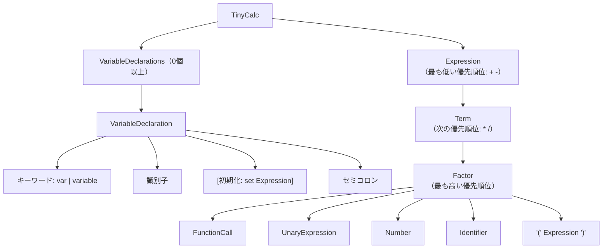

[← 01 - イントロダクション](./01-introduction.md) | [目次](./index.md) | [03 - BNFからパーサーを組み立てる →](./03-building-parsers.md)

# 02 - TinyCalc BNF定義

## 完全なBNF

```
TinyCalc              ::= VariableDeclarations Expression

VariableDeclarations  ::= { VariableDeclaration }
VariableDeclaration   ::= ('var' | 'variable') Identifier ['set' Expression] ';'

Expression            ::= Term { ('+' | '-') Term }
Term                  ::= Factor { ('*' | '/') Factor }
Factor                ::= FunctionCall
                        | UnaryExpression
                        | Number
                        | Identifier
                        | '(' Expression ')'

UnaryExpression       ::= ('+' | '-') Factor

FunctionCall          ::= SingleArgFunction
                        | TwoArgFunction
                        | NoArgFunction
SingleArgFunction     ::= SingleArgFuncName '(' Expression ')'
TwoArgFunction        ::= TwoArgFuncName '(' Expression ',' Expression ')'
NoArgFunction         ::= 'random' '(' ')'

SingleArgFuncName     ::= 'sin' | 'cos' | 'tan' | 'sqrt' | 'abs' | 'log'
TwoArgFuncName        ::= 'min' | 'max' | 'pow'

Identifier            ::= AlphabetUnderScore { AlphabetNumericUnderScore }
Number                ::= [Sign] ( Digits '.' Digits
                                 | Digits '.'
                                 | Digits
                                 | '.' Digits ) [Exponent]

Digits                ::= Digit { Digit }
Digit                 ::= '0' | '1' | ... | '9'
Sign                  ::= '+' | '-'
Exponent              ::= ('e' | 'E') [Sign] Digits
AlphabetUnderScore    ::= 'a'...'z' | 'A'...'Z' | '_'
AlphabetNumericUnderScore ::= AlphabetUnderScore | Digit
```

## 記法の説明

| 記法 | 意味 |
|------|------|
| `A B` | 連接（Chain）— AのあとにBが続く |
| `A \| B` | 選択（Choice）— AまたはB |
| `{ A }` | 0回以上の繰り返し（ZeroOrMore） |
| `[ A ]` | 省略可能（Optional） |
| `'...'` | リテラル文字列（キーワードまたは記号） |

## 文法の階層構造

TinyCalcの文法は、**演算子の優先順位** を構造的に表現しています：



### 演算子の優先順位

| 優先順位 | 演算子 | BNF上の規則 |
|----------|--------|-------------|
| 高 | 関数呼び出し、括弧、単項 | Factor |
| 中 | `*`, `/` | Term |
| 低 | `+`, `-` | Expression |

この設計により、`1 + 2 * 3` は自動的に `1 + (2 * 3)` として解析されます。

## 循環参照

BNFには以下の循環参照（再帰）が存在します：

```
Expression → Term → Factor → '(' Expression ')'
                           → FunctionCall → SingleArgFunction → Expression
                           → FunctionCall → TwoArgFunction   → Expression
```

また、変数宣言にも循環があります：

```
VariableDeclaration → 'set' Expression → Term → Factor → ...
```

unlaxerでは、この循環参照を `LazyChain` / `LazyChoice` を使って解決します。
詳細は [09 - Lazyと再帰](09-lazy-and-recursion.md) で解説します。

---

[← 01 - イントロダクション](./01-introduction.md) | [目次](./index.md) | [03 - BNFからパーサーを組み立てる →](./03-building-parsers.md)
