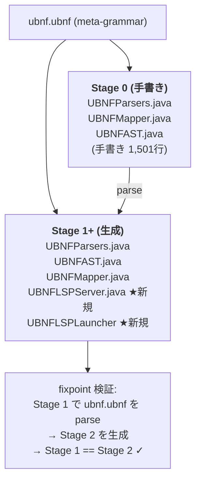

# Architecture: UBNF Grammar Editor (Self-Hosting + LSP)

## 1. Problem

`.ubnf` ファイルの編集にIDE支援がない。構文エラーは `mvn package` 実行時まで発見できない。

## 2. Solution

UBNF の文法を UBNF 自身で記述（self-hosting）し、自動生成される LSP サーバーで `.ubnf` ファイルの編集支援を提供する。

## 3. Bootstrap Architecture



## 4. Phases

### Phase 1: ubnf.ubnf の完成
- 不足構文の追加（token expressions, quantifiers, separated lists）
- Self-hosting fixpoint 検証

### Phase 2: LSP アノテーション
- @declares(symbol=name) でルール定義
- @backref(name=ref) でルール参照 → Go-to-Definition
- @catalog でアノテーション/キーワード補完

### Phase 3: codegen + VS Code Extension
- ubnf.ubnf → UBNFLSPServer.java 生成
- VS Code Extension (package.json + TextMate grammar + launcher)

## 5. Design Decisions

### DD-1: なぜ self-hosting か
- UBNFParsers.java (1,501行) の手書き保守コスト削減
- 自身の文法を自身で処理できることが品質の証明
- LSP 生成の前提条件（@mapping が必要）

### DD-2: UBNFMapper のセマンティック処理は残す
以下は文法で表現できないため mapper コードに残る:
- エスケープシーケンス処理 (`\n` → 改行)
- 整数パース（precedence level, bounded quantifier bounds）
- 修飾名の再構築（ドット区切り package name）
- @typeof キャプチャ名の修正（パース時の曖昧性解消）

### DD-3: TextMate grammar は UBNF から自動生成
- token 宣言のキーワードを抽出
- @whitespace 設定からコメント構文を抽出
- string literal パターンを生成

## 6. File Structure

```
unlaxer-dsl/
├── grammar/
│   └── ubnf.ubnf                    ← メタ文法（Phase 1 で完成）
├── docs/
│   └── architecture-grammar-editor.md ← 本ドキュメント
├── src/main/java/.../bootstrap/
│   ├── UBNFParsers.java              ← Stage 0 (手書き、最終的に削除)
│   ├── UBNFMapper.java               ← セマンティック処理（残す）
│   └── UBNFAST.java                  ← AST 定義（残す）
└── src/test/java/.../codegen/
    ├── SelfHostingRoundTripTest.java  ← fixpoint テスト
    └── SelfHostingTest.java          ← 構造検証テスト
```
