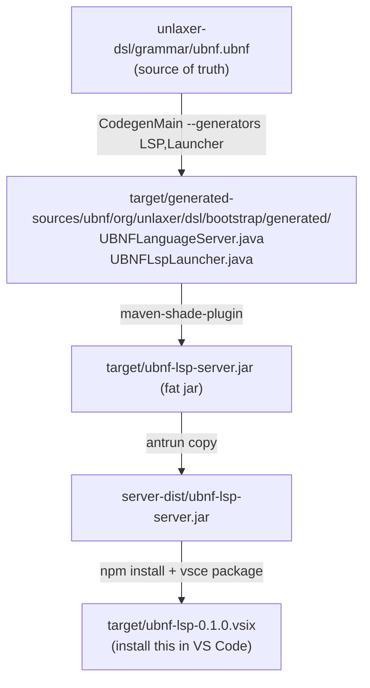

# UBNF VS Code Extension — `unlaxer` editing `unlaxer`

This is the VS Code extension for `.ubnf` files — and it is **generated
from `ubnf.ubnf`**, the meta-grammar that describes the UBNF syntax in
UBNF itself.

The base LSP is generated from the meta-grammar. The handwritten extension adds
validation, navigation, snippets and authoring help. Keyword vocabulary is read
from the meta-grammar AST; descriptions and tutorials are maintained separately.
This is not yet a fully generated replacement for the handwritten UBNF frontend.

## はじめて使う場合：画面内の catalog/help

拡張をインストールしたら、コマンドパレットから
**UBNF: はじめの一歩 / Catalog・Help** を開いてください。
`.ubnf` のエディタ右上の本のアイコン、および VS Code の Getting Started からも開けます。

- **はじめの一歩**：単語 → 数字 → 代入 → リスト → 文字列 → 同じ区切りの6段階。
  文法の全文、行ごとの意味、成功入力・失敗入力、確認項目を同じ画面に表示します。
- **構文 catalog**：日本語のやりたいこと・記号・キーワードから検索できます。
- **困ったとき**：文法エラー、未定義名、入口、空白、左再帰、Unicode位置、LSP起動の直し方。
- **新規文書で開く**：同梱サンプルを未保存の新規 UBNF 文書に開きます。既存文書を変更しません。
  `.ubnf` として保存すると LSP が診断します。

help は LSP が起動できなくても利用でき、外部サイト・CDN・通信は不要です。
試験入力欄の成功/失敗はテスト済みの**期待値**で、help 画面で解析を実行した結果ではありません。
言語用 playground は [生成 CLI](../../docs/ubnf-playground-ja.md) から作成できます。
VSIX からの生成・起動導線は親 issue #353 で接続する次の工程です。

共通 assets は `../src/main/resources/ubnf-help/` にあります。`npm run compile` で
`help-dist/` にコピーされ、VSIX に同梱されます。`catalog.json` の全文例は
`DeclarativeTokenConformanceTest#authoringCatalogExamplesAgreeInJavaAndRust` が
Java / Rust の受理・拒否、消費位置、AST・Unicode span、両 Rust emitter の一致を検証します。

```bash
npm ci
npx playwright install chromium
npm run test:help
# Linux: 配布する VSIX そのものを、隔離した VS Code profile で起動検証
xvfb-run -a npm run test:vsix -- target/ubnf-lsp-3.3.0-SNAPSHOT.vsix
```

Chromium で全レッスン・検索・ダウンロード・モバイル幅を操作し、別のテストで
webview から未検証のパスやコマンドを受け付けないことを確認します。
スクリーンショットは `target/ubnf-help-desktop.png` と `target/ubnf-help-mobile.png` です。
VSIX smoke は配布物を一時ディレクトリへ展開し、拡張の起動・help の表示・同梱 Java LSP の
補完を検証します。ユーザーの VS Code profile や拡張には触れません。初回は公式の VS Code
テスト用実行ファイルをダウンロードするためネットワーク接続が必要です。

## Why this exists

`.ubnf` files are unlaxer's primary input. Until this extension, editing
them meant trial-and-error against `mvn package` to find typos. With
this extension installed:

- Real-time parse diagnostics
- Keyword completion (`grammar`, `token`, `@root`, `@mapping`, …)
- Go-to-definition for rule references (`@backref`)
- Hover with parse status
- Semantic tokens (valid / invalid)

And — more importantly — it proves the unlaxer pipeline is **complete
enough to specify itself**.

## How it is built



All of this is wrapped in `pom.xml` so a top-level `mvn -B package`
produces the VSIX.

## Quick start

```bash
# from repo root
mvn -B install -DskipTests              # builds + installs into local m2
cd unlaxer-dsl/ubnf-vscode
mvn -B verify -Dgpg.skip=true           # produces target/ubnf-lsp-0.1.0.vsix

# install the extension (requires VS Code on PATH)
code --install-extension target/ubnf-lsp-0.1.0.vsix

# open any .ubnf file (e.g. unlaxer-dsl/grammar/ubnf.ubnf itself!)
```

## How it relates to `unlaxer init`

`unlaxer init <name>` (Issue #5) generates a brand-new VS Code extension
scaffold for an arbitrary DSL. This `ubnf-vscode/` is the **canonical
worked example** of that same pattern, applied to UBNF itself. The
template under `unlaxer-dsl/src/main/resources/scaffold/` and this
directory share the same shape: pom.xml (codegen + shade + vsce), a
`vscode-extension/` subdirectory, an `IMPLEMENTATION` doc.

## Historical record

The original self-hosting milestone (the moment `ubnf.ubnf` first
generated a working `UBNFLanguageServer`) is documented in
[`docs/ubnf-self-hosting.md`](../../docs/ubnf-self-hosting.md).

## Related issues

- opaopa6969/unlaxer-parser#4 — Grammar Editor LSP (this extension)
- opaopa6969/unlaxer-parser#5 — `unlaxer init` scaffold (the template)
- opaopa6969/unlaxer-parser#8 — replacing the hand-written
  `UBNFParsers.java` with the generated one
